```{r setup, include=FALSE}
knitr::opts_chunk$set(eval = F, echo = T, message = F, warning = F, 
                      comment = NA, out.width = "100%")
```

---

# Introduction

This vignette contains the `R` code and analysis done for the paper:

> - `r shiny::icon("newspaper")` [Derek Wright, Jiayi Hang, James D House & Kirstin E Bett. **Lentil Protein**. *unpublished*](https://github.com/derekmichaelwright/AGILE_LDP_Protein)
> - `r shiny::icon("github")` <https://github.com/derekmichaelwright/AGILE_LDP_Protein>

> - `r shiny::icon("newspaper")` [Jiayi Hang, Da Shi, Jason Neufeld, Kirstin E Bett, & James D House. **Prediction of protein and amino acid contents in whole and ground lentils using near-infrared reflectance spectroscopy**. *LWT*, (**2022**) 165: 113669. doi.org/10.1016/j.lwt.2022.113669)](https://doi.org/10.1016/j.lwt.2022.113669)

which is follow-up to:

> - `r shiny::icon("newspaper")` [Derek M Wright, Sandesh Neupane, Taryn Heidecker, Teketel A Haile, Clarice J Coyne, Rebecca J McGee, Sripada Udupa, Fatima Henkrar, Eleonora Barilli, Diego Rubiales, Tania Gioia, Giuseppina Logozzo, Stefania Marzario, Reena Mehra, Ashutosh Sarker, Rajeev Dhakal, Babul Anwar, Debashish Sarker, Albert Vandenberg, and Kirstin E. Bett. **Understanding photothermal interactions can help expand production range and increase genetic diversity of lentil (*Lens culinaris* Medik.)**. *Plants, People, Planet*. (**2020**) 3(2): 171-181. doi.org/10.1002/ppp3.10158](https://doi.org/10.1002/ppp3.10158)
> - `r shiny::icon("github")` <https://github.com/derekmichaelwright/AGILE_LDP_Phenology>

---

This work done as part of the AGILE project at the University of Saskatchewan along with collaboration with partners at the University of Manitoba.


---

# Data Preparation

> - `r shiny::icon("save")` [Data/myD_LDP.csv](Data/myD_LDP.csv)
> - `r shiny::icon("save")` [Data/myD_Protein_WetChem.csv](Data/myD_Protein_WetChem.csv)
> - `r shiny::icon("save")` [Data/myD_Protein_NIRS.csv](Data/myD_Protein_NIRS.csv)

```{r}
# Load Libraries
library(tidyverse)
library(ggbeeswarm)
library(ggpubr)
library(FactoMineR)
library(plotly)
library(htmlwidgets)
# Create plotting theme
theme_AGL <- theme_bw() + 
  theme(strip.background   = element_rect(colour = "black", fill = NA, size = 0.5),
        panel.background   = element_rect(colour = "black", fill = NA, size = 0.5),
        panel.border       = element_rect(colour = "black", size = 0.5),
        panel.grid         = element_line(color  = alpha("black", 0.1), size = 0.5),
        panel.grid.minor.x = element_blank(), 
        panel.grid.minor.y = element_blank())
# Prep data
myPs <- c("Protein", "Glutamate", "Aspartate", "Arginine",
          "Leucine", "Lysine", "Phenylalanine", "Serine", "Valine", 
          "Isoleucine", "Proline", "Alanine", "Glycine", "Threonine", 
          "Histidine", "Tyrosine", "Methionine", "Cysteine", "Tryptophan")
myEs1 <- c("Sutherland, Canada 2016", "Rosthern, Canada 2016",
           "Sutherland, Canada 2017", "Rosthern, Canada 2017")
myEs2 <- c("Su16", "Ro16", "Su17", "Ro17")
myCs_Expt <- c("steelblue", "darkorange", "darkblue", "darkred")
myCs_Region <- c("darkred", "darkgreen", "darkorange", "darkblue", "steelblue")
myCs_Clusters <- c("red4", "darkorange3", "blue2", "deeppink3", 
                      "steelblue", "darkorchid4", "darkslategray", "chartreuse4")
# Wet Chemistry Data
d1 <- read.csv("Data/myD_Protein_WetChem.csv") %>%
  select(-Plot, -Rep, -Sample.Name..1st..text.) %>%
  rename(Year=Planting.Date..date.) %>%
  gather(AminoAcid, Value, 5:ncol(.)) %>%
  mutate(AminoAcid = gsub("Protein....", "Protein", AminoAcid),
         AminoAcid = gsub("Glutamic.acid", "Glutamate", AminoAcid),
         AminoAcid = gsub("Aspartic.acid", "Aspartate", AminoAcid),
         AminoAcid = gsub("..1st....", "", AminoAcid),
         AminoAcid = factor(AminoAcid, levels = myPs),
         Expt = factor(paste(Location, Year), levels = myEs1),
         ExptShort = plyr::mapvalues(Expt, myEs1, myEs2),
         Value = round(as.numeric(Value), 4))
# NIRS Data
d2 <- read.csv("Data/myD_Protein_NIRS.csv") %>% 
  select(-Plot, -Rep, -Sample.Name..1st..text.) %>%
  rename(Year=Planting.Date..date.) %>%
  gather(AminoAcid, Value, 5:ncol(.)) %>%
  mutate(AminoAcid = gsub("Glutamic.acid", "Glutamate", AminoAcid),
         AminoAcid = gsub("Aspartic.acid", "Aspartate", AminoAcid),
         AminoAcid = gsub("..1st....", "", AminoAcid),
         AminoAcid = factor(AminoAcid, levels = myPs),
         Expt = factor(paste(Location, Year), levels = myEs1),
         ExptShort = plyr::mapvalues(Expt, myEs1, myEs2),
         Value = round(Value, 4))
#
myLDP <- read.csv("Data/myD_LDP.csv")
# Protein Families
myPFs <- c("Family.Glutamate", "Family.Aspartate", "Family.Pyruvate", 
           "Family.Serine", "Family.Histidine", "Family.Aromatic",
           "Perc.Family.Glutamate", "Perc.Family.Aspartate", "Perc.Family.Pyruvate",
           "Perc.Family.Serine", "Perc.Family.Histidine", "Perc.Family.Aromatic")
d3 <- d2 %>% spread(AminoAcid, Value) %>%
  mutate(Family.Glutamate = Glutamate + Proline + Arginine, 
         Family.Aspartate = Aspartate + Threonine + Isoleucine + Methionine + Lysine,
         Family.Pyruvate = Alanine + Valine + Leucine,
         Family.Serine = Serine + Glycine + Cysteine,
         Family.Histidine = Histidine,
         Family.Aromatic = Tryptophan + Phenylalanine + Tyrosine ) %>%
  mutate(Perc.Family.Glutamate = 100 * Family.Glutamate / Protein,
         Perc.Family.Aspartate = 100 * Family.Aspartate / Protein, 
         Perc.Family.Pyruvate = 100 * Family.Pyruvate / Protein,
         Perc.Family.Serine = 100 * Family.Serine / Protein,
         Perc.Family.Histidine = 100 * Family.Histidine / Protein,
         Perc.Family.Aromatic = 100 * Family.Aromatic / Protein) %>%
  select(Name, Expt, ExptShort, 
         Family.Glutamate, Family.Aspartate, Family.Histidine,
         Family.Pyruvate, Family.Serine, Family.Aromatic,
         #
         Perc.Family.Glutamate, Perc.Family.Aspartate, Perc.Family.Histidine,
         Perc.Family.Pyruvate, Perc.Family.Serine, Perc.Family.Aromatic) %>%
  gather(AminoAcidFamily, Value, 4:ncol(.)) %>%
  mutate(AminoAcidFamily = factor(AminoAcidFamily, levels = myPFs))
```

---

# GWAS

## Prepare Data For GWAS

```{r eval = F}
# Function to fix names for GWAS
fixNames <- function(xx) {
  xx %>% mutate(Name = gsub(" ", "_", Name),
         Name = gsub("-", "\\.", Name),
         Name = plyr::mapvalues(Name, "3156.11_AGL", "X3156.11_AGL"))
}
# Ro16 data
myY <- d2 %>% filter(ExptShort == "Ro16") %>%
  select(-Entry, -Location, -Year, -Expt) %>%
  mutate(AminoAcid = paste(AminoAcid, ExptShort, sep = "_")) %>%
  select(-ExptShort) %>%
  spread(AminoAcid, Value) %>%
  fixNames()
write.csv(myY, "Data/myY_NIRS_Ro16.csv", row.names = F)
# Ro17 data
myY <- d2 %>% filter(ExptShort == "Ro17") %>%
  select(-Entry, -Location, -Year, -Expt) %>%
  mutate(AminoAcid = paste(AminoAcid, ExptShort, sep = "_")) %>%
  select(-ExptShort) %>%
  spread(AminoAcid, Value) %>%
  fixNames()
write.csv(myY, "Data/myY_NIRS_Ro17.csv", row.names = F)
# Su16 data
myY <- d2 %>% filter(ExptShort == "Su16") %>%
  select(-Entry, -Location, -Year, -Expt) %>%
  mutate(AminoAcid = paste(AminoAcid, ExptShort, sep = "_")) %>%
  select(-ExptShort) %>%
  spread(AminoAcid, Value) %>%
  fixNames()
write.csv(myY, "Data/myY_NIRS_Su16.csv", row.names = F)
# Su17 data
myY <- d2 %>% filter(ExptShort == "Su17") %>%
  select(-Entry, -Location, -Year, -Expt) %>%
  mutate(AminoAcid = paste(AminoAcid, ExptShort, sep = "_")) %>%
  select(-ExptShort) %>%
  spread(AminoAcid, Value) %>%
  fixNames()
write.csv(myY, "Data/myY_NIRS_Su17.csv", row.names = F)
# All Data
myY <- d2 %>% 
  select(-Entry, -Location, -Year, -Expt) %>%
  mutate(AminoAcid = paste(AminoAcid, ExptShort, sep = "_")) %>%
  select(-ExptShort) %>%
  spread(AminoAcid, Value) %>%
  fixNames()
write.csv(myY, "Data/myY_NIRS.csv", row.names = F)
# Covariate Data
myCV <- myLDP %>% 
  select(Name, DTF_Ro16, DTF_Ro17, DTF_Su16, DTF_Su17,
               REP_Ro16, REP_Ro17, REP_Su16, REP_Su17) %>%
  fixNames()
write.csv(myCV, "Data/myCV.csv", row.names = F)
```

---

## Run GWAS

> - `r shiny::icon("save")` [Data/myG_LDP.zipv](Data/myG_LDP.zip)
> - `r shiny::icon("save")` [Data/myCV.csv"](Data/myCV.csv%22)

> - `r shiny::icon("save")` [Data/myY_NIRS.csv](Data/myY_NIRS.csv)
> - `r shiny::icon("save")` [Data/myY_NIRS_Ro16.csv](Data/myY_NIRS_Ro16.csv)
> - `r shiny::icon("save")` [Data/myY_NIRS_Ro17.csv](Data/myY_NIRS_Ro17.csv)
> - `r shiny::icon("save")` [Data/myY_NIRS_Su16.csv](Data/myY_NIRS_Su16.csv)
> - `r shiny::icon("save")` [Data/myY_NIRS_Su17.csv](Data/myY_NIRS_Su17.csv)

```{r eval = F}
# devtools::install_github("jiabowang/GAPIT3")
library(GAPIT3)
#
myG <- read.csv("Data/myG_LDP.csv", header = F)
myCV <- read.csv("Data/myCV.csv")
# Run GWAS on all data
myY <- read.csv("Data/myY_NIRS.csv")
myGAPIT <- GAPIT(
  Y = myY[,c("Name","Glutamate_Ro16")],#,"Glutamate_Ro17","Glutamate_Su16","Glutamate_Su17","Aspartate_Ro16","Aspartate_Ro17","Aspartate_Su16","Aspartate_Su17")],
  G = myG,
  PCA.total = 4,
  model = c("MLM","FarmCPU","Blink"),
  Phenotype.View = F
)
# Run GWAS for Ro16 with CVs
myY_Ro16 <- read.csv("Data/myY_NIRS_Ro16.csv")
myGAPIT <- GAPIT(
  Y = myY_Ro16[,c("Name","Glutamate_Ro16","Aspartate_Ro16")],
  G = myG,
  CV = myCV[,c("Name","DTF_Ro16","REP_Ro16")],
  PCA.total = 0,
  model = c("MLM","FarmCPU","Blink"),
  Phenotype.View = F
)
# Run GWAS for Ro17 with CVs
myY_Ro17 <- read.csv("Data/myY_NIRS_Ro17.csv")
myGAPIT <- GAPIT(
  Y = myY_Ro17[,c("Name","Glutamate_Ro17","Aspartate_Ro17")],
  G = myG,
  CV = myCV[!is.na(myCV$REP_Ro17),c("Name","DTF_Ro17","REP_Ro17")],
  PCA.total = 0,
  model = c("MLM","FarmCPU","Blink"),
  Phenotype.View = F
)
# Run GWAS for Su16 with CVs
myY_Su16 <- read.csv("Data/myY_NIRS_Su16.csv")
myGAPIT <- GAPIT(
  Y = myY_Su16[,c("Name","Glutamate_Su16","Aspartate_Su16")],
  G = myG,
  CV = myCV[,c("Name","DTF_Su16","REP_Su16")],
  PCA.total = 0,
  model = c("MLM","FarmCPU","Blink"),
  Phenotype.View = F
)
# Run GWAS for Su17 with CVs
myY_Su17 <- read.csv("Data/myY_NIRS_Su17.csv")
myGAPIT <- GAPIT(
  Y = myY_Su17[,c("Name","Glutamate_Su17","Aspartate_Su17")],
  G = myG,
  CV = myCV[!is.na(myCV$REP_Su17),c("Name","DTF_Su17","REP_Su17")],
  PCA.total = 0,
  model = c("MLM","FarmCPU","Blink"),
  Phenotype.View = F
)
```

---

# Post GWAS

```{r}
# devtools::install_github("derekmichaelwright/gwaspr")
library(gwaspr)
myMs <- c(# Marker set #1
          "Lcu.2RBY.Chr3p339102503", "Lcu.2RBY.Chr5p327505937", "Lcu.2RBY.Chr5p467479275",
          # Marker set #2
          "Lcu.2RBY.Chr1p437385632", "Lcu.2RBY.Chr4p432694216", "Lcu.2RBY.Chr6p411536500") 
myCs <- c(rep("red",3), rep("blue",3))
#
myG <- read.csv("Data/myG_LDP.csv", header = T)
```

---

## Supplemental Table 1 - Significant Results

> - `r shiny::icon("save")` [Supplemental_table_01.csv](Supplemental_table_01.csv)

```{r eval = F}
# reorder GWAS results tables and compile significant results
myR1 <- list_Result_Files("GWAS_Results/")
order_GWAS_Results(folder = "GWAS_Results/", files = myR1)
x1 <- table_GWAS_Results("GWAS_Results/", myR1, threshold = 6.7, sug.threshold = 5.3)
#
myR2 <- list_Result_Files("GWAS_Results_DTF_REP/")
order_GWAS_Results(folder = "GWAS_Results_DTF_REP/", files = myR2)
x2 <- table_GWAS_Results("GWAS_Results_DTF_REP/", myR2, threshold = 6.7, sug.threshold = 5.3)
#
x1 <- x1 %>% mutate(CV = "NONE") %>% arrange(P.value)
x2 <- x2 %>% mutate(CV = "DTF+REP") %>% arrange(P.value)
xx <- bind_rows(x1, x2)
write.csv(xx, "Supplemental_table_01.csv", row.names = F)
```

```{r eval = F, echo = F}
yy <- table_Results_Summary("GWAS_Results/", isOrdered = F)
yy <- table_Results_Summary("GWAS_Results/", isOrdered = T)
yy <- table_Results_Summary(folder = "GWAS_Results_DTF_REP/", isOrdered = F)
yy <- table_Results_Summary(folder = "GWAS_Results_DTF_REP/", isOrdered = T)
nrow(xx %>% filter(Threshold == "Significant") %>% filter(!duplicated(SNP)))
```

```{r eval = T}
xx <- read.csv("Supplemental_table_01.csv")
DT::datatable(xx)
```

---

## Manhattan plots

> - `r shiny::icon("chart-line")` [Additional/ManH/](https://github.com/derekmichaelwright/AGILE_LDP_Protein/tree/master/Additional/ManH/)


```{r eval = F}
# Create custom manhattan plots
myTs <- list_Traits("GWAS_Results/")
myTs <- myTs[c(9:12,17:20)]
for(i in myTs) {
  mp <- gg_Manhattan(folder = "GWAS_Results/", trait = i, facet = F,
                     models = c("MLM", "MLMM", "FarmCPU", "BLINK"),
                     vlines = myMs, vline.colors = myCs,
                     threshold = 6.7, sug.threshold = 5, pmax = 12 )
  ggsave(paste0("Additional/ManH/Multi_",i,"_1_noCV.png"), 
         mp, width = 12, height = 4, bg = "white")
}
#
myTs <- list_Traits("GWAS_Results_DTF_REP/")
for(i in myTs) {
  mp <- gg_Manhattan(folder = "GWAS_Results_DTF_REP/", trait = i, facet = F,
                     title = paste(i, "| CV = DTF + REP"),
                     models = c("MLM", "FarmCPU", "BLINK"),
                     vlines = myMs, vline.colors = myCs,
                     threshold = 6.7, sug.threshold = 5, pmax = 12 )
  ggsave(paste0("Additional/ManH/Multi_",i,"_2_CVDTFREP.png"), 
         mp, width = 12, height = 4, bg = "white")
}
```

---

# Supplemental Figure 1 - Wet Chem vs NIRS


```{r}
# Prep data
x1 <- d1 %>% select(Name, Expt, AminoAcid, `Wet Chemistry`=Value)
x2 <- d2 %>% select(Name, Expt, AminoAcid, NIRS=Value)
xx <- left_join(x1, x2, by = c("Name", "Expt", "AminoAcid"))
# Plot
mp <- ggplot(xx, aes(x = `Wet Chemistry`, y = NIRS)) +
  geom_point(aes(color = Expt), alpha = 0.5, pch = 16) +
  stat_smooth(geom = "line", method = "lm", alpha = 0.7, linewidth = 1.5) +
  stat_regline_equation(aes(label = ..rr.label..)) +
  facet_wrap(AminoAcid ~ ., scales = "free") +
  scale_color_manual(values = myCs_Expt) +
  theme_AGL +
  theme(legend.position = "bottom") +
  guides(color = guide_legend(override.aes = list(size = 3))) +
  labs(title = "Concentration (g / 100g dry seed)",
       y = "Near-infrared Spectroscopy")
ggsave("Supplemental_Figure_01.jpg", mp, width = 10, height = 8, dpi = 600)
```

---

# Supplemental Figure 2 - Total Protein & Amino Acids


```{r}
# Prep data
xx <- d2 %>% 
  mutate(Family = ifelse(AminoAcid == "Protein", "Total Protein", NA),
         Family = ifelse(AminoAcid %in% c("Glutamate", "Proline",  "Arginine"), "Glutamate", Family),
         Family = ifelse(AminoAcid %in% c("Aspartate", "Threonine", "Isoleucine", "Methionine", "Lysine"), "Aspartate", Family),
         Family = ifelse(AminoAcid %in% c("Alanine", "Valine", "Leucine"), "Pyruvate", Family),
         Family = ifelse(AminoAcid %in% c("Serine", "Glycine", "Cysteine"), "Serine", Family),
         Family = ifelse(AminoAcid %in% c("Histidine"), "Histidine", Family),
         Family = ifelse(AminoAcid %in% c("Tryptophan", "Phenylalanine", "Tyrosine"), "Aromatic", Family)) %>%
  mutate(AminoAcid = factor(AminoAcid, levels = myPs),
         Family = factor(Family, levels = c("Total Protein", "Glutamate", "Aspartate", "Pyruvate",
                                            "Serine", "Histidine", "Aromatic")))
# Plot
mp <- ggplot(xx, aes(x = Value, fill = Family)) +
  geom_histogram(color = "black", alpha = 0.7, lwd = 0.2) +
  facet_grid(ExptShort ~ AminoAcid, scales = "free_x") +
  scale_x_reverse() +
  theme_AGL +
  theme(legend.position = "bottom",
        axis.text.x = element_text(angle = 45, hjust = 1)) +
  guides(fill = guide_legend(nrow = 1)) +
  labs(title = "Lentil Diversity Panel", x = "g / 100g dry seed")
ggsave("Supplemental_Figure_02.jpg", mp, width = 30, height = 7, dpi = 600)
```

---

# Figure 1 - Total Protein & Amino Acids


```{r}
# Prep data
xx <- d2 %>% filter(AminoAcid != "Protein")
# Plot
mp1 <- ggplot(xx, aes(x = AminoAcid, y = Value, fill = Expt)) +
  geom_boxplot(alpha = 0.7, coef = 5, lwd = 0.2) +
  scale_fill_manual(name = NULL, values = myCs_Expt) +
  scale_y_continuous(breaks = 0:5) +
  theme_AGL +
  theme(legend.position = "none", 
        axis.text.x = element_text(angle = 45, hjust = 1)) +
  labs(title = "A) Amino Acids", y = "g / 100g dry seed", x = NULL)
# Prep data
myFams1 <- c("Family.Glutamate", "Family.Aspartate", "Family.Pyruvate", 
             "Family.Serine", "Family.Histidine", "Family.Aromatic")
myFams2 <- c("Glutamte Family", "Aspartate Family", "Pyruvate Family", 
             "Serine Family", "Histidine Family", "Aromatic Family")
xx <- d3 %>% filter(!grepl("Perc", AminoAcidFamily)) %>% 
  mutate(AminoAcidFamily = plyr::mapvalues(AminoAcidFamily, myFams1, myFams2))
# Plot
mp2 <- ggplot(xx, aes(x = Value, fill = Expt)) +
  geom_histogram(color = "black", alpha = 0.7, lwd = 0.1) +
  facet_grid(ExptShort ~ AminoAcidFamily, scales = "free_x", labeller = label_wrap_gen(width = 10)) +
  scale_fill_manual(values = myCs_Expt) +
  theme_AGL +
  theme(legend.position = "bottom",
        legend.text = element_text(size = 8),
        axis.text.x = element_text(angle = 45, hjust = 1)) +
  guides(fill = guide_legend(ncol = 2, override.aes = list(lwd = 0))) +
  labs(title = "B) Amino Acid Families", 
       y = "Count", x = "g / 100g dry seed")
mpl <- get_legend(mp2)
mp2 <- mp2 + theme(legend.position = "none")
# Prep data
x1 <- d2 %>% filter(AminoAcid == "Protein", ExptShort == "Su16") %>%
  arrange(Value) %>% pull(Name)
xx <- d2 %>% filter(AminoAcid == "Protein") %>%
  mutate(Name = factor(Name, levels = x1))
# Plot
mp3 <- ggplot(xx, aes(x = Name, y = Value, color = ExptShort)) +
  geom_point(alpha = 0.7, pch = 16) +
  scale_color_manual(name = NULL, values = myCs_Expt) +
  scale_y_continuous(breaks = 25:35) +
  theme_AGL +
  theme(legend.position = "none",
        panel.grid.major.x = element_blank(),
        axis.text.x = element_blank(),
        axis.ticks.x = element_blank()) +
  labs(title = "C) Total Protein", x = "Entry",
       y = "Protein (g / 100g dry seed)")
mp <- ggarrange(mp1, ggarrange(mp2, ggarrange(mp3, mpl, ncol = 1, heights = c(4,1)), ncol = 2), nrow = 2) 
ggsave("Figure_01.jpg", mp, width = 10, height = 8, dpi = 600, bg = "white")
```

```{r}
d2 %>% group_by(AminoAcid) %>% 
  summarise(Mean = mean(Value), CV = goeveg::cv(Value), Min = min(Value),  Max = max(Value))
```

---

# Figure 2 - Protein x Traits

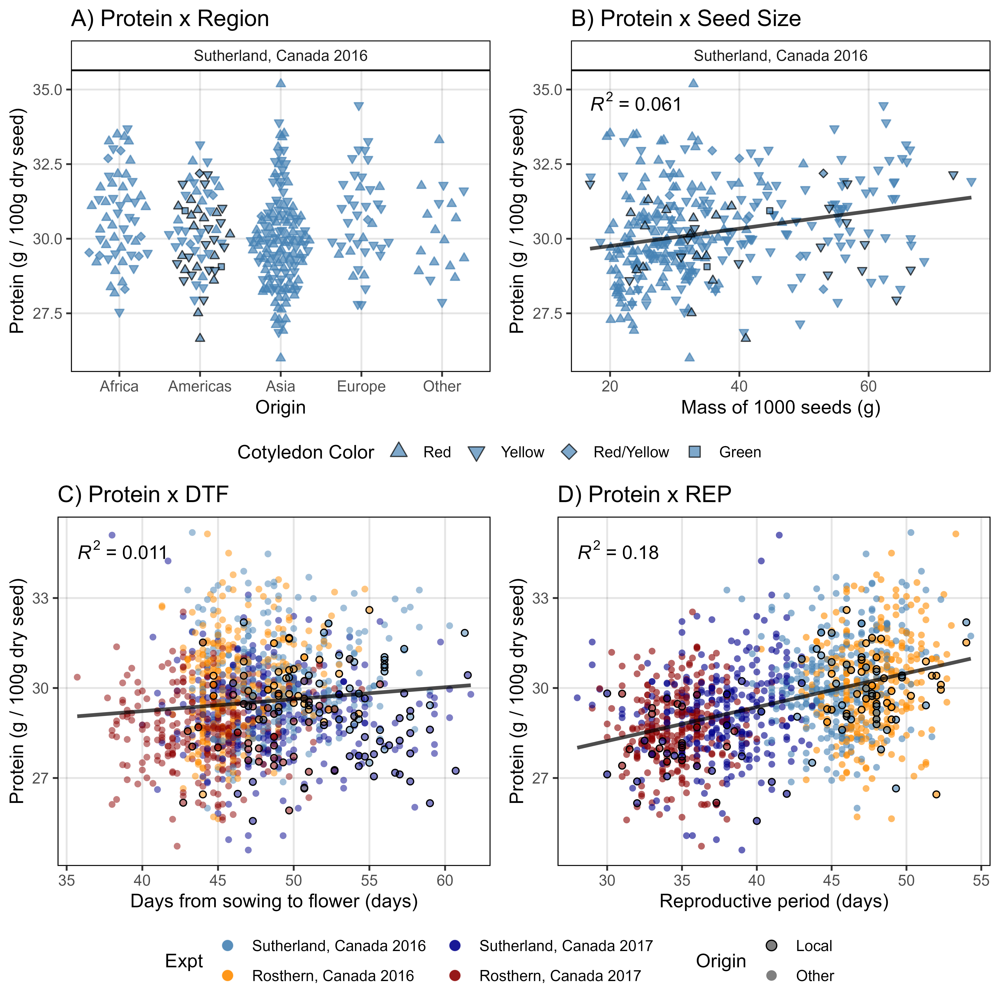

```{r eval = F, echo = F}
cor(xx$Value[xx$ExptShort=="Su16"], xx$SeedMass1000.2017[xx$ExptShort=="Su16"])^2
cor(xx$Value[xx$ExptShort=="Su16"], xx$SeedMass1000.2016[xx$ExptShort=="Su16"])^2
cor(xx$Value[xx$ExptShort=="Su17"], xx$SeedMass1000.2017[xx$ExptShort=="Su17"])^2
cor(xx$Value[xx$ExptShort=="Ro16"], xx$SeedMass1000.2017[xx$ExptShort=="Ro16"])^2
cor(xx$Value[xx$ExptShort=="Ro16"], xx$SeedMass1000.2016[xx$ExptShort=="Ro16"])^2
cor(xx$Value[xx$ExptShort=="Ro17"], xx$SeedMass1000.2017[xx$ExptShort=="Ro17"])^2
```

```{r}
# Prep data
myCots <- c("Red", "Yellow", "Red/Yellow", "Green")
xx <- d2 %>% filter(AminoAcid == "Protein") %>%
  left_join(myLDP, by = c("Entry","Name")) %>%
  mutate(Origin = ifelse(Origin %in% c("Canada","USA"), "Local", "Other"),
         CotyledonColor = factor(CotyledonColor, levels = myCots)) %>%
  arrange(desc(Origin)) %>% 
  filter(ExptShort == "Su16")
# Plot
mp1 <- ggplot(xx, aes(x = Region, y = Value, color = Origin, pch = CotyledonColor)) +
  geom_quasirandom(fill = "steelblue", alpha = 0.7) +
  facet_grid(. ~ Expt) +
  scale_color_manual(values = c("black", "steelblue"), guide = F) +
  scale_shape_manual(name = "Cotyledon Color", values = c(24,25,23,22)) +
  theme_AGL +
  guides(shape = guide_legend(override.aes = list(size = 3))) +
  labs(title = "A) Protein x Region", 
       x = "Origin", y = "Protein (g / 100g dry seed)")
# Plot
mp2 <- ggplot(xx, aes(x = SeedMass1000.2017, y = Value)) +
  geom_point(aes(shape = CotyledonColor, color = Origin), fill = "steelblue", alpha = 0.7) +
  stat_smooth(geom = "line", method = "lm", se = F, 
              color = "black", alpha = 0.7, size = 1) +
  stat_regline_equation(aes(label = ..rr.label..)) +
  facet_wrap(Expt ~ .) +
  scale_color_manual(values = c("black", "steelblue"), guide = F) +
  scale_shape_manual(name = "Cotyledon Color", values = c(24,25,23,22)) +
  theme_AGL + 
  guides(shape = guide_legend(override.aes = list(size = 3))) +
  labs(title = "B) Protein x Seed Size", 
       x = "Mass of 1000 seeds (g)", y = "Protein (g / 100g dry seed)")
# Prep data
x1 <- d2 %>% filter(AminoAcid == "Protein") %>%
  select(Entry, Expt, ExptShort, Protein=Value)
x2 <- myLDP %>% select(Entry, Name, DTF_Ro16, DTF_Ro17, DTF_Su16, DTF_Su17) %>%
  gather(ExptShort, DTF, 3:6) %>%
  mutate(ExptShort = gsub("DTF_", "", ExptShort))
xx <- left_join(x1, x2, by = c("Entry", "ExptShort")) %>%
  mutate(ExptShort = factor(ExptShort, levels = myEs2)) %>%
  left_join(myLDP, by = c("Entry","Name")) %>%
  mutate(Origin = ifelse(Origin %in% c("Canada","USA"), "Local", "Other")) %>%
  arrange(desc(Origin))
# Plot
mp3 <- ggplot(xx, aes(x = DTF, y = Protein)) +
  geom_point(aes(fill = Expt), color = alpha("white",0), pch = 21) +
  geom_point(aes(color = Origin), fill = alpha("white",0), pch = 21) +
  stat_smooth(geom = "line", method = "lm", se = F, 
              color = "black", alpha = 0.7, size = 1) +
  stat_regline_equation(aes(label = ..rr.label..)) +
  scale_fill_manual(values = alpha(myCs_Expt,0.5)) +
  scale_color_manual(values = c("black", alpha("white",0))) +
  guides(color = guide_legend(nrow = 2, override.aes = list(size = 2.5, fill = "grey50")),
         fill = guide_legend(nrow = 2, override.aes = list(size = 3, alpha = 0.9))) +
  theme_AGL + 
  labs(title = "C) Protein x DTF", 
       x = "Days from sowing to flower (days)", y = "Protein (g / 100g dry seed)")
# Prep data
x1 <- d2 %>% filter(AminoAcid == "Protein") %>%
  select(Entry, Expt, ExptShort, Protein=Value)
x2 <- myLDP %>% select(Entry, Name, REP_Ro16, REP_Ro17, REP_Su16, REP_Su17) %>%
  gather(ExptShort, REP, 3:6) %>%
  mutate(ExptShort = gsub("REP_", "", ExptShort))
xx <- left_join(x1, x2, by = c("Entry", "ExptShort")) %>%
  left_join(myLDP, by = c("Entry","Name")) %>%
  mutate(Origin = ifelse(Origin %in% c("Canada","USA"), "Local", "Other")) %>%
  arrange(desc(Origin))
# Plot
mp4 <- ggplot(xx, aes(x = REP, y = Protein)) +
  geom_point(aes(fill = Expt), color = alpha("white",0), pch = 21) +
  geom_point(aes(color = Origin), fill = alpha("white",0), pch = 21) +
  stat_smooth(geom = "line", method = "lm", se = F, 
              color = "black", alpha = 0.7, size = 1) +
  stat_regline_equation(aes(label = ..rr.label..)) +
  scale_fill_manual(values = alpha(myCs_Expt,0.6)) +
  scale_color_manual(values = c("black", alpha("white",0))) +
  guides(color = guide_legend(nrow = 2, override.aes = list(size = 2.5, fill = "grey50")),
         fill = guide_legend(nrow = 2, override.aes = list(size = 3, alpha = 0.9))) +
  theme_AGL + 
  labs(title = "D) Protein x REP", 
       x = "Reproductive period (days)", y = "Protein (g / 100g dry seed)")
#
mp1 <- ggarrange(mp1, mp2, ncol = 2, common.legend = T, legend = "bottom")
mp2 <- ggarrange(mp3, mp4, ncol = 2, common.legend = T, legend = "bottom")
mp <- ggarrange(mp1, mp2, ncol = 1, heights = c(1,1.1))
ggsave("Figure_02.jpg", mp, width = 8, height = 8, dpi = 600, bg = "white")
```

---

# Figure 3 & Supplemental Figure 3 - Selections

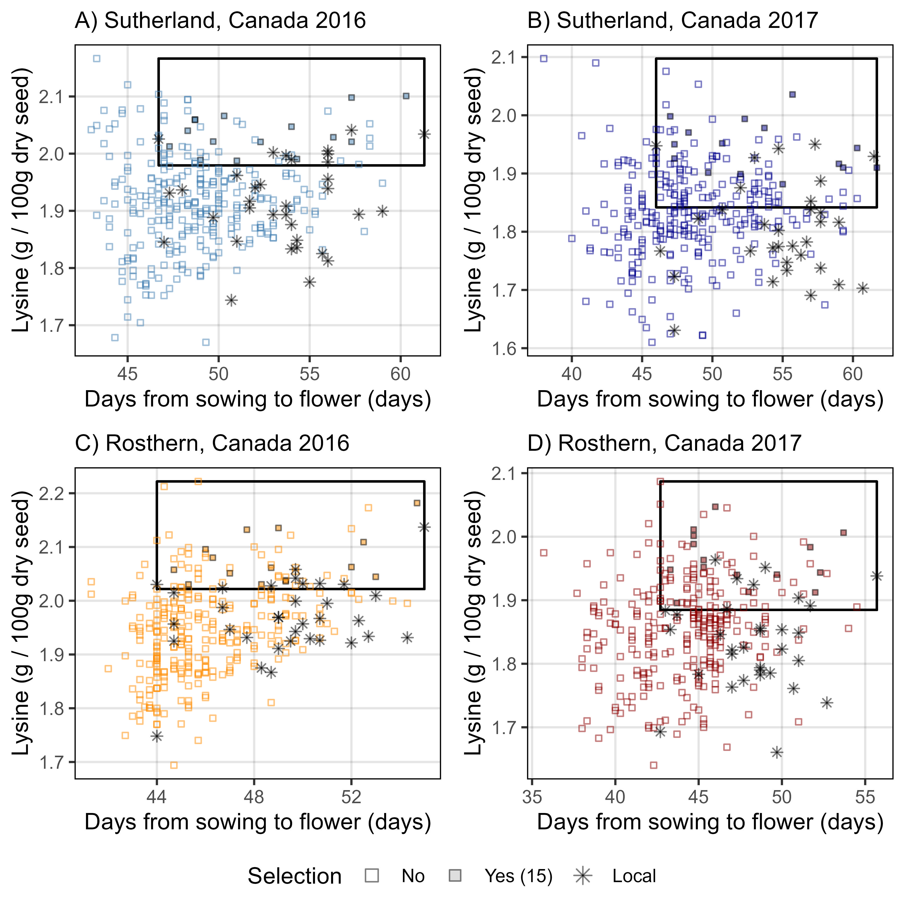

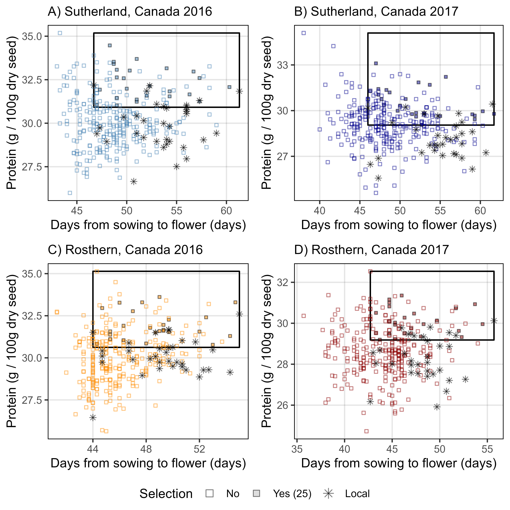

> - `r shiny::icon("chart-line")` [Figure_03_Su16.html](https://derekmichaelwright.github.io/AGILE_LDP_Protein/Additional/Figure_03_Su16.html)
> - `r shiny::icon("chart-line")` [Figure_03_Su17.html](https://derekmichaelwright.github.io/AGILE_LDP_Protein/Additional/Figure_03_Su17.html)
> - `r shiny::icon("chart-line")` [Figure_03_Ro16.html](https://derekmichaelwright.github.io/AGILE_LDP_Protein/Additional/Figure_03_Ro16.html)
> - `r shiny::icon("chart-line")` [Figure_03_Ro17.html](https://derekmichaelwright.github.io/AGILE_LDP_Protein/Additional/Figure_03_Ro17.html)

> - `r shiny::icon("chart-line")` [Supplemental_Figure_03_Su16.html](https://derekmichaelwright.github.io/AGILE_LDP_Protein/Additional/Supplemental_Figure_03_Su16.html)
> - `r shiny::icon("chart-line")` [Supplemental_Figure_03_Su17.html](https://derekmichaelwright.github.io/AGILE_LDP_Protein/Additional/Supplemental_Figure_03_Su17.html)
> - `r shiny::icon("chart-line")` [Supplemental_Figure_03_Ro16.html](https://derekmichaelwright.github.io/AGILE_LDP_Protein/Additional/Supplemental_Figure_03_Ro16.html)
> - `r shiny::icon("chart-line")` [Supplemental_Figure_03_Ro17.html](https://derekmichaelwright.github.io/AGILE_LDP_Protein/Additional/Supplemental_Figure_03_Ro17.html)

```{r}
# Prep data
gg_Selection <- function(myTrait = "DTF_Ro16", myAmino = "Protein", 
                         myExpt = "Ro16", myTitle = myExpt, myColor = "steelblue") {
  # Prep data
  xi <- myLDP %>% select(Name, Origin, Ro16=DTF_Ro16, Ro17=DTF_Ro17, Su16=DTF_Su16, Su17=DTF_Su17) %>%
    gather(ExptShort, DTF, Ro16, Ro17, Su16, Su17)
  xx <- d2 %>% filter(AminoAcid == myAmino) %>%
    left_join(xi, by = c("Name", "ExptShort")) %>% 
    mutate(Selection = NA)
  #
  for(i in myEs2) {
    myYmin <- quantile(xx %>% filter(ExptShort == i, Origin %in% c("Canada", "USA")) %>% pull(Value), 0.75)
    myYmax <- max(xx %>% filter(ExptShort == i) %>% pull(Value))
    myXmin <- min(xx %>% filter(ExptShort == i, Origin %in% c("Canada", "USA")) %>% pull(DTF))
    myXmax <- max(xx %>% filter(ExptShort == i) %>% pull(DTF))
    xx <- xx %>% 
      mutate(Selection = ifelse((ExptShort == i & Value > myYmin & DTF > myXmin), "Yes", Selection))
  }
  ss <- xx %>% select(Name, ExptShort, Selection) %>% spread(ExptShort, Selection) %>% 
    filter(!is.na(Ro16), !is.na(Ro17), !is.na(Su16), !is.na(Su17)) %>% # must be "Yes" in all Expt
    mutate(Selection = "Yes") %>% select(Name, Selection)
  xx <- xx %>% filter(ExptShort == myExpt) %>% select(-Selection) %>%
    left_join(ss, by = "Name") %>%
    mutate(Origin2 = ifelse(Origin %in% c("Canada", "USA"), "Local", "Other"),
           Selection = ifelse(is.na(Selection), "No", Selection),
           Selection = ifelse(Origin2 == "Local", "Local", Selection)) %>%
    arrange(desc(Origin2))
  myNum <- sum(xx$Selection == "Yes")
  xx <- xx %>% 
    mutate(Selection = ifelse(Selection == "Yes", paste0("Yes (", myNum, ")"), Selection),
           Selection = factor(Selection, levels = c("No", paste0("Yes (", myNum, ")"), "Local")))
  #
  myYmin <- quantile(xx %>% filter(Origin2 == "Local") %>% pull(Value), 0.75)
  myYmax <- max(xx %>% pull(Value))
  myXmin <- min(xx %>% filter(Origin2 == "Local") %>% pull(DTF))
  myXmax <- max(xx %>% pull(DTF))
  # Plot
  ggplot(xx) +
    geom_rect(xmin = myXmin, xmax = myXmax, 
              ymin = myYmin, ymax = myYmax,
              color = "black", fill = NA) +
    geom_point(aes(x = DTF, y = Value, shape = Selection, size = Selection,
                   fill = Selection, color = Selection,
                   key1 = Entry, key2 = Name, key3 = Origin), alpha = 0.5) +
    scale_color_manual(values = c(myColor, "black", "black")) +
    scale_fill_manual(values = c(myColor, myColor, "black")) +
    scale_shape_manual(values = c(0,22,8)) +
    scale_size_manual(values = c(1,1,1.5)) +
    #facet_wrap(Expt ~ .) +
    guides(shape = guide_legend(override.aes = list(fill = "grey", color = "black", size = 2.5))) +
    theme_AGL + 
    labs(subtitle = myTitle, 
         x = "Days from sowing to flower (days)",
         y = paste(myAmino, "(g / 100g dry seed)"))
}
mp1 <- gg_Selection(myTrait = "DTF_Su16", myExpt = "Su16", myColor = "steelblue",
                    myTitle ="A) Sutherland, Canada 2016")
mp2 <- gg_Selection(myTrait = "DTF_Su17", myExpt = "Su17", myColor = "darkblue",
                    myTitle ="B) Sutherland, Canada 2017")
mp3 <- gg_Selection(myTrait = "DTF_Ro16", myExpt = "Ro16", myColor = "darkorange",
                    myTitle ="C) Rosthern, Canada 2016")
mp4 <- gg_Selection(myTrait = "DTF_Ro17", myExpt = "Ro17", myColor = "darkred",
                    myTitle ="D) Rosthern, Canada 2017")
mp <- ggarrange(mp1, mp2, mp3, mp4, ncol = 2, nrow = 2, common.legend = T, legend = "bottom")
ggsave("Supplemental_Figure_03.jpg", mp, width = 6, height = 6, dpi = 600, bg = "white")
saveWidget(ggplotly(mp1), file="Additional/Supplemental_Figure_03_Su16.html")
saveWidget(ggplotly(mp2), file="Additional/Supplemental_Figure_03_Su17.html")
saveWidget(ggplotly(mp3), file="Additional/Supplemental_Figure_03_Ro16.html")
saveWidget(ggplotly(mp4), file="Additional/Supplemental_Figure_03_Ro17.html")
#
mp1 <- gg_Selection(myTrait = "DTF_Su16", myExpt = "Su16", myAmino = "Lysine", myColor = "steelblue",
                    myTitle ="A) Sutherland, Canada 2016")
mp2 <- gg_Selection(myTrait = "DTF_Su17", myExpt = "Su17", myAmino = "Lysine", myColor = "darkblue",
                    myTitle ="B) Sutherland, Canada 2017")
mp3 <- gg_Selection(myTrait = "DTF_Ro16", myExpt = "Ro16", myAmino = "Lysine", myColor = "darkorange",
                    myTitle ="C) Rosthern, Canada 2016")
mp4 <- gg_Selection(myTrait = "DTF_Ro17", myExpt = "Ro17", myAmino = "Lysine", myColor = "darkred",
                    myTitle ="D) Rosthern, Canada 2017")
mp <- ggarrange(mp1, mp2, mp3, mp4, ncol = 2, nrow = 2, common.legend = T, legend = "bottom")
ggsave("Figure_03.jpg", mp, width = 6, height = 6, dpi = 600, bg = "white")
saveWidget(ggplotly(mp1), file="Additional/Figure_03_Su16.html")
saveWidget(ggplotly(mp2), file="Additional/Figure_03_Su17.html")
saveWidget(ggplotly(mp3), file="Additional/Figure_03_Ro16.html")
saveWidget(ggplotly(mp4), file="Additional/Figure_03_Ro17.html")
```

---

# Figure 4 - GWAS Summary

> - `r shiny::icon("chart-line")` [Figure_04_A.html](https://derekmichaelwright.github.io/AGILE_LDP_Protein/Additional/Figure_04_A.html)
> - `r shiny::icon("chart-line")` [Figure_04_B.html](https://derekmichaelwright.github.io/AGILE_LDP_Protein/Additional/Figure_04_B.html)


```{r}
# Prep data
myPs <- c("Protein", "Glutamate", "Aspartate", "Leucine",
          "Arginine", "Lysine", "Phenylalanine", "Valine", "Serine",
          "Proline", "Isoleucine", "Alanine", "Glycine", "Threonine", 
          "Tyrosine", "Histidine", "Methionine", "Cysteine", "Tryptophan")
#
myTs <- c(paste0(myPs, "_Su16"), paste0(myPs, "_Su17"),
          paste0(myPs, "_Ro16"), paste0(myPs, "_Ro17"))
# Plot
mp1 <- gg_GWAS_Summary(folder = "GWAS_Results/", 
                       traits = myTs,
                       models = c("MLM", "MLMM", "FarmCPU", "BLINK"),
                       colors = c("darkgreen", "darkred", "darkorange3", "steelblue"),
                       threshold = 6.7, sug.threshold = 5, 
                       hlines = seq(19.5,72.5, by = 19), lrows = 2,
                       vlines = myMs, vline.colors = myCs,
                       title = "A) No Covariate") +
  labs(caption = NULL) + 
  guides(fill = guide_legend(title="Model", order = 1, nrow = 2), 
         shape = guide_legend(title="Model", order = 1, nrow = 2),
         color = guide_legend(title="Marker", order = 2, byrow = T))
#
mp2 <- gg_GWAS_Summary(folder = "GWAS_Results_DTF_REP/", 
                       traits = myTs,
                       models = c("MLM", "MLMM", "FarmCPU", "BLINK"),
                       colors = c("darkgreen", "darkred", "darkorange3", "steelblue"),
                       threshold = 6.7, sug.threshold = 5, 
                       hlines = seq(19.5,72.5, by = 19), lrows = 2,
                       vlines = myMs, vline.colors = myCs,
                       title = "B) Covariate = DTF + REP") +
  labs(caption = NULL) + 
  guides(fill = guide_legend(title="Model", order = 1, nrow = 2), 
         shape = guide_legend(title="Model", order = 1, nrow = 2),
         color = guide_legend(title="Marker", order = 2, byrow = T))
mp <- ggarrange(mp1, mp2, ncol = 1, common.legend = T, legend = "bottom", heights = c(1,1.1))
ggsave("Figure_04.jpg", mp, width = 12, height = 20, bg = "white")
# Save HTML
mp1 <- ggplotly(mp1) %>% layout(showlegend = FALSE)
saveWidget(as_widget(mp1), "Additional/Figure_04_A.html",
           knitrOptions = list(fig.width = 12, fig.height = 10), 
           selfcontained = T)
mp2 <- ggplotly(mp2) %>% layout(showlegend = FALSE)
saveWidget(as_widget(mp2), "Additional/Figure_04_B.html",
           knitrOptions = list(fig.width = 12, fig.height = 10), 
           selfcontained = T)
```

---

# Supplemental Figure 4 - Protein x Amino Acid


```{r}
# Prep data
x1 <- d2 %>% filter(AminoAcid != "Protein")
x2 <- d2 %>% filter(AminoAcid == "Protein") %>%
  select(Name, ExptShort, Total.Protein=Value)
xx <- left_join(x1, x2, by = c("Name", "ExptShort"))
# Plot
mp <- ggplot(xx, aes(x = Total.Protein, y = Value, color = Expt)) +
  geom_point(size = 0.75, alpha = 0.6, pch = 16) +
  facet_wrap(. ~ AminoAcid, scales = "free_y", ncol = 6) +
  scale_color_manual(values = myCs_Expt) +
  theme_AGL +
  theme(legend.position = "bottom") +
  guides(color = guide_legend(override.aes = list(size = 3))) +
  labs(title = "Lentil Diversity Panel", 
       y = "Amino Acid (g / 100g dry seed)", x = "Protein (g / 100g dry seed)")
ggsave("Supplemental_Figure_04.jpg", mp, width = 12, height = 8, dpi = 600)
```

---

# Figure 5 - Markers

Sutherland, Canada 2016

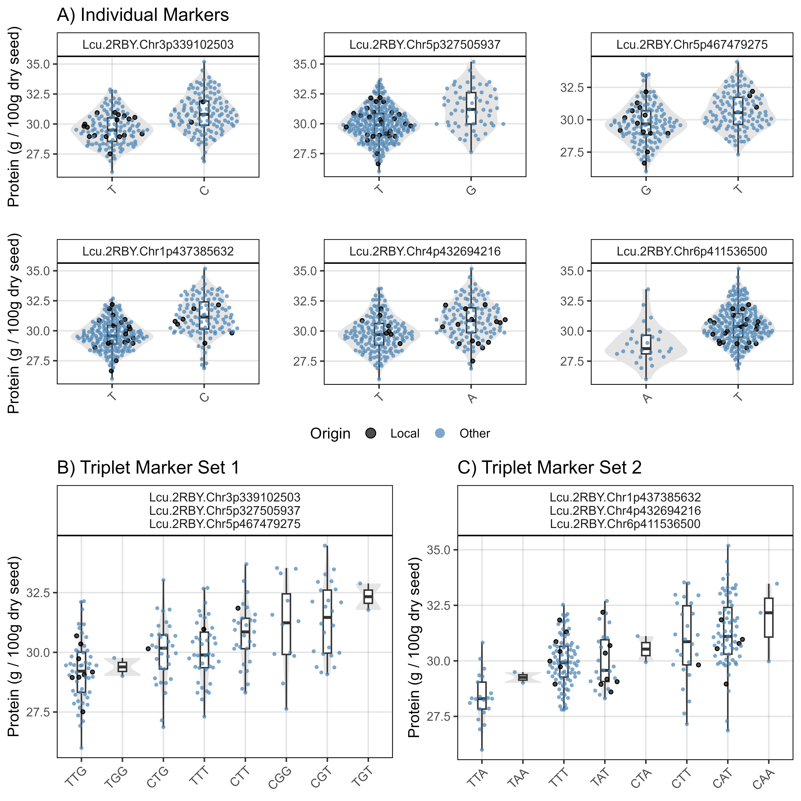

```{r}
# Prep data
myY_Su17 <- read.csv("Data/myY_NIRS_Su17.csv")
myY_Su16 <- read.csv("Data/myY_NIRS_Su16.csv")
myY_Ro16 <- read.csv("Data/myY_NIRS_Ro16.csv")
myY_Ro17 <- read.csv("Data/myY_NIRS_Ro17.csv")
#
# Create plotting function
ggMultiMarkers <- function (myG, myY, myTrait, myMarkers, points = T, myColor = "steelblue",
                            myWidth = 0.1, myTitle = "", myYlab = "") {
    # Prep data
    x1 <- myG %>% filter(rs %in% myMarkers) %>% 
      mutate(rs = factor(rs, levels = myMarkers)) %>% arrange(rs)
    for(i in 12:ncol(x1)) { if(sum(!grepl("G|C|A|T", x1[,i])) > 0) { x1[,i] <- NA } }
    x1 <- x1[,!is.na(x1[1,])]
    #
    myMLabs <- paste(myMarkers, collapse = "\n")
    #
    xx <- x1 %>% gather(Name, Allele, 12:ncol(.)) %>%
      group_by(Name) %>%
      summarise(Alleles = paste(Allele, collapse = ""))
    #
    myLDP <- read.csv("Data/myD_LDP.csv") %>% 
      mutate(Name = gsub(" ", "_", Name),
             Name = gsub("-", "\\.", Name),
             Name = plyr::mapvalues(Name, "3156.11_AGL", "X3156.11_AGL"))
    #
    xx <- xx %>% left_join(myY, by = "Name") %>% filter(!is.na(get(myTrait)))
    x2 <- xx %>% group_by(Alleles) %>% 
      summarise(Value = mean(get(myTrait), na.rm = T)) %>% 
      arrange(Value) 
    xx <- xx %>% mutate(Alleles = factor(Alleles, levels = x2$Alleles) ) %>%
      left_join(select(myLDP, Name, Origin), by = "Name") %>%
      mutate(Origin = ifelse(Origin %in% c("Canada","USA"), "Local", "Other"))
    #
    mp <- ggplot(xx, aes(x = Alleles, y = get(myTrait))) + 
      geom_violin(fill = "grey90", color = NA) + 
      geom_boxplot(width = myWidth, coef = 5) + 
      facet_grid(. ~ as.character(myMLabs)) +
      theme_AGL +
      theme(legend.position = "top",
            axis.text.x = element_text(angle = 45, hjust = 1)) + 
      labs(title = myTitle, y = myYlab, x = NULL)
    if(points == T) { 
      mp <- mp + 
        geom_quasirandom(aes(fill = Origin, color = Origin), pch = 21, size = 1) + 
        scale_fill_manual(values = alpha(c("black", myColor),0.7)) +
        scale_color_manual(values = c("black",alpha("white",0))) +
        guides(color = guide_legend(override.aes = list(size = 3)))
    }
    mp
}
# Plot
mp1 <- ggMultiMarkers(myG, myY_Su16, myTrait = "Protein_Su16", myMarkers = myMs[1], myColor = "steelblue",
                      myTitle = "A) Individual Markers", myYlab = "Protein (g / 100g dry seed)")
mp2 <- ggMultiMarkers(myG, myY_Su16, myTrait = "Protein_Su16", myMarkers = myMs[2], myColor = "steelblue")
mp3 <- ggMultiMarkers(myG, myY_Su16, myTrait = "Protein_Su16", myMarkers = myMs[3], myColor = "steelblue")
mp4 <- ggMultiMarkers(myG, myY_Su16, myTrait = "Protein_Su16", myMarkers = myMs[4], myColor = "steelblue",
                      myYlab = "Protein (g / 100g dry seed)")
mp5 <- ggMultiMarkers(myG, myY_Su16, myTrait = "Protein_Su16", myMarkers = myMs[5], myColor = "steelblue")
mp6 <- ggMultiMarkers(myG, myY_Su16, myTrait = "Protein_Su16", myMarkers = myMs[6], myColor = "steelblue")
mp1 <- ggarrange(mp1, mp2, mp3, mp4, mp5, mp6, ncol = 3, nrow = 2, 
                 common.legend = T, legend = "bottom")
#
mp2 <- ggMultiMarkers(myG, myY_Su16, myTrait = "Protein_Su16", 
                      myMarkers = myMs[c(1:3)], myWidth = 0.2, myColor = "steelblue",
                      myTitle = "B) Triplet Marker Set 1", myYlab = "Protein (g / 100g dry seed)")
mp3 <- ggMultiMarkers(myG, myY_Su16, myTrait = "Protein_Su16", 
                      myMarkers = myMs[c(4:6)], myWidth = 0.2, myColor = "steelblue",
                      myTitle = "C) Triplet Marker Set 2", myYlab = "Protein (g / 100g dry seed)")
mp2 <- ggarrange(mp2, mp3, ncol = 2, legend = "none")
#
mp <- ggarrange(mp1, mp2, ncol = 1, heights = c(1.3,1))
ggsave("Figure_05a.jpg", mp, width = 8, height = 8, bg = "white", dpi = 600)
```

Sutherland, Canada 2017

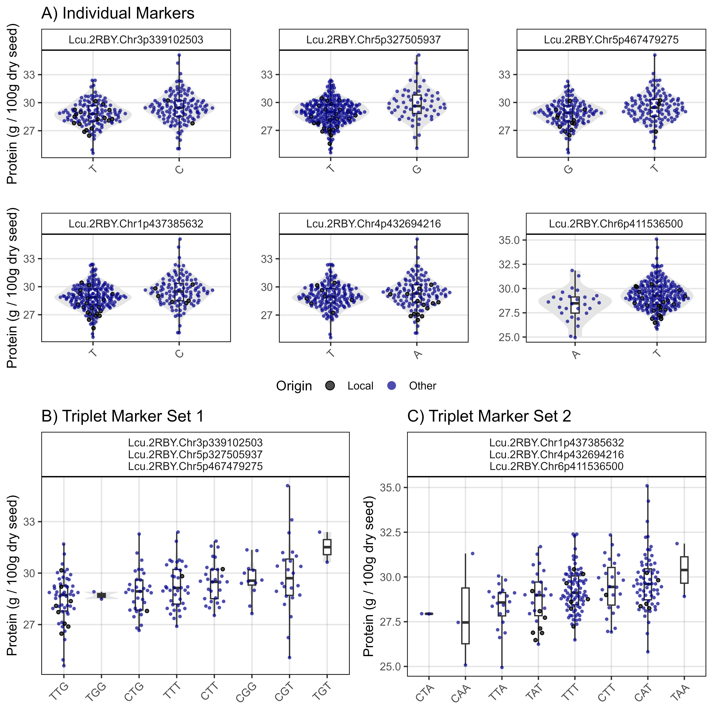

```{r}
#
mp1 <- ggMultiMarkers(myG, myY_Su17, myTrait = "Protein_Su17", myMarkers = myMs[1], myColor = "darkblue", 
                      myTitle = "A) Individual Markers", myYlab = "Protein (g / 100g dry seed)")
mp2 <- ggMultiMarkers(myG, myY_Su17, myTrait = "Protein_Su17", myMarkers = myMs[2], myColor = "darkblue")
mp3 <- ggMultiMarkers(myG, myY_Su17, myTrait = "Protein_Su17", myMarkers = myMs[3], myColor = "darkblue")
mp4 <- ggMultiMarkers(myG, myY_Su17, myTrait = "Protein_Su17", myMarkers = myMs[4], myColor = "darkblue", 
                      myYlab = "Protein (g / 100g dry seed)")
mp5 <- ggMultiMarkers(myG, myY_Su17, myTrait = "Protein_Su17", myMarkers = myMs[5], myColor = "darkblue")
mp6 <- ggMultiMarkers(myG, myY_Su17, myTrait = "Protein_Su17", myMarkers = myMs[6], myColor = "darkblue")
mp1 <- ggarrange(mp1, mp2, mp3, mp4, mp5, mp6, ncol = 3, nrow = 2, 
                 common.legend = T, legend = "bottom")
#
mp2 <- ggMultiMarkers(myG, myY_Su17, myTrait = "Protein_Su17", 
                      myMarkers = myMs[c(1:3)], myWidth = 0.2, myColor = "darkblue",
                      myTitle = "B) Triplet Marker Set 1", myYlab = "Protein (g / 100g dry seed)")
mp3 <- ggMultiMarkers(myG, myY_Su17, myTrait = "Protein_Su17", 
                      myMarkers = myMs[c(4:6)], myWidth = 0.2, myColor = "darkblue",
                      myTitle = "C) Triplet Marker Set 2", myYlab = "Protein (g / 100g dry seed)")
mp2 <- ggarrange(mp2, mp3, ncol = 2, legend = "none")
#
mp <- ggarrange(mp1, mp2, ncol = 1, heights = c(1.3,1))
ggsave("Figure_05b.jpg", mp, width = 8, height = 8, bg = "white", dpi = 600)
```

Rosthern, Canada 2016

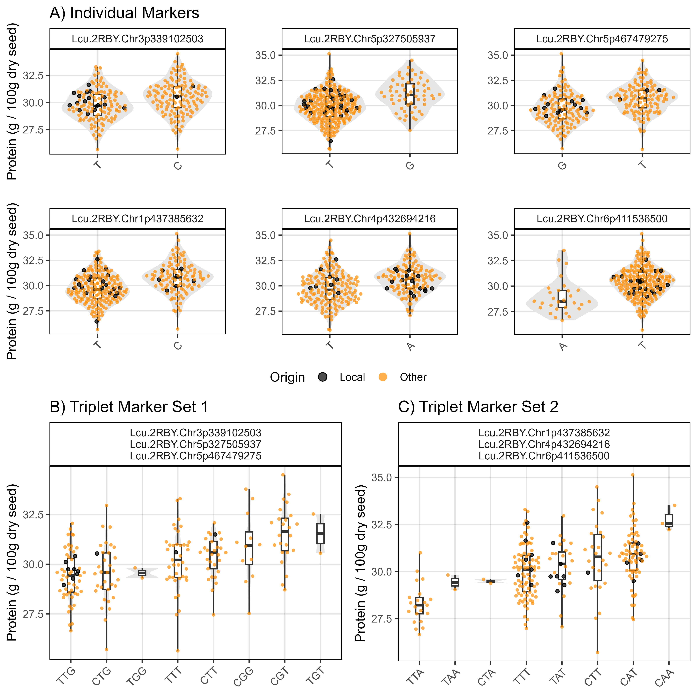

```{r}
#
mp1 <- ggMultiMarkers(myG, myY_Ro16, myTrait = "Protein_Ro16", myMarkers = myMs[1], myColor = "darkorange", 
                      myTitle = "A) Individual Markers", myYlab = "Protein (g / 100g dry seed)")
mp2 <- ggMultiMarkers(myG, myY_Ro16, myTrait = "Protein_Ro16", myMarkers = myMs[2], myColor = "darkorange")
mp3 <- ggMultiMarkers(myG, myY_Ro16, myTrait = "Protein_Ro16", myMarkers = myMs[3], myColor = "darkorange")
mp4 <- ggMultiMarkers(myG, myY_Ro16, myTrait = "Protein_Ro16", myMarkers = myMs[4], myColor = "darkorange", 
                      myYlab = "Protein (g / 100g dry seed)")
mp5 <- ggMultiMarkers(myG, myY_Ro16, myTrait = "Protein_Ro16", myMarkers = myMs[5], myColor = "darkorange")
mp6 <- ggMultiMarkers(myG, myY_Ro16, myTrait = "Protein_Ro16", myMarkers = myMs[6], myColor = "darkorange")
mp1 <- ggarrange(mp1, mp2, mp3, mp4, mp5, mp6, ncol = 3, nrow = 2, 
                 common.legend = T, legend = "bottom")
#
mp2 <- ggMultiMarkers(myG, myY_Ro16, myTrait = "Protein_Ro16", 
                      myMarkers = myMs[c(1:3)], myWidth = 0.2, myColor = "darkorange",
                      myTitle = "B) Triplet Marker Set 1", myYlab = "Protein (g / 100g dry seed)")
mp3 <- ggMultiMarkers(myG, myY_Ro16, myTrait = "Protein_Ro16", 
                      myMarkers = myMs[c(4:6)], myWidth = 0.2, myColor = "darkorange",
                      myTitle = "C) Triplet Marker Set 2", myYlab = "Protein (g / 100g dry seed)")
mp2 <- ggarrange(mp2, mp3, ncol = 2, legend = "none")
#
mp <- ggarrange(mp1, mp2, ncol = 1, heights = c(1.3,1))
ggsave("Figure_05c.jpg", mp, width = 8, height = 8, bg = "white", dpi = 600)
```

Rosthern, Canada 2017

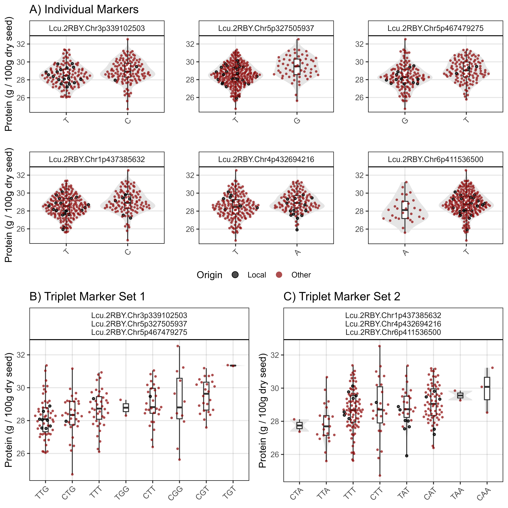

```{r}
#
mp1 <- ggMultiMarkers(myG, myY_Ro17, myTrait = "Protein_Ro17", myMarkers = myMs[1], myColor = "darkred", 
                      myTitle = "A) Individual Markers", myYlab = "Protein (g / 100g dry seed)")
mp2 <- ggMultiMarkers(myG, myY_Ro17, myTrait = "Protein_Ro17", myMarkers = myMs[2], myColor = "darkred")
mp3 <- ggMultiMarkers(myG, myY_Ro17, myTrait = "Protein_Ro17", myMarkers = myMs[3], myColor = "darkred")
mp4 <- ggMultiMarkers(myG, myY_Ro17, myTrait = "Protein_Ro17", myMarkers = myMs[4], myColor = "darkred", 
                      myYlab = "Protein (g / 100g dry seed)")
mp5 <- ggMultiMarkers(myG, myY_Ro17, myTrait = "Protein_Ro17", myMarkers = myMs[5], myColor = "darkred")
mp6 <- ggMultiMarkers(myG, myY_Ro17, myTrait = "Protein_Ro17", myMarkers = myMs[6], myColor = "darkred")
mp1 <- ggarrange(mp1, mp2, mp3, mp4, mp5, mp6, ncol = 3, nrow = 2, 
                 common.legend = T, legend = "bottom")
#
mp2 <- ggMultiMarkers(myG, myY_Ro17, myTrait = "Protein_Ro17", 
                      myMarkers = myMs[c(1:3)], myWidth = 0.2, myColor = "darkred",
                      myTitle = "B) Triplet Marker Set 1", myYlab = "Protein (g / 100g dry seed)")
mp3 <- ggMultiMarkers(myG, myY_Ro17, myTrait = "Protein_Ro17", 
                      myMarkers = myMs[c(4:6)], myWidth = 0.2, myColor = "darkred",
                      myTitle = "C) Triplet Marker Set 2", myYlab = "Protein (g / 100g dry seed)")
mp2 <- ggarrange(mp2, mp3, ncol = 2, legend = "none")
#
mp <- ggarrange(mp1, mp2, ncol = 1, heights = c(1.3,1))
ggsave("Figure_05d.jpg", mp, width = 8, height = 8, bg = "white", dpi = 600)
```

---

# Supplemental Figure 5 - MAS Markers


```{r}
# Prep data
xM <- read.csv("Data/MAS_Markers.csv")
# Create a plotting function
ggMASMarkers <- function(myExpt, myColor) {
  xx <- myG %>% filter(rs %in% xM$SNP) %>%
    mutate(rs = factor(rs, levels = xM$SNP))
  #
  for(i in 12:ncol(xx)) { xx[,i] <- ifelse(!grepl("G|C|A|T", xx[,i]), NA, xx[,i]) }
  #
  xx <- xx %>% gather(Name, Allele, 12:ncol(.)) 
  #
  myLDP <- read.csv("Data/myD_LDP.csv") %>% 
    mutate(Name = gsub(" ", "_", Name),
           Name = gsub("-", "\\.", Name),
           Name = plyr::mapvalues(Name, "3156.11_AGL", "X3156.11_AGL"))
  #
  xY <- d2 %>% filter(AminoAcid == "Protein", ExptShort == myExpt) %>% 
    select(Name, Value) %>%
    mutate(Name = gsub(" ", "_", Name),
           Name = gsub("-", "\\.", Name),
           Name = plyr::mapvalues(Name, "3156.11_AGL", "X3156.11_AGL"))
  xx <- xx %>% left_join(xY, by = "Name") %>% 
    mutate(Value = ifelse(is.na(Allele), NA, Value)) %>%
    left_join(select(myLDP, Name, Origin), by = "Name") %>%
    filter(!is.na(Allele))
  xc <- xx %>% filter(Origin %in% c("Canada","USA"))
  #
  ggplot(xx, aes(x = Allele, y = Value)) + 
    geom_violin(fill = myColor, color = NA, alpha = 0.7) + 
    geom_boxplot(width = 0.1, coef = 5, ) + 
    geom_quasirandom(data = xc, alpha = 0.7, size = 0.5) +
    facet_wrap(rs ~ ., scales = "free_x", ncol = 6) +
    theme_AGL +
    theme(legend.position = "bottom",
          axis.text.x = element_text(angle = 45, hjust = 1)) + 
    labs(title = myExpt, x = "Allele", y = "Protein (g / 100g dry seed)")
}
# Plot
mp <- ggMASMarkers(myExpt = "Su16", myColor = "steelblue")
ggsave("Supplemental_Figure_05a.jpg", mp, width = 14, height = 14, dpi = 600)
mp <- ggMASMarkers(myExpt = "Su17", myColor = "darkblue")
ggsave("Supplemental_Figure_05b.jpg", mp, width = 14, height = 14, dpi = 600)
mp <- ggMASMarkers(myExpt = "Ro16", myColor = "darkorange")
ggsave("Supplemental_Figure_05c.jpg", mp, width = 14, height = 14, dpi = 600)
mp <- ggMASMarkers(myExpt = "Ro17", myColor = "darkred")
ggsave("Supplemental_Figure_05d.jpg", mp, width = 14, height = 14, dpi = 600)
```

---

# Additional Figures

## Additional Figure 1 - Amino Acid Family by Expt

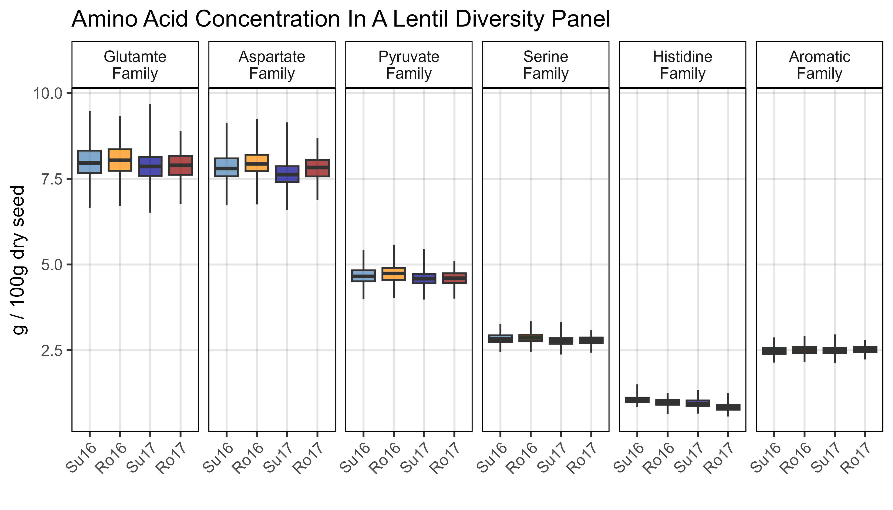

```{r}
# Prep data
myFams1 <- c("Family.Glutamate", "Family.Aspartate", "Family.Pyruvate", 
             "Family.Serine","Family.Histidine","Family.Aromatic")
myFams2 <- c("Glutamte Family", "Aspartate Family", "Pyruvate Family", 
             "Serine Family", "Histidine Family", "Aromatic Family")
xx <- d3 %>% filter(!grepl("Perc", AminoAcidFamily)) %>% 
  mutate(AminoAcidFamily = plyr::mapvalues(AminoAcidFamily, myFams1, myFams2))
# Plot
mp <- ggplot(xx, aes(x = ExptShort, y = Value, fill = Expt)) +
  geom_boxplot(alpha = 0.7, coef = 3.5) +
  scale_fill_manual(name = NULL, values = myCs_Expt) +
  facet_grid(. ~ AminoAcidFamily, labeller = label_wrap_gen(width = 10)) +
  theme_AGL +
  theme(legend.position = "none",
        axis.text.x = element_text(angle = 45, hjust = 1)) +
  labs(title = "Amino Acid Concentration In A Lentil Diversity Panel",
       y = "g / 100g dry seed", x = "")
ggsave("Additional/Additional_Figure_01.jpg", mp, width = 7, height = 4, dpi = 600)
```

---

## Additional Figure 2 - Proteins by Expt

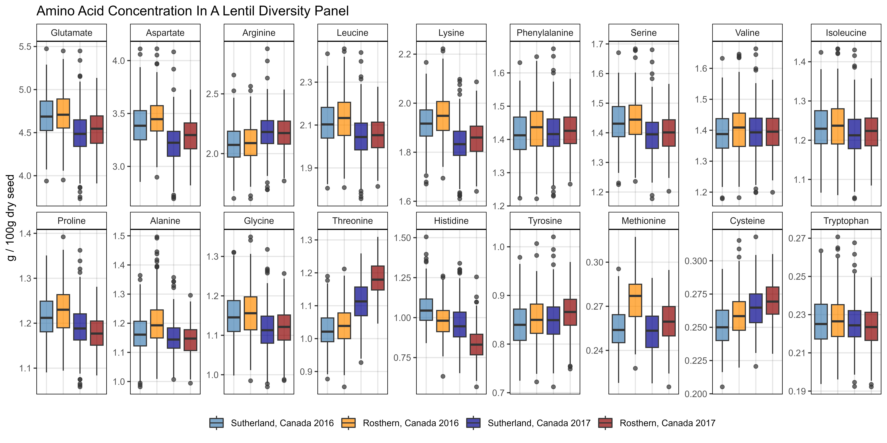

```{r}
# Prep data
xx <- d2 %>% filter(AminoAcid != "Protein")
# Plot
mp <- ggplot(xx, aes(x = Expt, y = Value, fill = Expt)) +
  geom_boxplot(alpha = 0.7) +
  facet_wrap(. ~ AminoAcid, scales = "free_y", ncol = 9) +
  scale_fill_manual(name = NULL, values = myCs_Expt) +
  theme_AGL +
  theme(legend.position = "bottom",
        axis.text.x = element_blank(),
        axis.ticks.x = element_blank()) +
  labs(title = "Amino Acid Concentration In A Lentil Diversity Panel", 
       y = "g / 100g dry seed", x = NULL)
ggsave("Additional/Additional_Figure_02.jpg", mp, width = 12, height = 6, dpi = 600)
```

---

## Additional Figure 3 - Cotyledon Color

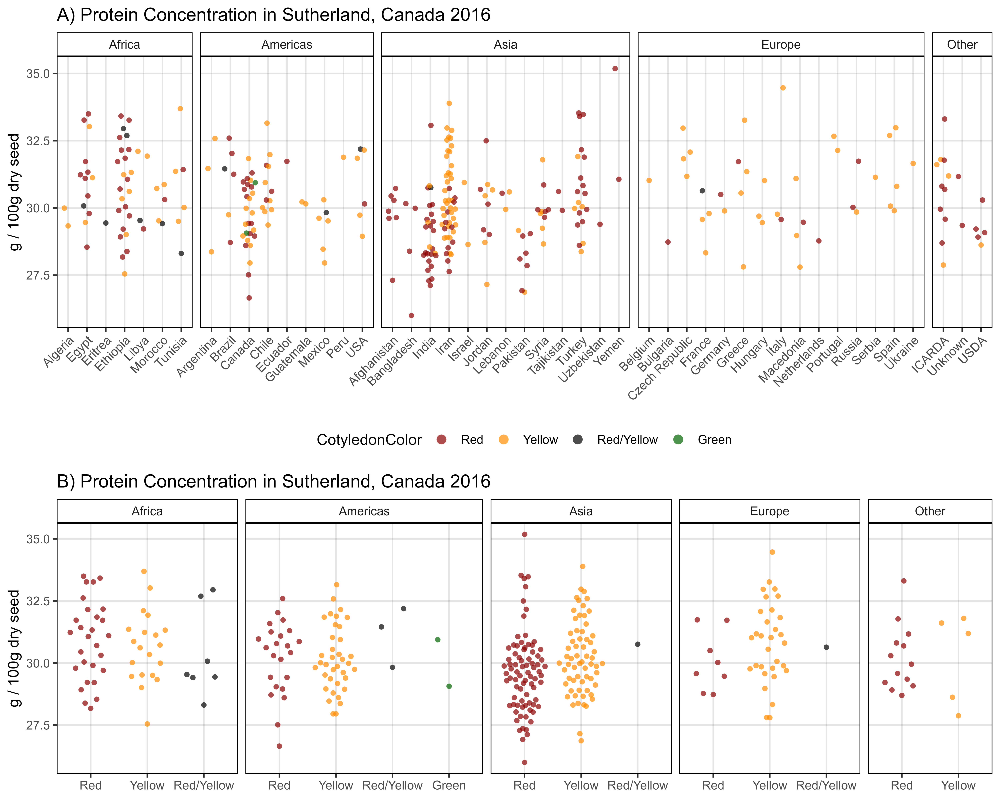

```{r}
# Prep data
myCots <- c("Red", "Yellow", "Red/Yellow", "Green")
xx <- d2 %>% filter(AminoAcid == "Protein") %>%
  left_join(myLDP, by = c("Entry", "Name")) %>%
  mutate(CotyledonColor = factor(CotyledonColor, levels = myCots))
# Plot
mp1 <- ggplot(xx %>% filter(ExptShort == "Su16"), 
              aes(x = Origin, y = Value, color = CotyledonColor)) +
  geom_quasirandom(alpha = 0.7, pch = 16) +
  facet_grid(. ~ Region, scales = "free_x", space = "free_x") +
  scale_color_manual(values = c("darkred","darkorange","black","darkgreen")) +
  theme_AGL +
  theme(axis.text.x = element_text(angle = 45, hjust = 1),
        legend.position = "bottom") +
  guides(color = guide_legend(override.aes = list(size = 3))) +
  labs(title = "A) Protein Concentration in Sutherland, Canada 2016", 
       x = NULL, y = "g / 100g dry seed")
mp2 <- ggplot(xx %>% filter(ExptShort == "Su16"), 
              aes(x = CotyledonColor, y = Value, color = CotyledonColor)) +
  geom_quasirandom(alpha = 0.7, pch = 16) +
  facet_grid(. ~ Region, scales = "free_x", space = "free_x") +
  scale_color_manual(values = c("darkred","darkorange","black","darkgreen")) +
  theme_AGL +
  theme(legend.position = "none") +
  labs(title = "B) Protein Concentration in Sutherland, Canada 2016", 
       x = NULL, y = "g / 100g dry seed")
mp <- ggarrange(mp1, mp2, ncol = 1, nrow = 2, heights = c(1.4,1))
ggsave("Additional/Additional_Figure_03.jpg", mp, width = 10, height = 8, dpi = 600)
```

---

## Additional Figure 4 - Size

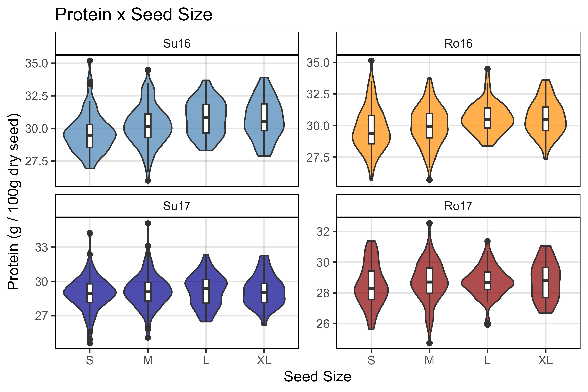

```{r}
# Prep data
x1 <- d2 %>% filter(AminoAcid == "Protein") %>% rename(Protein=Value)
x2 <- myLDP %>% select(Name, CotyledonColor, SeedMass1000.2017, Size, DTF_Cluster, Source)
xx <- left_join(x1, x2, by = "Name") %>%
  mutate(Size = factor(Size, levels = c("S","M","L","XL")))
# Plot
mp <- ggplot(xx, aes(x = Size, y = Protein)) +
  geom_violin(aes(fill = ExptShort), alpha = 0.7) + 
  geom_boxplot(width = 0.1) +
  scale_fill_manual(values = myCs_Expt) +
  facet_wrap(ExptShort ~ ., scales = "free_y", ncol = 2) +
  theme_AGL +
  theme(legend.position = "none") +
  labs(title = "Protein x Seed Size", 
       x = "Seed Size", y = "Protein (g / 100g dry seed)")
ggsave("Additional/Additional_Figure_04.jpg", mp, width = 6, height = 4, dpi = 600)
```

---

## Additional Figure 5 - Stability

> - `r shiny::icon("save")` [Additional/Pulses/lentils-quality-report.csv](Additional/Pulses/lentils-quality-report.csv)

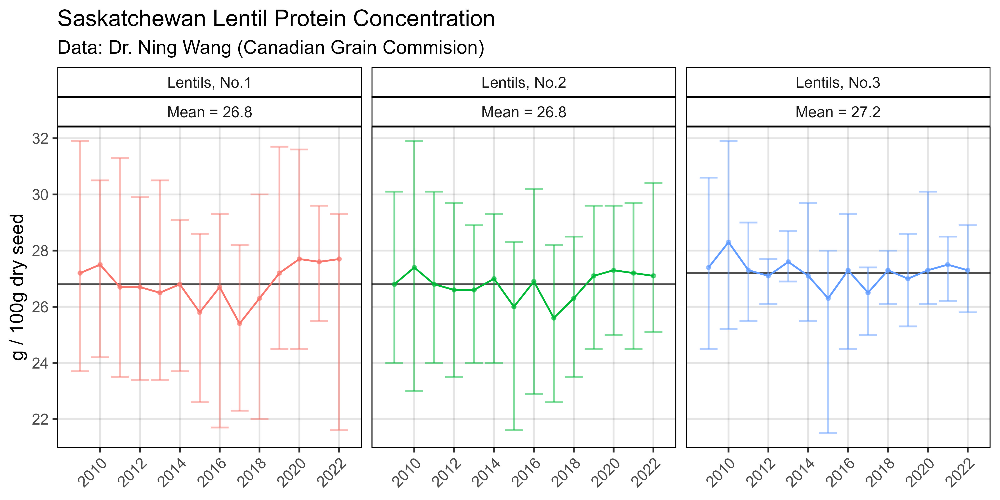

```{r}
# Prep data
xx <- read.csv("Additional/Pulses/lentils-quality-report.csv")
xm <- xx %>% group_by(Grade) %>% summarise(Avg = round(mean(Mean),1))
xx <- xx %>% left_join(xm, by = "Grade")
# Plot
mp <- ggplot(xx, aes(x = Year, y = Mean, color = Grade)) +
  geom_hline(aes(yintercept = Avg), alpha = 0.7) +
  geom_point(size = 0.75, alpha = 0.6) + geom_line() +
  geom_errorbar(aes(ymin = Min, ymax = Max), alpha = 0.5) +
  facet_grid(. ~ Grade + paste("Mean =", Avg)) +
  scale_x_continuous(breaks = seq(2010,2022, by = 2)) +
  scale_y_continuous(breaks = seq(22,32, by = 2), minor_breaks = 22:32) +
  theme_AGL +
  theme(legend.position = "none",
        axis.text.x = element_text(angle = 45, hjust = 1)) +
  labs(title = "Saskatchewan Lentil Protein Concentration", 
       subtitle = "Data: Dr. Ning Wang (Canadian Grain Commision)", 
       y = "g / 100g dry seed", x = NULL)
ggsave("Additional/Additional_Figure_05.jpg", mp, width = 8, height = 4, dpi = 600)
```

---

## Additional Figure 6 - Pulses

> - `r shiny::icon("save")` [Additional/Pulses/pulses-quality.xlsx](Additional/Pulses/PulsesAminoAcids.xlsx)

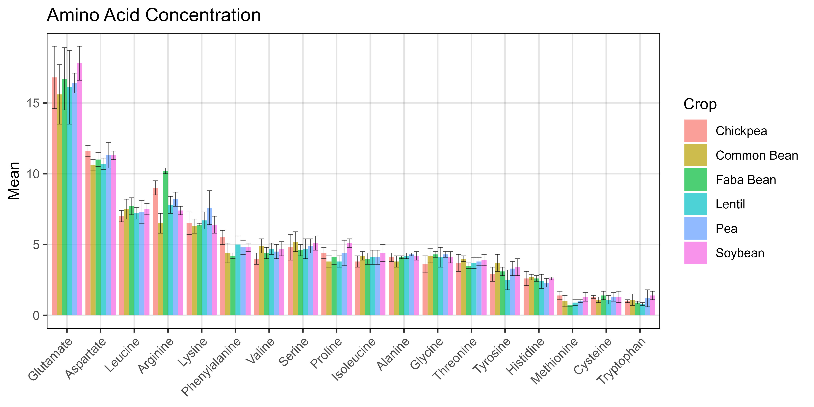

```{r}
# Prep data
x1 <- readxl::read_xlsx("Additional/Pulses/pulses-quality.xlsx", "mean") %>%
  gather(Crop, Mean, 2:ncol(.))
x2 <- readxl::read_xlsx("Additional/Pulses/pulses-quality.xlsx", "sd") %>%
  gather(Crop, SD, 2:ncol(.))
xx <- left_join(x1, x2, by = c("Amino Acid","Crop")) %>%
  mutate(`Amino Acid` = factor(`Amino Acid`, levels = myPs))
# Plot
mp <- ggplot(xx, aes(x = `Amino Acid`, y = Mean, fill = Crop)) +
  geom_col(position = "dodge", alpha = 0.7) +
  geom_errorbar(aes(ymin = Mean - SD, ymax = Mean + SD), 
                position = "dodge", linewidth = 0.2, alpha = 0.7) +
  theme_AGL +
  theme(axis.text.x = element_text(angle = 45, hjust = 1)) +
  labs(title = "Amino Acid Concentration", x = NULL)
ggsave("Additional/Additional_Figure_06.jpg", mp, width = 8, height = 4, dpi = 600)
```

---

## Additional Figure 7 - Johnson et al. QTLs

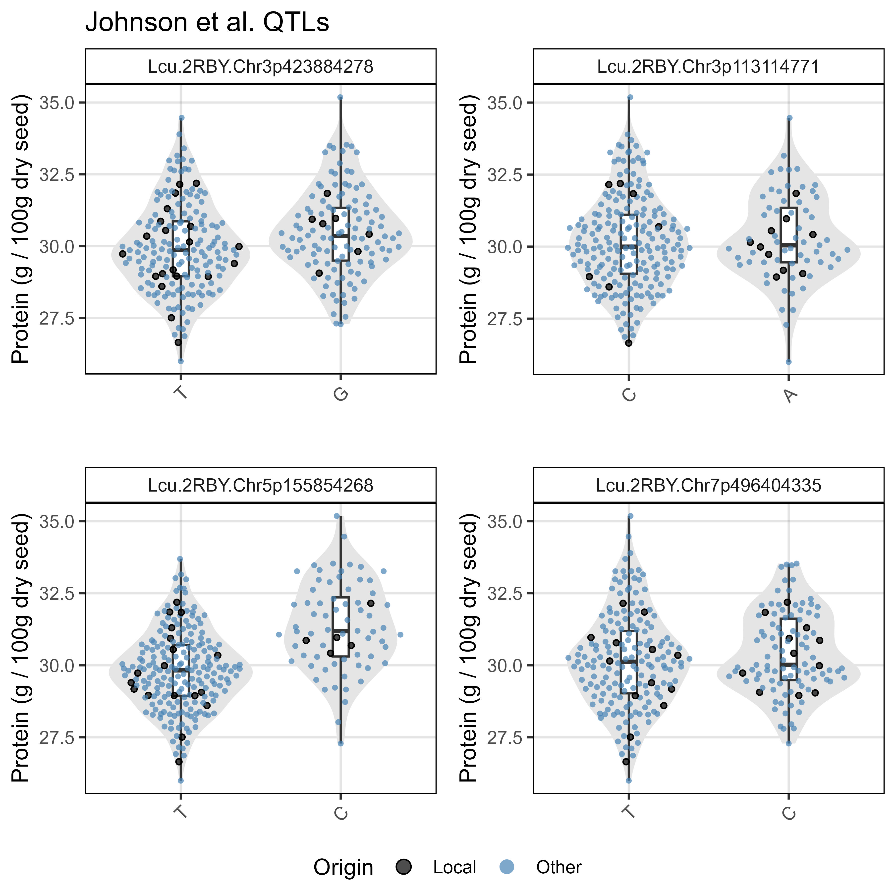

```{r}
# Prep data
myM2 <- c("Lcu.2RBY.Chr3p423884278","Lcu.2RBY.Chr3p113114771",
          "Lcu.2RBY.Chr5p155854268", "Lcu.2RBY.Chr7p496404335")
# Plot
mp1 <- ggMultiMarkers(myG, myY_Su16, myTrait = "Protein_Su16",
               myMarkers = myM2[1], myColor = "steelblue", 
               myYlab = "Protein (g / 100g dry seed)",
               myTitle = "Johnson et al. QTLs")
mp2 <- ggMultiMarkers(myG, myY_Su16, myTrait = "Protein_Su16",
               myMarkers = myM2[2], myColor = "steelblue", myTitle = "",
               myYlab = "Protein (g / 100g dry seed)")
mp3 <- ggMultiMarkers(myG, myY_Su16, myTrait = "Protein_Su16",
               myMarkers = myM2[3], myColor = "steelblue", myTitle = "", 
               myYlab = "Protein (g / 100g dry seed)")
mp4 <- ggMultiMarkers(myG, myY_Su16, myTrait = "Protein_Su16",
               myMarkers = myM2[4], myColor = "steelblue", myTitle = "", 
               myYlab = "Protein (g / 100g dry seed)")
mp <- ggarrange(mp1, mp2, mp3, mp4, ncol = 2, nrow = 2, 
                
                common.legend = T, legend = "bottom")
ggsave("Additional/Additional_Figure_07.jpg", mp, 
       width = 6, height = 6, dpi = 600, bg = "white")
```

---

&copy; Derek Michael Wright
