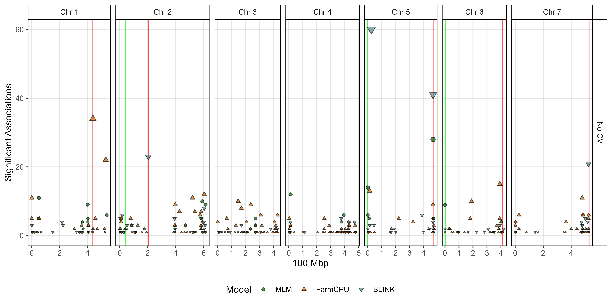
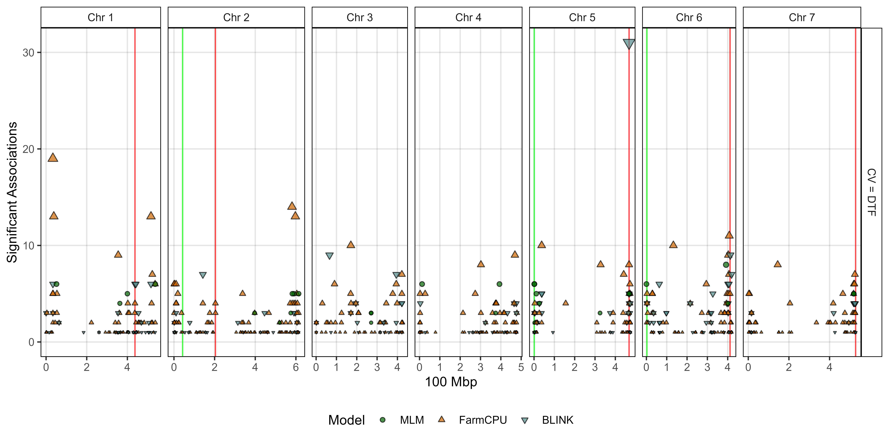
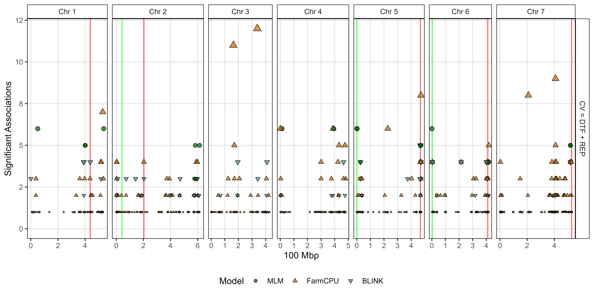
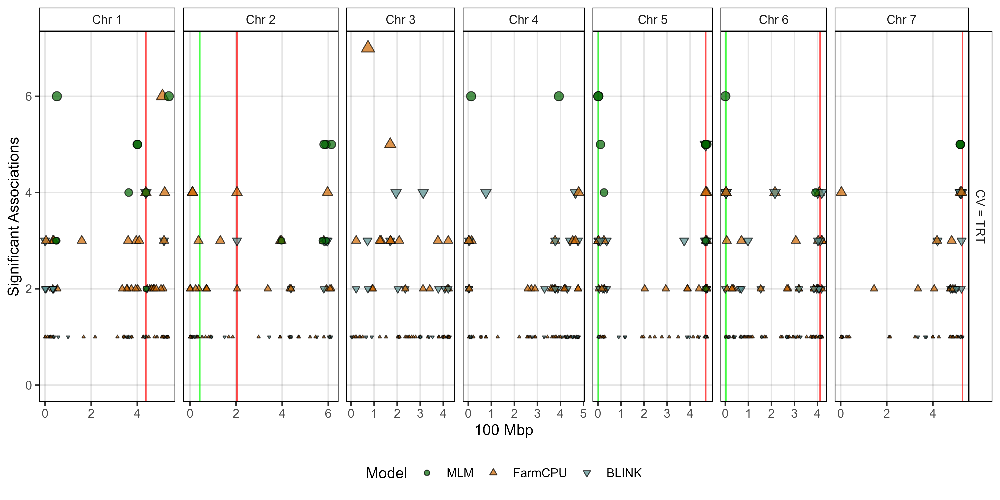
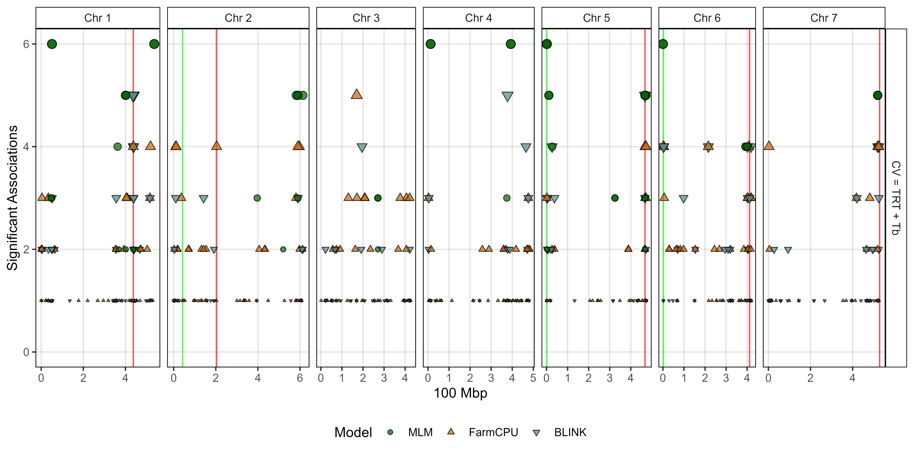
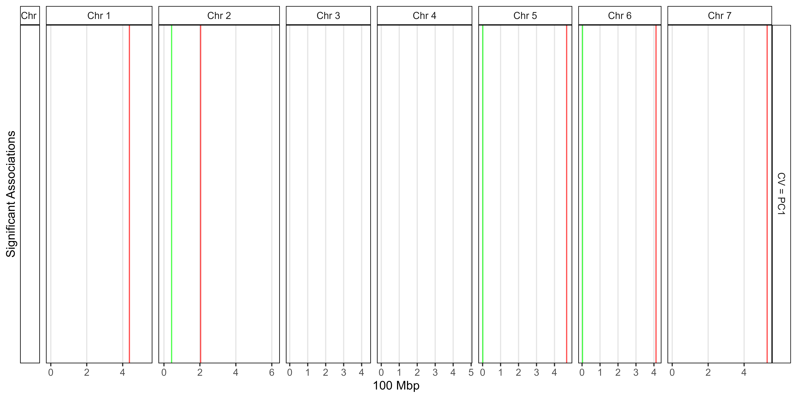

```{r setup, include=FALSE}
knitr::opts_chunk$set(eval = F, echo = T, message = F, warning = F, 
                      comment = NA, out.width = "100%")
```

---

# Introduction

This vignette contains the `R` code and analysis done for the paper: 

`r shiny::icon("newspaper")` [Derek Wright, Jiayi Hang, James D House & Kirstin E Bett. **Lentil Protein**. *unpublished*](https://github.com/derekmichaelwright/AGILE_LDP_Protein) 

`r shiny::icon("github")` https://github.com/derekmichaelwright/AGILE_LDP_Protein

`r shiny::icon("newspaper")` [Jiayi Hang, Da Shi, Jason Neufeld, Kirstin E Bett, & James D House. **Prediction of protein and amino acid contents in whole and ground lentils using near-infrared reflectance spectroscopy**. *LWT*, (**2022**) 165: 113669. doi.org/10.1016/j.lwt.2022.113669)](https://doi.org/10.1016/j.lwt.2022.113669)

which is follow-up to:

`r shiny::icon("newspaper")` [Derek M Wright, Sandesh Neupane, Taryn Heidecker, Teketel A Haile, Clarice J Coyne, Rebecca J McGee, Sripada Udupa, Fatima Henkrar, Eleonora Barilli, Diego Rubiales, Tania Gioia, Giuseppina Logozzo, Stefania Marzario, Reena Mehra, Ashutosh Sarker, Rajeev Dhakal, Babul Anwar, Debashish Sarker, Albert Vandenberg, and Kirstin E. Bett. **Understanding photothermal interactions can help expand production range and increase genetic diversity of lentil (*Lens culinaris* Medik.)**. *Plants, People, Planet*. (**2020**) 00:1-11. doi.org/10.1002/ppp3.10158](https://doi.org/10.1002/ppp3.10158)

`r shiny::icon("github")` https://github.com/derekmichaelwright/AGILE_LDP_Phenology

---

This work done as part of the AGILE  and P2IRC projects at the University of Saskatchewan.


---

# Load Libraries

```{r}
library(tidyverse)
library(ggbeeswarm)
library(ggpubr)
library(GGally)
library(plotly)       # ggplotly()
library(htmlwidgets)  # saveWidget()
library(FactoMineR)   # PCA()
#
theme_AGL <- theme_bw() + 
  theme(strip.background   = element_rect(colour = "black", fill = NA, size = 0.5),
        panel.background   = element_rect(colour = "black", fill = NA, size = 0.5),
        panel.border       = element_rect(colour = "black", size = 0.5),
        panel.grid         = element_line(color  = alpha("black", 0.1), size = 0.5),
        panel.grid.minor.x = element_blank(), 
        panel.grid.minor.y = element_blank())
```

`r shiny::icon("save")` [myY_Protein.csv](myY_Protein.csv)

`r shiny::icon("save")` [myLDP.csv](myLDP.csv)

`r shiny::icon("save")` [myG_LDP.zip](myG_LDP.zip)

`r shiny::icon("save")` [myEnvData.csv](myEnvData.csv)

`r shiny::icon("save")` [myG_Countries.csv](myG_Countries.csv)

```{r eval = F, echo = F}
#
x1 <- agiler::AGILE_Seed %>% 
  select(Entry, Name, CotyledonColor, Size, SeedMass1000.2016, SeedMass1000.2017)
#
x2 <- read.csv("https://raw.githubusercontent.com/derekmichaelwright/AGILE_LDP_Phenology/master/data/data_pca_results.csv") %>% 
  select(Entry, Name, Origin, Region, DTF_Cluster=Cluster) %>%
  mutate(Region = ifelse(is.na(Region), "Other", Region))
#
myEs1 <- c("Sutherland, Canada 2016", "Rosthern, Canada 2016",
           "Sutherland, Canada 2017", "Rosthern, Canada 2017")
myEs2 <- c("Su16", "Ro16", "Su17", "Ro17")
x3 <- read.csv("https://raw.githubusercontent.com/derekmichaelwright/AGILE_LDP_Phenology/master/data/data_raw.csv") %>% 
  filter(Expt %in% myEs1) %>%
  mutate(Expt = plyr::mapvalues(Expt, myEs1, myEs2),
         REP = DTM - DTF2) %>%
  group_by(Entry, Name, Expt) %>%
  summarise(DTE = round(mean(DTE, na.rm = T),1),
            DTF = round(mean(DTF, na.rm = T),1),
            DTM = round(mean(DTM, na.rm = T),1),
            REP = round(mean(REP, na.rm = T),1)) %>%
  gather(Trait, Value, DTE, DTF, DTM, REP) %>%
  mutate(Trait = paste(Trait, Expt, sep = "_")) %>%
  select(-Expt) %>%
  spread(Trait, Value)
#
x4 <- read.csv("https://raw.githubusercontent.com/derekmichaelwright/AGILE_LDP_Phenology/master/data/data_ldp.csv") %>% 
  select(Entry, Name, Source, Lat, Lon)
#
x5 <- read.csv("https://raw.githubusercontent.com/derekmichaelwright/AGILE_LDP_Phenology/master/data/data_tb_pc.csv") %>%
  filter(Expt %in% myEs1) %>%
  select(Entry, Name, Expt, Tb, Pc) %>%
  mutate(Expt = plyr::mapvalues(Expt, myEs1, myEs2)) %>%
  gather(Trait, Value, Tb, Pc) %>%
  mutate(Trait = paste(Trait, Expt, sep = "_")) %>%
  select(-Expt) %>%
  spread(Trait, Value) %>%
  mutate(Pc_Ro16 = round(Pc_Ro16, 1), Pc_Ro17 = round(Pc_Ro17),
         Pc_Su16 = round(Pc_Su16, 1), Pc_Su17 = round(Pc_Su17),
         Tb_Ro16 = round(Tb_Ro16, 1), Tb_Ro17 = round(Tb_Ro17),
         Tb_Su16 = round(Tb_Su16, 1), Tb_Su17 = round(Tb_Su17) )
#
xx <- left_join(x1, x2, by = c("Entry", "Name")) %>%
  left_join(x3, by = c("Entry", "Name")) %>%
  left_join(x4, by = c("Entry", "Name")) %>%
  left_join(x5, by = c("Entry", "Name")) %>% 
  select(Entry, Name, Source, Lat, Lon, Origin, Region, DTF_Cluster, everything())
write.csv(xx, "myLDP.csv", row.names = F)
#
#
xx <- read.csv("https://raw.githubusercontent.com/derekmichaelwright/AGILE_LDP_Phenology/master/data/data_env.csv") %>%
  select(Expt, Date, DAP=DaysAfterPlanting, Temp=Temp_mean)
write.csv(xx, "myEnvData.csv", row.names = F)
#
xx <- read.csv("https://raw.githubusercontent.com/derekmichaelwright/AGILE_LDP_Phenology/master/data/data_countries.csv")
write.csv(xx, "myCountries.csv", row.names = F)
```

---

# Data Preparation

```{r}
# Prep data
myPs <- c("Protein", "Glutamic.acid", "Aspartic.acid", "Leucine",
          "Arginine", "Lysine", "Phenylalanine", "Valine", "Serine",
          "Proline", "Isoleucine", "Alanine", "Glycine", "Threonine", 
          "Tyrosine", "Histidine", "Methionine", "Cysteine", "Tryptophan")
myEs1 <- c("Sutherland, Canada 2016", "Rosthern, Canada 2016",
           "Sutherland, Canada 2017", "Rosthern, Canada 2017")
myEs2 <- c("Su16", "Ro16", "Su17", "Ro17")
myC_Expt <- c("steelblue", "darkorange", "darkblue", "darkred")
myC_Region <- c("darkred", "darkgreen", "darkorange", "darkblue", "steelblue")
myC_Clusters <- c("red4", "darkorange3", "blue2", "deeppink3", 
                      "steelblue", "darkorchid4", "darkslategray", "chartreuse4")
#
dd <- read.csv("myY_Protein.csv") %>% 
  select(-Sample.Name..1st..text., -Rep, -Plot) %>%
  rename(Year=Planting.Date..date.) %>%
  gather(Protein, Value, 5:ncol(.)) %>%
  mutate(Protein = gsub("..1st....", "", Protein),
         Protein = factor(Protein, levels = myPs),
         Expt = paste(Location, Year),
         ExptShort = plyr::mapvalues(Expt, myEs1, myEs2),
         Value = round(Value, 4))
#
myLDP <- read.csv("myLDP.csv")
myEnvData <- read.csv("myEnvData.csv") %>%
  mutate(Expt = plyr::mapvalues(Expt, myEs1, myEs2))
myCountries <- read.csv("myCountries.csv")
```

## Thermal Time

```{r}
# Calulate TFT
for(i in 1:nrow(myLDP)) {
  # Su16
  xi <- myEnvData %>% filter(Expt == "Su16", DAP >= myLDP$DTE_Su16[i], DAP <= myLDP$DTF_Su16[i])
  myLDP$TFT_0_Su16[i] <- round(sum(xi$Temp),1)
  xi <- myEnvData %>% filter(Expt == "Su16", DAP >= myLDP$DTE_Su16[i], DAP <= myLDP$DTF_Su16[i])
  myLDP$TFT_Tb_Su16[i] <- round(sum(xi$Temp - myLDP$Tb_Su16[i]),1)
  # Su17
  xi <- myEnvData %>% filter(Expt == "Su17", DAP >= myLDP$DTE_Su17[i], DAP <= myLDP$DTF_Su17[i])
  myLDP$TFT_0_Su17[i] <- round(sum(xi$Temp),1)
  xi <- myEnvData %>% filter(Expt == "Su17", DAP >= myLDP$DTE_Su17[i], DAP <= myLDP$DTF_Su17[i])
  myLDP$TFT_Tb_Su17[i] <- round(sum(xi$Temp - myLDP$Tb_Su17[i]),1)
  # Ro16
  xi <- myEnvData %>% filter(Expt == "Ro16", DAP >= myLDP$DTE_Ro16[i], DAP <= myLDP$DTF_Ro16[i])
  myLDP$TFT_0_Ro16[i] <- round(sum(xi$Temp),1)
  xi <- myEnvData %>% filter(Expt == "Ro16", DAP >= myLDP$DTE_Ro16[i], DAP <= myLDP$DTF_Ro16[i])
  myLDP$TFT_Tb_Ro16[i] <- round(sum(xi$Temp - myLDP$Tb_Ro16[i]),1)
  # Ro17
  xi <- myEnvData %>% filter(Expt == "Ro17", DAP >= myLDP$DTE_Ro17[i], DAP <= myLDP$DTF_Ro17[i])
  myLDP$TFT_0_Ro17[i] <- round(sum(xi$Temp),1)
  xi <- myEnvData %>% filter(Expt == "Ro17", DAP >= myLDP$DTE_Ro17[i], DAP <= myLDP$DTF_Ro17[i])
  myLDP$TFT_Tb_Ro17[i] <- round(sum(xi$Temp - myLDP$Tb_Ro17[i]),1)
}
# Calulate TRT
for(i in 1:nrow(myLDP)) {
  # Su16
  xi <- myEnvData %>% filter(Expt == "Su16", DAP >= myLDP$DTF_Su16[i], DAP <= myLDP$DTM_Su16[i])
  myLDP$TRT_0_Su16[i] <- round(sum(xi$Temp),1)
  xi <- myEnvData %>% filter(Expt == "Su16", DAP >= myLDP$DTF_Su16[i], DAP <= myLDP$DTM_Su16[i])
  myLDP$TRT_Tb_Su16[i] <- round(sum(xi$Temp - myLDP$Tb_Su16[i]),1)
  # Su17
  xi <- myEnvData %>% filter(Expt == "Su17", DAP >= myLDP$DTF_Su17[i], DAP <= myLDP$DTM_Su17[i])
  myLDP$TRT_0_Su17[i] <- round(sum(xi$Temp),1)
  xi <- myEnvData %>% filter(Expt == "Su17", DAP >= myLDP$DTF_Su17[i], DAP <= myLDP$DTM_Su17[i])
  myLDP$TRT_Tb_Su17[i] <- round(sum(xi$Temp - myLDP$Tb_Su17[i]),1)
  # Ro16
  xi <- myEnvData %>% filter(Expt == "Ro16", DAP >= myLDP$DTF_Ro16[i], DAP <= myLDP$DTM_Ro16[i])
  myLDP$TRT_0_Ro16[i] <- round(sum(xi$Temp),1)
  xi <- myEnvData %>% filter(Expt == "Ro16", DAP >= myLDP$DTF_Ro16[i], DAP <= myLDP$DTM_Ro16[i])
  myLDP$TRT_Tb_Ro16[i] <- round(sum(xi$Temp - myLDP$Tb_Ro16[i]),1)
  # Ro17
  xi <- myEnvData %>% filter(Expt == "Ro17", DAP >= myLDP$DTF_Ro17[i], DAP <= myLDP$DTM_Ro17[i])
  myLDP$TRT_0_Ro17[i] <- round(sum(xi$Temp),1)
  xi <- myEnvData %>% filter(Expt == "Ro17", DAP >= myLDP$DTF_Ro17[i], DAP <= myLDP$DTM_Ro17[i])
  myLDP$TRT_Tb_Ro17[i] <- round(sum(xi$Temp - myLDP$Tb_Ro17[i]),1)
}
```

---

# Figures 1

## Figure_1_01 - Proteins


```{r}
# Prep data
xx <- dd %>% filter(Protein != "Protein")
# Plot
mp <- ggplot(xx, aes(x = Protein, y = Value, fill = Expt)) +
  geom_boxplot(alpha = 0.7, coef = 5) +
  scale_fill_manual(name = NULL, values = myC_Expt) +
  theme_AGL +
  theme(legend.position = "bottom", 
        axis.text.x = element_text(angle = 45, hjust = 1)) +
  labs(title = "Seed Protein Percent in the Lentil Diversity Panel", 
       y = NULL, x = NULL)
ggsave("Figure_1_01.png", mp, width = 12, height = 6, dpi = 600)
```

---

## Figure_1_02 - Proteins by Expt


```{r}
# Prep data
xx <- dd %>% filter(Protein != "Protein")
# Plot
mp <- ggplot(xx, aes(x = Expt, y = Value, fill = Expt)) +
  geom_boxplot(alpha = 0.7) +
  facet_wrap(. ~ Protein, scales = "free_y", ncol = 9) +
  scale_fill_manual(name = NULL, values = myC_Expt) +
  theme_AGL +
  theme(legend.position = "bottom",
        axis.text.x = element_blank(),
        axis.ticks.x = element_blank()) +
  labs(title = "Seed Protein Percent in the Lentil Diversity Panel", 
       y = NULL, x = NULL)
ggsave("Figure_1_02.png", mp, width = 12, height = 6, dpi = 600)
```

---

# Figures 2

## Figure_2_01 - Seed Size x Protein


```{r}
# Prep data
xx <- dd %>% filter(Protein == "Protein") %>%
  left_join(myLDP, by = c("Entry","Name"))
# Plot
mp <- ggplot(xx, aes(x = SeedMass1000.2017, y = Value, color = Region)) +
  geom_point(alpha = 0.7) +
  stat_smooth(geom = "line", method = "lm", se = F, 
              color = "black", alpha = 0.7, size = 1) +
  facet_grid(ExptShort ~ Region, scale = "free_y") +
  theme_AGL + 
  theme(legend.position = "none") +
  labs(title = "Seed Protein Percent in the Lentil Diversity Panel", 
       y = "Percent", x = "Thousand Seed Mass")
ggsave("Figure_2_01.png", mp, width = 10, height = 7)
```

---

## Figure_2_02 - Seed Size x Amino Acids


```{r}
# Prep data
xx <- dd %>% filter(ExptShort == "Su17", Protein != "Protein") %>%
  left_join(myLDP, by = c("Entry","Name")) %>%
  select(Name, Region, SeedMass1000.2017, Protein, Value) 
# Plot
mp <- ggplot(xx, aes(x = SeedMass1000.2017, y = Value, color = Region)) +
  geom_point(alpha = 0.3) +
  stat_smooth(geom = "line", method = "lm", se = F, 
              alpha = 0.9, size = 1) +
  facet_wrap(Protein ~ ., scale = "free_y", ncol = 6) +
  theme_AGL + 
  theme(legend.position = "bottom") +
  labs(title = "Seed Protein Percent in the Lentil Diversity Panel",
       y = "Percent", x = "Thousand Seed Mass")
ggsave("Figure_2_02.png", mp, width = 14, height = 7)
```

---

## Figure_2_03 - Canada


```{r}
# Prep data
xx <- dd %>% filter( Protein == "Protein") %>%
  left_join(myLDP, by = c("Entry","Name")) %>%
  filter(Origin == "Canada")
# Plot
mp <- ggplot(xx, aes(x = SeedMass1000.2017, y = Value, color = CotyledonColor)) +
  geom_point(alpha = 0.7) +
  stat_smooth(geom = "line", method = "lm", se = F, 
              color = "black", alpha = 0.7, size = 1) +
  facet_grid(. ~ ExptShort, scale = "free_y") +
  scale_color_manual(values = c("darkgreen","darkred","darkorange")) +
  theme_AGL + 
  theme(legend.position = "bottom") +
  labs(title = "Origin = Canada", y = "Seed Percent Protein", x = "Thousand Seed Mass")
ggsave("Figure_2_03.png", mp, width = 6, height = 3)
```

---

## Figure_2_04 - India


```{r}
# Prep data
xx <- dd %>% filter( Protein == "Protein") %>%
  left_join(myLDP, by = c("Entry","Name")) %>%
  filter(Origin == "India")
# Plot
mp <- ggplot(xx, aes(x = SeedMass1000.2017, y = Value, color = CotyledonColor)) +
  geom_point(alpha = 0.7) +
  stat_smooth(geom = "line", method = "lm", se = F, 
              color = "black", alpha = 0.7, size = 1) +
  facet_grid(. ~ ExptShort, scale = "free_y") +
  scale_color_manual(values = c("darkred","darkgreen","darkorange")) +
  theme_AGL + 
  theme(legend.position = "bottom") +
  labs(title = "Origin = India", 
       y = "Seed Percent Protein", x = "Thousand Seed Mass")
ggsave("Figure_2_04.png", mp, width = 6, height = 3)
```

---

## Figure_2_05 - Cotyledon Color


```{r}
# Prep data
xx <- dd %>% filter( Protein == "Protein") %>%
  left_join(myLDP, by = c("Entry","Name")) %>%
  filter(CotyledonColor %in% c("Red","Yellow"))
# Plot
mp <- ggplot(xx, aes(x = SeedMass1000.2017, y = Value, color = CotyledonColor)) +
  geom_point(alpha = 0.7) +
  stat_smooth(geom = "line", method = "lm", se = F, 
              color = "black", alpha = 0.7, size = 1) +
  facet_grid(CotyledonColor ~ ExptShort, scale = "free_y") +
  scale_color_manual(values = c("darkred","darkorange")) +
  theme_AGL + 
  theme(legend.position = "none") +
  labs(y = "Seed Percent Protein", x = "Thousand Seed Mass")
ggsave("Figure_2_05.png", mp, width = 6, height = 3.5)
```

---

## Figure_2_06 - Protein x size


```{r}
# Prep data
xx <- dd %>% filter( Protein == "Protein") %>%
  left_join(myLDP, by = c("Entry","Name")) %>%
  filter(!is.na(Size)) %>%
  mutate(`Seed Size` = factor(Size, levels = c("S", "M", "L", "XL")))
# Plot
mp <- ggplot(xx, aes(x = `Seed Size`, y = Value, fill = `Seed Size`)) +
  geom_violin(alpha = 0.7) + 
  geom_boxplot(width = 0.2, fill = "white") +
  facet_grid(. ~ ExptShort, scale = "free_y") +
  theme_AGL +
  labs(y = "Protein")
ggsave("Figure_2_06.png", mp, width = 10, height = 4)
```

---

# Figures 3

## Figure_3_01 - Protein x DTF


```{r}
# Prep data
xx <- dd %>% filter( Protein == "Protein") %>%
  left_join(myLDP, by = c("Entry","Name")) 
# Plot
mp <- ggplot(xx, aes(x = DTF_Su17, y = Value, color = Region)) +
  geom_point() +
  stat_smooth(geom = "line", method = "lm", se = F, 
              color = "black", alpha = 0.7, size = 1) +
  facet_grid(ExptShort ~ Region, scale = "free_y") +
  theme_AGL +
  labs(y = "Protein")
ggsave("Figure_3_01.png", mp, width = 10, height = 6)
```

---

## Figure_3_02 - Protein x REP


```{r}
# Prep data
xx <- dd %>% filter( Protein == "Protein") %>%
  left_join(myLDP, by = c("Entry","Name")) 
# Plot
mp <- ggplot(xx, aes(x = REP_Su17, y = Value, color = Region)) +
  geom_point() +
  stat_smooth(geom = "line", method = "lm", se = F, 
              color = "black", alpha = 0.7, size = 1) +
  facet_grid(ExptShort ~ Region, scale = "free_y") +
  theme_AGL +
  labs(y = "Protein")
ggsave("Figure_3_02.png", mp, width = 10, height = 6)
```

---

## Figure_3_03 - DTF Canada


```{r}
# Prep data
xx <- dd %>% filter( Protein == "Protein") %>%
  left_join(myLDP, by = c("Entry","Name")) %>%
  filter(Origin == "Canada", ExptShort == "Su17")
# Plot
mp <- ggplot(xx, aes(x = SeedMass1000.2017, y = DTF_Su17, color = CotyledonColor)) +
  geom_point(alpha = 0.7) +
  stat_smooth(geom = "line", method = "lm", se = F, 
              color = "black", alpha = 0.7, size = 1) +
  facet_grid(. ~ ExptShort, scale = "free_y") +
  scale_color_manual(values = c("darkgreen","darkred","darkorange")) +
  theme_AGL + 
  theme(legend.position = "bottom") +
  labs(title = "Origin = Canada", y = "Seed Percent Protein", x = "Thousand Seed Mass")
ggsave("Figure_3_03.png", mp, width = 4, height = 3)
```

---

## Figure_3_04 - REP Canada


```{r}
# Prep data
xx <- dd %>% filter( Protein == "Protein") %>%
  left_join(myLDP, by = c("Entry","Name")) %>%
  filter(Origin == "Canada", ExptShort == "Su17")
# Plot
mp <- ggplot(xx, aes(x = SeedMass1000.2017, y = REP_Su17, color = CotyledonColor)) +
  geom_point(alpha = 0.7) +
  stat_smooth(geom = "line", method = "lm", se = F, 
              color = "black", alpha = 0.7, size = 1) +
  facet_grid(. ~ ExptShort, scale = "free_y") +
  scale_color_manual(values = c("darkgreen","darkred","darkorange")) +
  theme_AGL + 
  theme(legend.position = "bottom") +
  labs(title = "Origin = Canada", y = "Seed Percent Protein", x = "Thousand Seed Mass")
ggsave("Figure_3_04.png", mp, width = 4, height = 3)
```

---

# Figures 4

## Figure_4_01 - ggpairs


```{r}
# Create plotting functions
my_lower <- function(data, mapping, cols = myC_Expt, ...) {
  ggplot(data = data, mapping = mapping) +
    geom_point(alpha = 0.5, size = 0.3, aes(color = Expt)) +
    scale_color_manual(values = cols) +
    theme_bw() +
    theme(axis.text = element_text(size = 7.5))
}
my_middle <- function(data, mapping, cols = myC_Expt, ...) {
  ggplot(data = data, mapping = mapping) + 
    geom_density(alpha = 0.5) + 
    scale_color_manual(name = NULL, values = cols) +
    scale_fill_manual(name = NULL, values = cols) +
    guides(color = F, fill = guide_legend(nrow = 3, byrow = T)) +
    theme_bw() +
    theme(axis.text = element_text(size = 7.5))
}
# See: https://github.com/ggobi/ggally/issues/139
my_upper <- function(data, mapping, color = I("black"), sizeRange = c(1,5), ...) {
  # Prep data
  x <- eval_data_col(data, mapping$x) 
  y <- eval_data_col(data, mapping$y)
  #
  r2 <- cor(x, y, method = "pearson", use = "complete.obs")^2
  rt <- format(r2, digits = 2)[1]
  cex <- max(sizeRange)
  tt <- as.character(rt)
  # plot the cor value
  p <- ggally_text(label = tt, mapping = aes(), color = color, 
                   xP = 0.5, yP = 0.5, size = 6,  ... ) + theme_bw() 
  # Create color palette
  corColors <- RColorBrewer::brewer.pal(n = 10, name = "RdBu")[2:9]
  if        (r2 <= -0.9)              { corCol <- alpha(corColors[1], 0.5) 
  } else if (r2 >= -0.9 & r2 <= -0.6) { corCol <- alpha(corColors[2], 0.5)
  } else if (r2 >= -0.6 & r2 <= -0.3) { corCol <- alpha(corColors[3], 0.5)
  } else if (r2 >= -0.3 & r2 <= 0)    { corCol <- alpha(corColors[4], 0.5)
  } else if (r2 >= 0    & r2 <= 0.3)  { corCol <- alpha(corColors[5], 0.5) 
  } else if (r2 >= 0.3  & r2 <= 0.6)  { corCol <- alpha(corColors[6], 0.5)
  } else if (r2 >= 0.6  & r2 <= 0.9)  { corCol <- alpha(corColors[7], 0.5) 
  } else                              { corCol <- alpha(corColors[8], 0.5) }
  # Plot
  p <- p +
    theme(panel.background = element_rect(fill = corCol),
          panel.grid.major = element_blank(), 
          panel.grid.minor = element_blank())
  p
}
# Plot Correlations for each Expt
xx <- dd %>% select(Name, Expt=ExptShort, Protein, Value) %>%
  spread(Protein, Value)
# i<-myEs2[1]
for(i in myEs2) {
  mp <- GGally::ggpairs(xx %>% filter(Expt == i), 
               columns = colnames(xx)[3:ncol(xx)], 
        upper  = list(continuous = my_upper), 
        diag   = list(continuous = my_middle),
        lower  = list(continuous = wrap(my_lower, cols = "black")),
        title  = i) + 
    theme(strip.background = element_rect(fill = "White"))
  ggsave(paste0("Figure_4_01_", i, ".png"), 
         mp, width = 15, height = 15, dpi = 600)
}
```

---

## Figure_4_02 - Protein x Amino Acid


```{r}
# Prep data
x1 <- dd %>% filter(Protein != "Protein")
x2 <- dd %>% filter(Protein == "Protein") %>%
  select(Name, ExptShort, Total.Protein=Value)
xx <- left_join(x1, x2, by = c("Name", "ExptShort"))
# Plot
mp <- ggplot(xx, aes(x = Total.Protein, y = Value, color = ExptShort)) +
  geom_point(size = 0.75, alpha = 0.6) +
  facet_wrap(. ~ Protein, scales = "free_y", ncol = 6) +
  scale_color_manual(name = NULL, values = myC_Expt) +
  theme_AGL +
  theme(legend.position = "bottom") +
  labs(title = "Seed Protein Content in the LDP")
ggsave("Figure_4_02.png", mp, width = 12, height = 8, dpi = 600)
```

```{r echo = F, eval = F}
# Prep data
ggProtein <- function(exptshort = "Su17", protein = "Histidine") {
  x1 <- dd %>% filter(Protein == protein, ExptShort == exptshort) %>%
    arrange(Value) %>% pull(Name)
  xx <- dd %>% filter(Protein == protein) %>%
    mutate(Name = factor(Name, levels = x1))
  # Plot
  ggplot(xx, aes(x = Name, y = Value, color = ExptShort)) +
    geom_point() +
    scale_color_manual(name = NULL, values = myC_Expt) +
    theme_AGL +
    theme(legend.position = "bottom",
          axis.text.x = element_text(angle = 45, hjust = 1, size = 3)) +
    labs(title = protein, y = "Seed Protein Percent", x = NULL)
}
for(i in myPs) {
  mp <- ggProtein(exptshort = "Su17", protein = i)
  ggsave(paste0("Additional/AminoAcids/Additional_Figure_1_", i, ".png"), 
         mp, width = 16, height = 6, dpi = 600)
}
```

---

# PCA

```{r}
# Prep data
xx <- dd %>% 
  select(-Location, -Year, -Expt) %>%
  mutate(Protein = paste(Protein, ExptShort, sep = "_")) %>%
  select(-ExptShort) %>%
  spread(Protein, Value) %>%
#xx <- read.csv("myY_GWAS.csv") %>%
  filter(!Name %in% c("CDC Gold AGL", "Shasta AGL", "ILL 7946 AGL", "PI 426784 LSP AGL"))
xx <- xx %>% select(-Name) %>% column_to_rownames("Entry") %>% as.matrix()
# PCA
mypca <- PCA(xx, ncp = 10, graph = F)
# Heirarcical clustering
mypcaH <- HCPC(mypca, nb.clust = 3, graph = F)
perc <- round(mypca[[1]][,2], 1)
x1 <- mypcaH[[1]] %>% rownames_to_column("Entry")
x2 <- mypca[[3]]$coord %>% as.data.frame() %>% rownames_to_column("Entry")
pca <- left_join(x1, x2, by = "Entry") %>%
  mutate(Entry = as.numeric(Entry)) %>%
  left_join(myLDP, by = "Entry") %>%
  #left_join(select(ct, Origin=Country, Region), by = "Origin") %>%
  select(Entry, Name, Origin, Region, Cluster=clust,
         PC1=Dim.1, PC2=Dim.2, PC3=Dim.3, PC4=Dim.4, PC5=Dim.5,
         PC6=Dim.6, PC7=Dim.7, PC8=Dim.8, PC9=Dim.9, PC10=Dim.10)
# Save data
write.csv(pca, "myPCA_Results.csv", row.names = F)
```

---

## Figure_5_01 - PCs


```{r}
# Plot (a) PCA 1v2
find_hull <- function(df) df[chull(df[,"PC1"], df[,"PC2"]), ]
polys <- plyr::ddply(pca, "Cluster", find_hull) %>% mutate(Cluster = factor(Cluster))
mp1 <- ggplot(pca) +
  geom_polygon(data = polys, alpha = 0.15, aes(x = PC1, y = PC2, fill = Cluster)) +
  geom_point(aes(x = PC1, y = PC2, colour = Cluster)) +
  scale_fill_manual(values = myC_Clusters) +
  scale_color_manual(values = myC_Clusters) +
  theme_AGL + 
  theme(legend.position = "none", panel.grid = element_blank()) +
  labs(x = paste0("PC1 (", perc[1], "%)"),
       y = paste0("PC2 (", perc[2], "%)"))
# Plot (a) PCA 1v3
find_hull <- function(df) df[chull(df[,"PC1"], df[,"PC3"]), ]
polys <- plyr::ddply(pca, "Cluster", find_hull) %>% mutate(Cluster = factor(Cluster))
mp2 <- ggplot(pca) +
  geom_polygon(data = polys, alpha = 0.15, aes(x = PC1, y = PC3, fill = Cluster)) +
  geom_point(aes(x = PC1, y = PC3, colour = Cluster)) +
  scale_fill_manual(values = myC_Clusters) +
  scale_color_manual(values = myC_Clusters) +
  theme_AGL + 
  theme(legend.position = "none", panel.grid = element_blank()) +
  labs(x = paste0("PC1 (", perc[1], "%)"),
       y = paste0("PC3 (", perc[3], "%)"))
# Plot (a) PCA 2v3
find_hull <- function(df) df[chull(df[,"PC2"], df[,"PC3"]), ]
polys <- plyr::ddply(pca, "Cluster", find_hull) %>% mutate(Cluster = factor(Cluster))
mp3 <- ggplot(pca) +
  geom_polygon(data = polys, alpha = 0.15, aes(x = PC2, y = PC3, fill = Cluster)) +
  geom_point(aes(x = PC2, y = PC3, colour = Cluster)) +
  scale_fill_manual(values = myC_Clusters) +
  scale_color_manual(values = myC_Clusters) +
  theme_AGL + 
  theme(legend.position = "none", panel.grid = element_blank()) +
  labs(x = paste0("PC2 (", perc[2], "%)"),
       y = paste0("PC3 (", perc[3], "%)"))
# Append 
mp <- ggarrange(mp1, mp2, mp3, nrow = 1, ncol = 3, hjust = 0)
ggsave("Figure_5_01.png", mp, width = 8, height = 2.5, dpi = 600)
```

---

## Figure_5_02 - PC Inputs


```{r}
#
xx <- dd %>% filter(ExptShort == "Su17") %>%
  left_join(select(pca, Entry, Cluster), by = "Entry")
#
mp <- ggplot(xx, aes(x = Cluster, y = Value, group = Cluster)) +
  geom_boxplot(aes(fill = Cluster), coef = 5) + 
  facet_wrap(Protein ~ ., scales = "free_y") +
  scale_fill_manual(values = myC_Clusters) +
  theme_AGL +
  theme(axis.text.x = element_blank(),
        axis.ticks.x = element_blank()) + 
  labs(x = NULL)
ggsave("Figure_5_02.png", mp, width = 8, height = 6, dpi = 600)
```

---

## Figure_5_03 - Map


```{r}
# Plot (c)
xx <- myLDP %>% left_join(select(pca, Entry, Cluster), by = "Entry") %>%
  filter(!Origin %in% c("ICARDA","USDA","Unknown"), !is.na(Cluster)) %>% 
  group_by(Origin, Cluster) %>% 
  summarise(Count = n()) %>% 
  spread(Cluster, Count) %>%
  ungroup() %>% as.data.frame() %>%
  left_join(select(myCountries, Origin=Country,Lat,Lon), by = "Origin")
xx[is.na(xx)] <- 0 
invisible(png("Figure_5_03.png", width = 4800, height = 2200, res = 600))
par(mai = c(0,0,0,0), xaxs = "i", yaxs = "i")
rworldmap::mapPies(dF = xx, nameX = "Lon", nameY = "Lat", zColours = myC_Clusters,
          nameZs = c("1","2","3"), lwd = 1,
          xlim = c(-140,110), ylim = c(0,20), addCatLegend = F,
          oceanCol = "grey90", landCol = "white", borderCol = "black") 
#legend(-139.5, 15.5, title = "Cluster", legend = 1:8, col = colors,
#       pch = 16, cex = 1, pt.cex = 2, box.lwd = 2)
invisible(dev.off()) 
# dev.set(dev.next())
```

---

# GWAS

## Prepare GWAS Data

```{r}
myY <- dd %>% filter(ExptShort == "Ro16") %>%
  select(-Entry, -Location, -Year, -Expt) %>%
  mutate(Protein = paste(Protein, ExptShort, sep = "_")) %>%
  select(-ExptShort) %>%
  spread(Protein, Value) %>%
  mutate(Name = gsub(" ", "_", Name),
         Name = gsub("-", "\\.", Name),
         Name = plyr::mapvalues(Name, "3156.11_AGL", "X3156.11_AGL"))
write.csv(myY, "myY_GWAS_Ro16.csv", row.names = F)
#
myY <- dd %>% filter(ExptShort == "Ro17") %>%
  select(-Entry, -Location, -Year, -Expt) %>%
  mutate(Protein = paste(Protein, ExptShort, sep = "_")) %>%
  select(-ExptShort) %>%
  spread(Protein, Value) %>%
  mutate(Name = gsub(" ", "_", Name),
         Name = gsub("-", "\\.", Name),
         Name = plyr::mapvalues(Name, "3156.11_AGL", "X3156.11_AGL"))
write.csv(myY, "myY_GWAS_Ro17.csv", row.names = F)
#
myY <- dd %>% filter(ExptShort == "Su16") %>%
  select(-Entry, -Location, -Year, -Expt) %>%
  mutate(Protein = paste(Protein, ExptShort, sep = "_")) %>%
  select(-ExptShort) %>%
  spread(Protein, Value) %>%
  mutate(Name = gsub(" ", "_", Name),
         Name = gsub("-", "\\.", Name),
         Name = plyr::mapvalues(Name, "3156.11_AGL", "X3156.11_AGL"))
write.csv(myY, "myY_GWAS_Su16.csv", row.names = F)
#
myY <- dd %>% filter(ExptShort == "Su17") %>%
  select(-Entry, -Location, -Year, -Expt) %>%
  mutate(Protein = paste(Protein, ExptShort, sep = "_")) %>%
  select(-ExptShort) %>%
  spread(Protein, Value) %>%
  mutate(Name = gsub(" ", "_", Name),
         Name = gsub("-", "\\.", Name),
         Name = plyr::mapvalues(Name, "3156.11_AGL", "X3156.11_AGL"))
write.csv(myY, "myY_GWAS_Su17.csv", row.names = F)
#
myCV <- myLDP %>% 
  select(Name, DTF_Ro16, DTF_Ro17, DTF_Su16, DTF_Su17,
               REP_Ro16, REP_Ro17, REP_Su16, REP_Su17,
         TFT_0_Su16, TFT_Tb_Su16, TFT_0_Su17, TFT_Tb_Su17,
         TFT_0_Ro16, TFT_Tb_Ro16, TFT_0_Ro17, TFT_Tb_Ro17,
         TRT_0_Su16, TRT_Tb_Su16, TRT_0_Su17, TRT_Tb_Su17,
         TRT_0_Ro16, TRT_Tb_Ro16, TRT_0_Ro17, TRT_Tb_Ro17) %>%
  left_join(select(pca, Name, PC1, PC2, PC3, PC4), by = "Name") %>%
  mutate(PC1 = round(PC1, 4),
         PC2 = round(PC2, 4),
         PC3 = round(PC3, 4),
         PC4 = round(PC4, 4),
         Name = gsub(" ", "_", Name),
         Name = gsub("-", "\\.", Name),
         Name = plyr::mapvalues(Name, "3156.11_AGL", "X3156.11_AGL"))
write.csv(myCV, "myCV.csv", row.names = F)
```

---

## Run GWAS

```{r}
library(GAPIT3) # devtools::install_github("jiabowang/GAPIT3",force=TRUE)
## Prep data
myY <- read.csv("myY_GWAS.csv")
myY_Su16 <- read.csv("myY_GWAS_Su16.csv")
myY_Su17 <- read.csv("myY_GWAS_Su17.csv")
myY_Ro16 <- read.csv("myY_GWAS_Ro16.csv")
myY_Ro17 <- read.csv("myY_GWAS_Ro17.csv")
myCV <- read.csv("myCV.csv")
myG <- read.csv("myG_LDP.csv", header = F)
```

### No CV

```{r}
setwd("GWAS_Results")
myGAPIT <- GAPIT(
  Y = myY,
  G = myG,
  PCA.total = 4,
  model = c("MLM","FarmCPU","Blink"),
  Phenotype.View = F
)
myGAPIT <- GAPIT(
  Y = myY,
  G = myG,
  PCA.total = 4,
  model = "MLMM",
  Phenotype.View = F
)
myGAPIT <- GAPIT(
  Y = myY,
  G = myG,
  PCA.total = 4,
  model = "FarmCPU",
  Phenotype.View = F
)
myGAPIT <- GAPIT(
  Y = myY,
  G = myG,
  PCA.total = 4,
  model = "Blink",
  Phenotype.View = F
)
```

### CV = DTF

```{r}
setwd("GWAS_Results_DTF")
myGAPIT <- GAPIT(
  Y = myY_Su16,
  G = myG,
  CV = myCV[, c("Name","DTF_Su16")],
  PCA.total = 0,
  model = c("MLM","FarmCPU","BLINK"),
  Phenotype.View = F
)
myGAPIT <- GAPIT(
  Y = myY_Su17,
  G = myG,
  CV = myCV[, c("Name","DTF_Su17")],
  PCA.total = 0,
  model = c("MLM","FarmCPU","BLINK"),
  Phenotype.View = F
)
myGAPIT <- GAPIT(
  Y = myY_Ro16,
  G = myG,
  CV = myCV[, c("Name","DTF_Ro16")],
  PCA.total = 0,
  model = c("MLM","FarmCPU","BLINK"),
  Phenotype.View = F
)
myGAPIT <- GAPIT(
  Y = myY_Ro17,
  G = myG,
  CV = myCV[, c("Name","DTF_Ro17")],
  PCA.total = 0,
  model = c("MLM","FarmCPU","BLINK"),
  Phenotype.View = F
)
```

### CV = DTF + REP

```{r}
setwd("GWAS_Results_DTF_REP")
myGAPIT <- GAPIT(
  Y = myY_Su16,
  G = myG,
  CV = myCV[, c("Name","DTF_Su16","REP_Su16")],
  PCA.total = 0,
  model = c("MLM","FarmCPU","BLINK"),
  Phenotype.View = F
)
myGAPIT <- GAPIT(
  Y = myY_Ro16,
  G = myG,
  CV = myCV[, c("Name","DTF_Ro16","REP_Ro16")],
  PCA.total = 0,
  model = c("MLM","FarmCPU","BLINK"),
  Phenotype.View = F
)
myGAPIT <- GAPIT(
  Y = myY_Su17[!is.na(myCV$REP_Su17),],
  G = myG,
  CV = myCV[!is.na(myCV$REP_Su17), c("Name","DTF_Su17","REP_Su17")],
  PCA.total = 0,
  model = c("MLM","FarmCPU","BLINK"),
  Phenotype.View = F
)
myGAPIT <- GAPIT(
  Y = myY_Ro17[!is.na(myCV$REP_Ro17),],
  G = myG,
  CV = myCV[!is.na(myCV$REP_Ro17), c("Name","DTF_Ro17","REP_Ro17")],
  PCA.total = 0,
  model = c("MLM","FarmCPU","BLINK"),
  Phenotype.View = F
)
```

### CV = TRT_Tb

```{r}
setwd("GWAS_Results_TRT_Tb")
myGAPIT <- GAPIT(
  Y = myY_Su16,
  G = myG,
  CV = myCV[, c("Name","TRT_Tb_Su16")],
  PCA.total = 0,
  model = c("MLM","FarmCPU","BLINK"),
  Phenotype.View = F
)
myGAPIT <- GAPIT(
  Y = myY_Ro16,
  G = myG,
  CV = myCV[, c("Name","TRT_Tb_Ro16")],
  PCA.total = 0,
  model = c("MLM","FarmCPU","BLINK"),
  Phenotype.View = F
)
#
myGAPIT <- GAPIT(
  Y = myY_Su17[!is.na(myCV$TRT_Tb_Su17),],
  G = myG,
  CV = myCV[!is.na(myCV$TRT_Tb_Su17), c("Name","TRT_Tb_Su17")],
  PCA.total = 0,
  model = c("MLM","FarmCPU","BLINK"),
  Phenotype.View = F
)
#
myGAPIT <- GAPIT(
  Y = myY_Ro17[!is.na(myCV$TRT_Tb_Ro17),],
  G = myG,
  CV = myCV[!is.na(myCV$TRT_Tb_Ro17), c("Name","TRT_Tb_Ro17")],
  PCA.total = 0,
  model = c("MLM","FarmCPU","BLINK"),
  Phenotype.View = F
)
```

### CV = TRT_0

```{r}
setwd("GWAS_Results_TRT")
myGAPIT <- GAPIT(
  Y = myY_Su16,
  G = myG,
  CV = myCV[, c("Name","TRT_0_Su16")],
  PCA.total = 0,
  model = c("MLM","FarmCPU","BLINK"),
  Phenotype.View = F
)
myGAPIT <- GAPIT(
  Y = myY_Ro16,
  G = myG,
  CV = myCV[, c("Name","TRT_0_Ro16")],
  PCA.total = 0,
  model = c("MLM","FarmCPU","BLINK"),
  Phenotype.View = F
)
#
myGAPIT <- GAPIT(
  Y = myY_Su17[!is.na(myCV$TRT_0_Su17),],
  G = myG,
  CV = myCV[!is.na(myCV$TRT_0_Su17), c("Name","TRT_0_Su17")],
  PCA.total = 0,
  model = c("MLM","FarmCPU","BLINK"),
  Phenotype.View = F
)
myGAPIT <- GAPIT(
  Y = myY_Ro17[!is.na(myCV$TRT_0_Ro17),],
  G = myG,
  CV = myCV[!is.na(myCV$TRT_0_Ro17), c("Name","TRT_0_Ro17")],
  PCA.total = 0,
  model = c("MLM","FarmCPU","BLINK"),
  Phenotype.View = F
)
```

### CV = PC1

```{r}
setwd("GWAS_Results_PC1")
myGAPIT <- GAPIT(
  Y = myY[!is.na(myCV$PC1),],
  G = myG,
  CV = myCV[!is.na(myCV$PC1), c("Name","PC1")],
  PCA.total = 0,
  model = c("MLM","FarmCPU","BLINK"),
  Phenotype.View = F
)
```

---

# Post GWAS

```{r}
# devtools::install_github("derekmichaelwright/gwaspr")
library(gwaspr)
#
myTraits <- list_Traits("GWAS_Results/")
#myTraits
#
myResults <- list_Result_Files("GWAS_Results/")
#myResults
#
myMs <- c(# DTF QTL
          "Lcu.2RBY.Chr2p42543877","Lcu.2RBY.Chr5p1069654","Lcu.2RBY.Chr6p2528817",
          # Protein QTL
          "Lcu.2RBY.Chr1p437385632","Lcu.2RBY.Chr2p204013279",
          "Lcu.2RBY.Chr5p467611866", "Lcu.2RBY.Chr6p411536500", "Lcu.2RBY.Chr7p528158536")
myCs <- c(rep("green",3), rep("red",5))
#
myPs <- c("Protein", "Glutamic.acid", "Aspartic.acid", "Leucine",
          "Arginine", "Lysine", "Phenylalanine", "Valine", "Serine",
          "Proline", "Isoleucine", "Alanine", "Glycine", "Threonine", 
          "Tyrosine", "Histidine", "Methionine", "Cysteine", "Tryptophan")
#
myTs1 <- c(paste0(myPs, "_Su16"), paste0(myPs, "_Su17"),
           paste0(myPs, "_Ro16"), paste0(myPs, "_Ro17"))
myTs2 <- myTs1[order(myTs1)]
```

---

## Significance Table

`r shiny::icon("save")` [GWAS_Results_Table.csv](GWAS_Results_Table.csv)

```{r eval = F}
#
myR1 <- list_Result_Files("GWAS_Results/")
order_GWAS_Results(folder = "GWAS_Results/", files = myR1)
x1 <- table_GWAS_Results("GWAS_Results/", myR1, threshold = 6.7, sug.threshold = 5.3)
#
myR2 <- list_Result_Files("GWAS_Results_DTF/")
order_GWAS_Results(folder = "GWAS_Results_DTF/", files = myR2)
x2 <- table_GWAS_Results("GWAS_Results_DTF/", myR2, threshold = 6.7, sug.threshold = 5.3)
#
myR3 <- list_Result_Files("GWAS_Results_DTF_REP/")
order_GWAS_Results(folder = "GWAS_Results_DTF_REP/", files = myR3)
x3 <- table_GWAS_Results("GWAS_Results_DTF_REP/", myR3, threshold = 6.7, sug.threshold = 5.3)
#
myR4 <- list_Result_Files("GWAS_Results_TRT/")
order_GWAS_Results(folder = "GWAS_Results_TRT/", files = myR4)
x4 <- table_GWAS_Results("GWAS_Results_TRT/", myR4, threshold = 6.7, sug.threshold = 5.3)
#
myR5 <- list_Result_Files("GWAS_Results_TRT_Tb/")
order_GWAS_Results(folder = "GWAS_Results_TRT_Tb/", files = myR5)
x5 <- table_GWAS_Results("GWAS_Results_TRT_Tb/", myR5, threshold = 6.7, sug.threshold = 5.3)
#
myR6 <- list_Result_Files("GWAS_Results_PC1/")
order_GWAS_Results(folder = "GWAS_Results_PC1/", files = myR6)
x6 <- table_GWAS_Results("GWAS_Results_PC1/", myR6, threshold = 6.7, sug.threshold = 5.3)
#
x1 <- x1 %>% mutate(CV = "NONE")
x2 <- x2 %>% mutate(CV = "DTF")
x3 <- x3 %>% mutate(CV = "DTF+REP")
x4 <- x4 %>% mutate(CV = "TRT")
x5 <- x5 %>% mutate(CV = "TRT+Tb")
x6 <- x6 %>% mutate(CV = "TRT+Tb")
xx <- bind_rows(x1, x2, x3, x4, x5, x6)
write.csv(xx, "GWAS_Results_Table.csv", row.names = F)
```

---

## Summary Fig

```{r}
#
gg_GWAS_Hits <- function(xx, myG, myTs, myR = 2000, myTitle = "", 
                         sigThresh = round(length(myTs)/10), sigMin = 0,  
                         vlines = NULL, vline.colors = rep("red", length(vlines)),
                         myCV = NULL) {
  #
  myCols <- c("darkgreen", "darkorange3", "darkslategray4","darkblue")
  xx <- xx %>% filter(Trait %in% myTs) %>% mutate(Hits = NA)
  myG <- myG %>% select(SNP=1, Chr=3, Pos=4)
  #
  i<-1
  for(i in 1:nrow(xx)) {
    myChr <- xx$Chr[i]
    myPos <- xx$Pos[i]
    myMod <- xx$Model[i]
    xi <- xx %>% 
      filter(Chr == myChr, Model == myMod,
             Pos > myPos-myR, Pos < myPos+myR)
    xx$Hits[i] <- nrow(xi)
    xi <- xi %>% filter(!(SNP == xx$SNP[i] & Trait == xx$Trait[i]))
    xx$Pos[xx$SNP %in% xi$SNP & xx$Trait %in% xi$Trait] <- NA
  }
  xx <- xx %>% filter(!is.na(Pos), Hits > sigMin) %>%
    mutate(Model = factor(Model, levels = c("MLM", "FarmCPU", "BLINK")))
  #
  # myTitle <- paste0(myTitle, " (", length(myTs), ")")
  if(!is.null(myCV)) { xx <- xx %>% filter(CV %in% myCV) }
  ymax <- max(xx$Hits)
  #
  # group_by(Model) %>% summarise(Count = n())
  mp <- ggplot(xx, aes(x = Pos / 100000000) ) +
    geom_blank(data = myG) #+
    #geom_hline(yintercept = sigThresh, alpha = 0.5, color = "darkred") 
  if(!is.null(vlines)) {
    myGM <- myG %>% 
      filter(SNP %in% vlines) %>% 
      mutate(SNP = factor(SNP, levels = vlines)) %>% 
      arrange(SNP)
    mp <- mp + 
      geom_vline(data = myGM, alpha = 0.7, 
                 aes(xintercept = Pos/1e+08, color = SNP)) + 
      scale_color_manual(name = NULL, values = vline.colors)
  }
  mp <- mp +
    geom_point(aes(y = Hits, size = Hits, key1 = SNP, 
                   fill = Model, shape = Model), alpha = 0.7) +
    facet_grid(paste(myTitle) ~ paste("Chr", Chr), 
               space = "free_x", scales = "free_x") +
    scale_shape_manual(values = c(21,24:25), breaks = c("MLM","FarmCPU","BLINK")) +
    scale_fill_manual(values = myCols, breaks = c("MLM","FarmCPU","BLINK")) +
    scale_size_continuous(range = c(0.5,3)) +
    scale_y_continuous(labels = scales::label_number(accuracy = 1),
                       limits = c(0,ymax)) +
    theme_AGL +
    theme(legend.position = "bottom") +
    guides(color = F, size = F) +
    labs(x = "100 Mbp", y = "Significant Associations")
  mp
}
#
xx <- read.csv("GWAS_Results_Table.csv")
myG <- read.csv("myG_LDP.csv", header = T)
myTs <- list_Traits("GWAS_Results/")
#
mp1 <- gg_GWAS_Hits(xx, myG, myTs, myTitle = "No CV", myCV = "NONE",
                    vlines = myMs, vline.colors = myCs)
ggsave("Supplemental_Figure_01_1_noCV.png", mp1, width = 10, height = 5, dpi = 600)
#
mp2 <- gg_GWAS_Hits(xx, myG, myTs, myTitle = "CV = DTF", myCV = "DTF",
                    vlines = myMs, vline.colors = myCs)
ggsave("Supplemental_Figure_01_2_CVDTF.png", mp2, width = 10, height = 5, dpi = 600)
#
mp3 <- gg_GWAS_Hits(xx, myG, myTs, myTitle = "CV = DTF + REP", myCV = "DTF+REP",
                    vlines = myMs, vline.colors = myCs)
ggsave("Supplemental_Figure_01_3_CVDTFREP.png", mp3, width = 10, height = 5, dpi = 600)
#
mp4 <- gg_GWAS_Hits(xx, myG, myTs, myTitle = "CV = TRT", myCV = "TRT",
                    vlines = myMs, vline.colors = myCs)
ggsave("Supplemental_Figure_01_4_CVTRT.png", mp4, width = 10, height = 5, dpi = 600)
#
mp5 <- gg_GWAS_Hits(xx, myG, myTs, myTitle = "CV = TRT + Tb", myCV = "TRT+Tb",
                    vlines = myMs, vline.colors = myCs)
ggsave("Supplemental_Figure_01_5_CVTRTTb.png", mp5, width = 10, height = 5, dpi = 600)
#
mp5 <- gg_GWAS_Hits(xx, myG, myTs, myTitle = "CV = PC1", myCV = "PC1",
                    vlines = myMs, vline.colors = myCs)
ggsave("Supplemental_Figure_01_6_CVPC1.png", mp5, width = 10, height = 5, dpi = 600)
```

```{r eval = F, echo = F}
#

#

#

#

#

#
```

---

## GWAS Summary Plots

### No CV


[Supplemental_Figure_04_1_noCV.html](https://derekmichaelwright.github.io/AGILE_LDP_Protein/Supplemental_Figure_04_1_noCV.html)

```{r}
myTs <- list_Traits("GWAS_Results/")
mp <- gg_GWAS_Summary(folder = "GWAS_Results/", 
                      traits = myTs2,
                      models = c("MLM", "FarmCPU", "BLINK"),
                      colors = c("darkgreen", "darkorange3", "steelblue"),
                      threshold = 7.3, sug.threshold = 6.7, 
                      hlines = seq(4.5,72.5, by = 4), lrows = 2,
                      vlines = myMs, vline.colors = myCs,
                      title = "Summary of Significant GWAS Results")
ggsave("Supplemental_Figure_02_1_noCV.png", mp, width = 12, height = 10)
#
mp <- gg_GWAS_Summary(folder = "GWAS_Results/", 
                      traits = myTs1,
                      models = c("MLM", "FarmCPU", "BLINK"),
                      colors = c("darkgreen", "darkorange3", "steelblue"),
                      threshold = 7.3, sug.threshold = 6.7, 
                      hlines = seq(19.5,72.5, by = 19), lrows = 2,
                      vlines = myMs, vline.colors = myCs,
                      title = "Summary of Significant GWAS Results")
ggsave("Supplemental_Figure_03_1_noCV.png", mp, width = 12, height = 10)
gg_GWAS_plotly(mp, filename = "Supplemental_Figure_04_1_noCV.html")
```

### CV = DTF


[Supplemental_Figure_04_2_CVDTF.html](https://derekmichaelwright.github.io/AGILE_LDP_Protein/Supplemental_Figure_04_2_CVDTF.html)

```{r}
myTs <- list_Traits("GWAS_Results_DTF/")
mp <- gg_GWAS_Summary(folder = "GWAS_Results_DTF/", 
                      traits = myTs2,
                      models = c("MLM", "FarmCPU", "BLINK"),
                      colors = c("darkgreen", "darkorange3", "steelblue"),
                      threshold = 7.3, sug.threshold = 6.7, 
                      hlines = seq(4.5,72.5, by = 4), lrows = 2,
                      vlines = myMs, vline.colors = myCs,
                      title = "Summary of Significant GWAS Results")
ggsave("Supplemental_Figure_02_2_CVDTF.png", mp, width = 12, height = 10)
#
mp <- gg_GWAS_Summary(folder = "GWAS_Results_DTF/", 
                      traits = myTs1,
                      models = c("MLM", "FarmCPU", "BLINK"),
                      colors = c("darkgreen", "darkorange3", "steelblue"),
                      threshold = 7.3, sug.threshold = 6.7, 
                      hlines = seq(19.5,72.5, by = 19), lrows = 2,
                      vlines = myMs, vline.colors = myCs,
                      title = "Summary of Significant GWAS Results")
ggsave("Supplemental_Figure_03_2_CVDTF.png", mp, width = 12, height = 10)
gg_GWAS_plotly(mp, filename = "Supplemental_Figure_04_2_CVDTF.html")
```

### CV = DTF + REP


[Supplemental_Figure_04_3_CVDTFREP.html](https://derekmichaelwright.github.io/AGILE_LDP_Protein/Supplemental_Figure_04_3_CVDTFREP.html)

```{r}
myTs <- list_Traits("GWAS_Results_DTF_REP/")
mp <- gg_GWAS_Summary(folder = "GWAS_Results_DTF_REP/", 
                      traits = myTs2,
                      models = c("MLM", "FarmCPU", "BLINK"),
                      colors = c("darkgreen", "darkorange3", "steelblue"),
                      threshold = 7.3, sug.threshold = 6.7, 
                      hlines = seq(4.5,72.5, by = 4), lrows = 2,
                      vlines = myMs, vline.colors = myCs,
                      title = "Summary of Significant GWAS Results")
ggsave("Supplemental_Figure_02_3_CVDTFREP.png", mp, width = 12, height = 10)
#
mp <- gg_GWAS_Summary(folder = "GWAS_Results_DTF_REP/", 
                      traits = myTs1,
                      models = c("MLM", "FarmCPU", "BLINK"),
                      colors = c("darkgreen", "darkorange3", "steelblue"),
                      threshold = 7.3, sug.threshold = 6.7, 
                      hlines = seq(19.5,72.5, by = 19), lrows = 2,
                      vlines = myMs, vline.colors = myCs,
                      title = "Summary of Significant GWAS Results")
ggsave("Supplemental_Figure_03_3_CVDTFREP.png", mp, width = 12, height = 10)
gg_GWAS_plotly(mp, filename = "Supplemental_Figure_04_3_CVDTFREP.html")
```

### CV = TRT 


[Supplemental_Figure_04_4_CVTRT.html](https://derekmichaelwright.github.io/AGILE_LDP_Protein/Supplemental_Figure_04_4_CVTRT.html)

```{r}
myTs <- list_Traits("GWAS_Results_TRT/")
mp <- gg_GWAS_Summary(folder = "GWAS_Results_TRT/", 
                      traits = myTs2,
                      models = c("MLM", "FarmCPU", "BLINK"),
                      colors = c("darkgreen", "darkorange3", "steelblue"),
                      threshold = 7.3, sug.threshold = 6.7, 
                      hlines = seq(4.5,72.5, by = 4), lrows = 2,
                      vlines = myMs, vline.colors = myCs,
                      title = "Summary of Significant GWAS Results")
ggsave("Supplemental_Figure_02_4_CVTRT.png", mp, width = 12, height = 10)
#
mp <- gg_GWAS_Summary(folder = "GWAS_Results_TRT/", 
                      traits = myTs1,
                      models = c("MLM", "FarmCPU", "BLINK"),
                      colors = c("darkgreen", "darkorange3", "steelblue"),
                      threshold = 7.3, sug.threshold = 6.7, 
                      hlines = seq(19.5,72.5, by = 19), lrows = 2,
                      vlines = myMs, vline.colors = myCs,
                      title = "Summary of Significant GWAS Results")
ggsave("Supplemental_Figure_03_4_CVTRT.png", mp, width = 12, height = 10)
gg_GWAS_plotly(mp, filename = "Supplemental_Figure_04_4_CVTRT.html")
```

### CV = TRT + Tb


[Supplemental_Figure_04_5_CVTRTTb.html](https://derekmichaelwright.github.io/AGILE_LDP_Protein/Supplemental_Figure_04_5_CVTRTTb.html)

```{r}
myTs <- list_Traits("GWAS_Results_TRT_Tb/")
mp <- gg_GWAS_Summary(folder = "GWAS_Results_TRT_Tb/", 
                      traits = myTs2,
                      models = c("MLM", "FarmCPU", "BLINK"),
                      colors = c("darkgreen", "darkorange3", "steelblue"),
                      threshold = 7.3, sug.threshold = 6.7, 
                      hlines = seq(4.5,72.5, by = 4), lrows = 2,
                      vlines = myMs, vline.colors = myCs,
                      title = "Summary of Significant GWAS Results")
ggsave("Supplemental_Figure_02_5_CVTRTTb.png", mp, width = 12, height = 10)
#Supplemental_Figure_02_5_CVTRTTb.png
mp <- gg_GWAS_Summary(folder = "GWAS_Results_TRT_Tb/", 
                      traits = myTs1,
                      models = c("MLM", "FarmCPU", "BLINK"),
                      colors = c("darkgreen", "darkorange3", "steelblue"),
                      threshold = 7.3, sug.threshold = 6.7, 
                      hlines = seq(19.5,72.5, by = 19), lrows = 2,
                      vlines = myMs, vline.colors = myCs,
                      title = "Summary of Significant GWAS Results")
ggsave("Supplemental_Figure_03_5_CVTRTTb.png", mp, width = 12, height = 10)
gg_GWAS_plotly(mp, filename = "Supplemental_Figure_04_5_CVTRTTb.html")
```

### CV = PC1


```{r}
myTs <- list_Traits("GWAS_Results_PC1/")
mp <- gg_GWAS_Summary(folder = "GWAS_Results_PC1/", 
                      traits = myTs2,
                      models = c("MLM", "FarmCPU", "BLINK"),
                      colors = c("darkgreen", "darkorange3", "steelblue"),
                      threshold = 6.7, sug.threshold = 5, 
                      hlines = seq(4.5,72.5, by = 4), lrows = 2,
                      vlines = myMs, vline.colors = myCs,
                      title = "Summary of Significant GWAS Results")
ggsave("Supplemental_Figure_02_6_CVPC1.png", mp, width = 12, height = 10)
#
mp <- gg_GWAS_Summary(folder = "GWAS_Results_PC1/", 
                      traits = myTs1,
                      models = c("MLM", "FarmCPU", "BLINK"),
                      colors = c("darkgreen", "darkorange3", "steelblue"),
                      threshold = 6.7, sug.threshold = 5, 
                      hlines = seq(19.5,72.5, by = 19), lrows = 2,
                      vlines = myMs, vline.colors = myCs,
                      title = "Summary of Significant GWAS Results")
ggsave("Supplemental_Figure_03_6_CVPC1.png", mp, width = 12, height = 10)
gg_GWAS_plotly(mp, filename = "Supplemental_Figure_04_6_CVPC1.html")
```

---

## Manhattan plots

`r shiny::icon("chart-line")` [Additional/ManH/](https://github.com/derekmichaelwright/AGILE_LDP_Protein/tree/master/Additional/ManH/)

```{r}
#
#
#
myTs <- list_Traits("GWAS_Results/")
#i <- myTs[1]
for(i in myTs) {
  mp <- gg_Manhattan(folder = "GWAS_Results/", trait = i, facet = F,
                     models = c("MLM", "FarmCPU", "BLINK"),
                     vlines = myMs, vline.colors = myCs,
                     threshold = 6.7, sug.threshold = 5, pmax = 12 )
  ggsave(paste0("Additional/ManH/Multi_",i,"_1_noCV.png"), 
         mp, width = 12, height = 4, bg = "white")
}
#
#
#
myTs <- list_Traits("GWAS_Results_DTF/")
#i <- myTs[1]
for(i in myTs) {
  mp <- gg_Manhattan(folder = "GWAS_Results_DTF/", trait = i, facet = F,
                     models = c("MLM", "FarmCPU", "BLINK"),
                     vlines = myMs, vline.colors = myCs,
                     threshold = 6.7, sug.threshold = 5, pmax = 12 )
  ggsave(paste0("Additional/ManH/Multi_",i,"_2_CVDTF.png"), 
         mp, width = 12, height = 4, bg = "white")
}
#
#
#
myTs <- list_Traits("GWAS_Results_DTF_REP/")
#i <- myTs[1]
for(i in myTs) {
  mp <- gg_Manhattan(folder = "GWAS_Results_DTF_REP/", trait = i, facet = F,
                     models = c("MLM", "FarmCPU", "BLINK"),
                     vlines = myMs, vline.colors = myCs,
                     threshold = 6.7, sug.threshold = 5, pmax = 12 )
  ggsave(paste0("Additional/ManH/Multi_",i,"_3_CVDTFREP.png"), 
         mp, width = 12, height = 4, bg = "white")
}
#
#
#
myTs <- list_Traits("GWAS_Results_TRT/")
#i <- myTs[1]
for(i in myTs) {
  mp <- gg_Manhattan(folder = "GWAS_Results_DTF_REP/", trait = i, facet = F,
                     models = c("MLM", "FarmCPU", "BLINK"),
                     vlines = myMs, vline.colors = myCs,
                     threshold = 6.7, sug.threshold = 5, pmax = 12 )
  ggsave(paste0("Additional/ManH/Multi_",i,"_4_CVTRT.png"), 
         mp, width = 12, height = 4, bg = "white")
}
#
#
#
myTs <- list_Traits("GWAS_Results_TRT_Tb/")
#i <- myTs[1]
for(i in myTs) {
  mp <- gg_Manhattan(folder = "GWAS_Results_DTF_REP/", trait = i, facet = F,
                     models = c("MLM", "FarmCPU", "BLINK"),
                     vlines = myMs, vline.colors = myCs,
                     threshold = 6.7, sug.threshold = 5, pmax = 12 )
  ggsave(paste0("Additional/ManH/Multi_",i,"_5_CVTRTTb.png"), 
         mp, width = 12, height = 4, bg = "white")
}
#
#
#
myTs <- list_Traits("GWAS_Results_PC1/")
#i <- myTs[1]
for(i in myTs) {
  mp <- gg_Manhattan(folder = "GWAS_Results_PC1/", trait = i, facet = F,
                     models = c("MLM", "FarmCPU", "BLINK"),
                     vlines = myMs, vline.colors = myCs,
                     threshold = 6.7, sug.threshold = 5, pmax = 12 )
  ggsave(paste0("Additional/ManH/Multi_",i,"_6_PC1.png"), 
         mp, width = 12, height = 4, bg = "white")
}
```

---

&copy; Derek Michael Wright