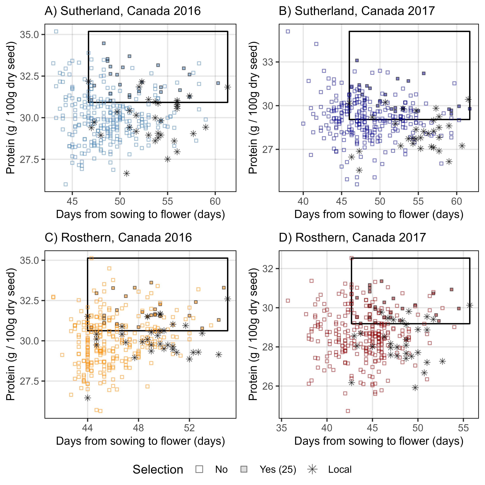

```{r setup, include=FALSE}
knitr::opts_chunk$set(eval = F, echo = T, message = F, warning = F, 
                      comment = NA, out.width = "100%")
```

---

# Introduction

This vignette contains the `R` code and analysis done for the paper: 

`r shiny::icon("newspaper")` [Derek Wright, Jiayi Hang, James D House & Kirstin E Bett. **Lentil Protein**. *unpublished*](https://github.com/derekmichaelwright/AGILE_LDP_Protein) 

`r shiny::icon("github")` https://github.com/derekmichaelwright/AGILE_LDP_Protein

`r shiny::icon("newspaper")` [Jiayi Hang, Da Shi, Jason Neufeld, Kirstin E Bett, & James D House. **Prediction of protein and amino acid contents in whole and ground lentils using near-infrared reflectance spectroscopy**. *LWT*, (**2022**) 165: 113669. doi.org/10.1016/j.lwt.2022.113669)](https://doi.org/10.1016/j.lwt.2022.113669)

which is follow-up to:

`r shiny::icon("newspaper")` [Derek M Wright, Sandesh Neupane, Taryn Heidecker, Teketel A Haile, Clarice J Coyne, Rebecca J McGee, Sripada Udupa, Fatima Henkrar, Eleonora Barilli, Diego Rubiales, Tania Gioia, Giuseppina Logozzo, Stefania Marzario, Reena Mehra, Ashutosh Sarker, Rajeev Dhakal, Babul Anwar, Debashish Sarker, Albert Vandenberg, and Kirstin E. Bett. **Understanding photothermal interactions can help expand production range and increase genetic diversity of lentil (*Lens culinaris* Medik.)**. *Plants, People, Planet*. (**2020**) 00:1-11. doi.org/10.1002/ppp3.10158](https://doi.org/10.1002/ppp3.10158)

`r shiny::icon("github")` https://github.com/derekmichaelwright/AGILE_LDP_Phenology

---

This work done as part of the AGILE project at the University of Saskatchewan along with collaboration with partners at the University of Manitoba.


---

# Data Preparation

`r shiny::icon("save")` [myY_Protein.csv](myY_Protein.csv)

`r shiny::icon("save")` [myLDP.csv](myLDP.csv)

`r shiny::icon("save")` [myG_LDP.zip](myG_LDP.zip)

`r shiny::icon("save")` [myEnvData.csv](myEnvData.csv)

`r shiny::icon("save")` [myG_Countries.csv](myG_Countries.csv)

```{r}
# Load Libraries
library(tidyverse)
library(ggbeeswarm)
library(ggpubr)
library(GGally)
library(plotly)       # ggplotly()
library(htmlwidgets)  # saveWidget()
library(FactoMineR)   # PCA()
#
theme_AGL <- theme_bw() + 
  theme(strip.background   = element_rect(colour = "black", fill = NA, size = 0.5),
        panel.background   = element_rect(colour = "black", fill = NA, size = 0.5),
        panel.border       = element_rect(colour = "black", size = 0.5),
        panel.grid         = element_line(color  = alpha("black", 0.1), size = 0.5),
        panel.grid.minor.x = element_blank(), 
        panel.grid.minor.y = element_blank())
# Prep data
myPs <- c("Protein", "Glutamic.acid", "Aspartic.acid", "Arginine",
          "Leucine", "Lysine", "Phenylalanine", "Serine", "Valine", 
          "Isoleucine", "Proline", "Alanine", "Glycine", "Threonine", 
          "Histidine", "Tyrosine", "Methionine", "Cysteine", "Tryptophan")
myEs1 <- c("Sutherland, Canada 2016", "Rosthern, Canada 2016",
           "Sutherland, Canada 2017", "Rosthern, Canada 2017")
myEs2 <- c("Su16", "Ro16", "Su17", "Ro17")
myCs_Expt <- c("steelblue", "darkorange", "darkblue", "darkred")
myCs_Region <- c("darkred", "darkgreen", "darkorange", "darkblue", "steelblue")
myCs_Clusters <- c("red4", "darkorange3", "blue2", "deeppink3", 
                      "steelblue", "darkorchid4", "darkslategray", "chartreuse4")
# Wet Chemistry Data
d1 <- read.csv("Data/myD_Protein_WetChem.csv") %>%
  select(-Plot, -Rep, -Sample.Name..1st..text.) %>%
  rename(Year=Planting.Date..date.) %>%
  gather(AminoAcid, Value, 5:ncol(.)) %>%
  mutate(AminoAcid = gsub("Protein....", "Protein", AminoAcid),
         AminoAcid = gsub("..1st....", "", AminoAcid),
         AminoAcid = factor(AminoAcid, levels = myPs),
         Expt = factor(paste(Location, Year), levels = myEs1),
         ExptShort = plyr::mapvalues(Expt, myEs1, myEs2),
         Value = round(as.numeric(Value), 4))
# NIRS Data
d2 <- read.csv("Data/myD_Protein_NIRS.csv") %>% 
  select(-Plot, -Rep, -Sample.Name..1st..text.) %>%
  rename(Year=Planting.Date..date.) %>%
  gather(AminoAcid, Value, 5:ncol(.)) %>%
  mutate(AminoAcid = gsub("..1st....", "", AminoAcid),
         AminoAcid = factor(AminoAcid, levels = myPs),
         Expt = factor(paste(Location, Year), levels = myEs1),
         ExptShort = plyr::mapvalues(Expt, myEs1, myEs2),
         Value = round(Value, 4))
#
myLDP <- read.csv("Data/myD_LDP.csv")
#myEnvData <- read.csv("myEnvData.csv") %>%
#  mutate(Expt = plyr::mapvalues(Expt, myEs1, myEs2))
#myCountries <- read.csv("myCountries.csv")
#myC <- read.csv("Data/myCountries.csv")
#
#d3 <- read.csv("myY_Protein_NIRS.csv")
#summary(as.factor(d2$Name))
#
# Protein Families
#
myPFs <- c("Family.Glutamate", "Family.Aspartate", "Family.Pyruvate", 
           "Family.Serine", "Family.Histidine", "Family.Aromatic",
           "Perc.Family.Glutamate", "Perc.Family.Aspartate", "Perc.Family.Pyruvate",
           "Perc.Family.Serine", "Perc.Family.Histidine", "Perc.Family.Aromatic")
d3 <- d2 %>% spread(AminoAcid, Value) %>%
  #filter(Location == "Sutherland, Canada", Year == 2017) %>%
  mutate(Family.Glutamate = Glutamic.acid + Proline + Arginine, #Glutamine +
         Family.Aspartate = Aspartic.acid + Threonine + Isoleucine + Methionine + Lysine, # Asparagine + 
         Family.Pyruvate = Alanine + Valine + Leucine,
         Family.Serine = Serine + Glycine + Cysteine,
         Family.Histidine = Histidine,
         Family.Aromatic = Tryptophan + Phenylalanine + Tyrosine ) %>%
  mutate(Perc.Family.Glutamate = 100 * Family.Glutamate / Protein,
         Perc.Family.Aspartate = 100 * Family.Aspartate / Protein, 
         Perc.Family.Pyruvate = 100 * Family.Pyruvate / Protein,
         Perc.Family.Serine = 100 * Family.Serine / Protein,
         Perc.Family.Histidine = 100 * Family.Histidine / Protein,
         Perc.Family.Aromatic = 100 * Family.Aromatic / Protein) %>%
  select(Name, Expt, ExptShort, 
         Family.Glutamate, Family.Aspartate, Family.Histidine,
         Family.Pyruvate, Family.Serine, Family.Aromatic,
         #
         Perc.Family.Glutamate, Perc.Family.Aspartate, Perc.Family.Histidine,
         Perc.Family.Pyruvate, Perc.Family.Serine, Perc.Family.Aromatic) %>%
  gather(AminoAcidFamily, Value, 4:ncol(.)) %>%
  mutate(AminoAcidFamily = factor(AminoAcidFamily, levels = myPFs))
```

```{r eval = F, echo = F}
#
# LS Means
#
d4 <- data.frame(Name = unique(d2$Name))
for(i in unique(d2$AminoAcid)) {
  xi <- d2 %>% filter(AminoAcid == i) 
  fit <- lm(Value ~ Name + Expt, data = xi)
  yi <- emmeans::lsmeans(fit, "Name") %>% 
    as.data.frame() %>%
    select(Name, lsmean)
  colnames(yi)[2] <- i
  d4 <- left_join(d4, yi, by = "Name")
}
```

```{r}
x1 <- d2 %>% filter(Entry == 1, AminoAcid == "Protein", ExptShort == "Su17")
x2 <- d2 %>% filter(Entry == 1, AminoAcid != "Protein", ExptShort == "Su17")
sum(x2$Value)
```

---

# GWAS

## Prepare Data

```{r eval = F}
#
myY <- d2 %>% filter(ExptShort == "Ro16") %>%
  select(-Entry, -Location, -Year, -Expt) %>%
  mutate(AminoAcid = paste(AminoAcid, ExptShort, sep = "_")) %>%
  select(-ExptShort) %>%
  spread(AminoAcid, Value) %>%
  mutate(Name = gsub(" ", "_", Name),
         Name = gsub("-", "\\.", Name),
         Name = plyr::mapvalues(Name, "3156.11_AGL", "X3156.11_AGL"))
write.csv(myY, "Data/myY_NIRS_Ro16.csv", row.names = F)
#
myY <- d2 %>% filter(ExptShort == "Ro17") %>%
  select(-Entry, -Location, -Year, -Expt) %>%
  mutate(AminoAcid = paste(AminoAcid, ExptShort, sep = "_")) %>%
  select(-ExptShort) %>%
  spread(AminoAcid, Value) %>%
  mutate(Name = gsub(" ", "_", Name),
         Name = gsub("-", "\\.", Name),
         Name = plyr::mapvalues(Name, "3156.11_AGL", "X3156.11_AGL"))
write.csv(myY, "Data/myY_NIRS_Ro17.csv", row.names = F)
#
myY <- d2 %>% filter(ExptShort == "Su16") %>%
  select(-Entry, -Location, -Year, -Expt) %>%
  mutate(AminoAcid = paste(AminoAcid, ExptShort, sep = "_")) %>%
  select(-ExptShort) %>%
  spread(AminoAcid, Value) %>%
  mutate(Name = gsub(" ", "_", Name),
         Name = gsub("-", "\\.", Name),
         Name = plyr::mapvalues(Name, "3156.11_AGL", "X3156.11_AGL"))
write.csv(myY, "Data/myY_NIRS_Su16.csv", row.names = F)
#
myY <- d2 %>% filter(ExptShort == "Su17") %>%
  select(-Entry, -Location, -Year, -Expt) %>%
  mutate(AminoAcid = paste(AminoAcid, ExptShort, sep = "_")) %>%
  select(-ExptShort) %>%
  spread(AminoAcid, Value) %>%
  mutate(Name = gsub(" ", "_", Name),
         Name = gsub("-", "\\.", Name),
         Name = plyr::mapvalues(Name, "3156.11_AGL", "X3156.11_AGL"))
write.csv(myY, "Data/myY_NIRS_Su17.csv", row.names = F)
#
myY <- d2 %>% #filter(ExptShort == "Ro16") %>%
  select(-Entry, -Location, -Year, -Expt) %>%
  mutate(AminoAcid = paste(AminoAcid, ExptShort, sep = "_")) %>%
  select(-ExptShort) %>%
  spread(AminoAcid, Value) %>%
  mutate(Name = gsub(" ", "_", Name),
         Name = gsub("-", "\\.", Name),
         Name = plyr::mapvalues(Name, "3156.11_AGL", "X3156.11_AGL"))
write.csv(myY, "Data/myY_NIRS.csv", row.names = F)
#
myCV <- myLDP %>% 
  select(Name, DTF_Ro16, DTF_Ro17, DTF_Su16, DTF_Su17,
               REP_Ro16, REP_Ro17, REP_Su16, REP_Su17#,
         #TFT_0_Su16, TFT_Tb_Su16, TFT_0_Su17, TFT_Tb_Su17,
         #TFT_0_Ro16, TFT_Tb_Ro16, TFT_0_Ro17, TFT_Tb_Ro17,
         #TRT_0_Su16, TRT_Tb_Su16, TRT_0_Su17, TRT_Tb_Su17,
         #TRT_0_Ro16, TRT_Tb_Ro16, TRT_0_Ro17, TRT_Tb_Ro17
         ) %>%
  #left_join(select(pca, Name, PC1, PC2, PC3, PC4), by = "Name") %>%
  mutate(#PC1 = round(PC1, 4),
         #PC2 = round(PC2, 4),
         #PC3 = round(PC3, 4),
         #PC4 = round(PC4, 4),
         Name = gsub(" ", "_", Name),
         Name = gsub("-", "\\.", Name),
         Name = plyr::mapvalues(Name, "3156.11_AGL", "X3156.11_AGL"))
write.csv(myCV, "Data/myCV.csv", row.names = F)
```

---

## Run GWAS

```{r eval = F}
#
myG <- read.csv("Data/myG_LDP.csv", header = F)
myCV <- read.csv("Data/myCV.csv")
#
myY <- read.csv("Data/myY_NIRS.csv")
myGAPIT <- GAPIT(
  Y = myY,
  G = myG,
  PCA.total = 4,
  model = c("MLM","MLMM","FarmCPU","Blink"),
  Phenotype.View = F
)
#
myY_Ro16 <- read.csv("Data/myY_NIRS_Ro16.csv")
myGAPIT <- GAPIT(
  Y = myY_Ro16,
  G = myG,
  CV = myCV[,c("Name","DTF_Ro16","REP_Ro16")],
  PCA.total = 0,
  model = c("MLM","MLMM","FarmCPU","Blink"),
  Phenotype.View = F
)
#
myY_Ro17 <- read.csv("Data/myY_NIRS_Ro17.csv")
myGAPIT <- GAPIT(
  Y = myY_Ro17,
  G = myG,
  CV = myCV[,c("Name","DTF_Ro17","REP_Ro17")],
  PCA.total = 0,
  model = c("MLM","MLMM","FarmCPU","Blink"),
  Phenotype.View = F
)
#
myY_Su16 <- read.csv("Data/myY_NIRS_Su16.csv")
myGAPIT <- GAPIT(
  Y = myY_Su16,
  G = myG,
  CV = myCV[,c("Name","DTF_Su16","REP_Su16")],
  PCA.total = 0,
  model = c("MLM","MLMM","FarmCPU","Blink"),
  Phenotype.View = F
)
#
myY_Su17 <- read.csv("Data/myY_NIRS_Su17.csv")
myGAPIT <- GAPIT(
  Y = myY_Su17,
  G = myG,
  CV = myCV[,c("Name","DTF_Su17","REP_Su17")],
  PCA.total = 0,
  model = c("MLM","MLMM","FarmCPU","Blink"),
  Phenotype.View = F
)
```

---

## Post GWAS

```{r}
# devtools::install_github("derekmichaelwright/gwaspr")
library(gwaspr)
myMs <- c("Lcu.2RBY.Chr3p339102503", "Lcu.2RBY.Chr5p327505937", "Lcu.2RBY.Chr5p467479275",#Lcu.2RBY.Chr5p467611866", 
          "Lcu.2RBY.Chr1p437385632", "Lcu.2RBY.Chr4p432694216", "Lcu.2RBY.Chr6p411536500") 
myCs <- c(rep("red",3), rep("blue",3))
```

---

### Significance Table

`r shiny::icon("save")` [GWAS_Results_Table.csv](GWAS_Results_Table.csv)

```{r eval = F}
#
myR1 <- list_Result_Files("GWAS_Results/")
order_GWAS_Results(folder = "GWAS_Results/", files = myR1)
x1 <- table_GWAS_Results("GWAS_Results/", myR1, threshold = 6.7, sug.threshold = 5.3)
#
myR2 <- list_Result_Files("GWAS_Results_DTF_REP/")
order_GWAS_Results(folder = "GWAS_Results_DTF_REP/", files = myR2)
x2 <- table_GWAS_Results("GWAS_Results_DTF_REP/", myR2, threshold = 6.7, sug.threshold = 5.3)
#
x1 <- x1 %>% mutate(CV = "NONE")
x2 <- x2 %>% mutate(CV = "DTF+REP")
xx <- bind_rows(x1, x2)
write.csv(xx, "Supplemental_table_01.csv", row.names = F)
```

```{r}
xx <- read.csv("Supplemental_table_01.csv")
length(unique(xx$SNP))
```

---

### Manhattan plots

`r shiny::icon("chart-line")` [Additional/ManH/](https://github.com/derekmichaelwright/AGILE_LDP_Protein/tree/master/Additional/ManH/)

```{r eval = F}
#
myTs <- list_Traits("GWAS_Results/")
for(i in myTs) {
  mp <- gg_Manhattan(folder = "GWAS_Results/", trait = i, facet = F,
                     models = c("MLM", "MLMM", "FarmCPU", "BLINK"),
                     vlines = myMs, vline.colors = myCs,
                     threshold = 6.7, sug.threshold = 5, pmax = 12 )
  ggsave(paste0("Additional/ManH/Multi_",i,"_1_noCV.png"), 
         mp, width = 12, height = 4, bg = "white")
}
#
myTs <- list_Traits("GWAS_Results_DTF_REP/")
for(i in myTs) {
  mp <- gg_Manhattan(folder = "GWAS_Results_DTF_REP/", trait = i, facet = F,
                     models = c("MLM", "FarmCPU", "BLINK"),
                     vlines = myMs, vline.colors = myCs,
                     threshold = 6.7, sug.threshold = 5, pmax = 12 )
  ggsave(paste0("Additional/ManH/Multi_",i,"_3_CVDTFREP.png"), 
         mp, width = 12, height = 4, bg = "white")
}
```

---

# Figures

## Supplemental Figure 1 - Wet Chem vs NIRS


```{r}
# Prep data
x1 <- d1 %>% select(Name, Expt, AminoAcid, `Wet Chemistry`=Value)
x2 <- d2 %>% select(Name, Expt, AminoAcid, NIRS=Value)
xx <- left_join(x1, x2, by = c("Name", "Expt", "AminoAcid"))
# Plot
mp <- ggplot(xx, aes(x = `Wet Chemistry`, y = NIRS)) +
  geom_point(aes(color = Expt), alpha = 0.5) +
  stat_smooth(geom = "line", method = "lm", alpha = 0.7, size = 1.5) +
  stat_regline_equation(aes(label = ..rr.label..)) +
  facet_wrap(AminoAcid ~ ., scales = "free") +
  scale_color_manual(values = myCs_Expt) +
  theme_AGL +
  theme(legend.position = "bottom") +
  labs(y = "Near-infrared Spectroscopy", title = "g / 100g seed")
ggsave("Supplemental_Figure_01.png", mp, width = 10, height = 8, dpi = 600)
```

---

## Supplemental Figure 2 - Total Protein & Amino Acids


```{r}
# Prep data
xx <- d2 %>% 
  mutate(Family = ifelse(AminoAcid == "Protein", "Total Protein", NA),
         Family = ifelse(AminoAcid %in% c("Glutamic.acid", "Proline",  "Arginine"), "Glutamate", Family),
         Family = ifelse(AminoAcid %in% c("Aspartic.acid", "Threonine", "Isoleucine", "Methionine", "Lysine"), "Aspartate", Family),
         Family = ifelse(AminoAcid %in% c("Alanine", "Valine", "Leucine"), "Pyruvate", Family),
         Family = ifelse(AminoAcid %in% c("Serine", "Glycine", "Cysteine"), "Serine", Family),
         Family = ifelse(AminoAcid %in% c("Histidine"), "Histidine", Family),
         Family = ifelse(AminoAcid %in% c("Tryptophan", "Phenylalanine", "Tyrosine"), "Aromatic", Family)) %>%
  mutate(AminoAcid = factor(AminoAcid, levels = myPs),
         Family = factor(Family, levels = c("Total Protein", "Glutamate", "Aspartate", "Pyruvate",
                                            "Serine", "Histidine", "Aromatic")))
# Plot
mp <- ggplot(xx, aes(x = Value, fill = Family)) +
  geom_histogram(color = "black", lwd = 0.2) +
  facet_grid(ExptShort ~ AminoAcid, scales = "free_x") +
  scale_x_reverse() +
  theme_AGL +
  theme(legend.position = "bottom",
        axis.text.x = element_text(angle = 45, hjust = 1)) +
  guides(fill = guide_legend(nrow = 1)) +
  labs(title = "Seed Protein Percent in the Lentil Diversity Panel", 
       y = NULL, x = "g / 100g seed")
ggsave("Supplemental_Figure_02.png", mp, width = 30, height = 7, dpi = 600)
```

---

## Figure 1 - Total Protein & Amino Acids


```{r}
# Prep data
xx <- d2 %>% filter(AminoAcid != "Protein")
# Plot
mp1 <- ggplot(xx, aes(x = AminoAcid, y = Value, fill = Expt)) +
  geom_boxplot(alpha = 0.7, coef = 5, lwd = 0.2) +
  scale_fill_manual(name = NULL, values = myCs_Expt) +
  scale_y_continuous(breaks = 0:5) +
  theme_AGL +
  theme(legend.position = "none", 
        axis.text.x = element_text(angle = 45, hjust = 1)) +
  labs(title = "A) Amino Acids", y = "g / 100g seed", x = NULL)
# Prep data
myFams1 <- c("Family.Glutamate", "Family.Aspartate", "Family.Pyruvate", 
             "Family.Serine","Family.Histidine","Family.Aromatic")
myFams2 <- c("Glutamte Family", "Aspartate Family", "Pyruvate Family", 
             "Serine Family", "Histidine Family", "Aromatic Family")
xx <- d3 %>% filter(!grepl("Perc", AminoAcidFamily)) %>% 
  mutate(AminoAcidFamily = plyr::mapvalues(AminoAcidFamily, myFams1, myFams2))
# Plot
mp2 <- ggplot(xx, aes(x = ExptShort, y = Value, fill = Expt)) +
  geom_boxplot(alpha = 0.7, coef = 3.5) +
  scale_fill_manual(name = NULL, values = myCs_Expt) +
  facet_grid(. ~ AminoAcidFamily, labeller = label_wrap_gen(width = 10)) +
  theme_AGL +
  theme(legend.position = "none",
        axis.text.x = element_text(angle = 45, hjust = 1)) +
  labs(title = "C)", y = "g / 100g seed", x = "")
# Prep data
#xx <- d3 %>% filter(!grepl("Perc", Protein))
# Plot
mp3 <- ggplot(xx, aes(x = Value, fill = Expt)) +
  geom_histogram(color = "black", alpha = 0.7, lwd = 0.1) +
  facet_grid(ExptShort ~ AminoAcidFamily, scales = "free_x", labeller = label_wrap_gen(width = 10)) +
  scale_fill_manual(values = myCs_Expt) +
  theme_AGL +
  theme(legend.position = "bottom",
        legend.text = element_text(size = 8),
        axis.text.x = element_text(angle = 45, hjust = 1)) +
  guides(fill = guide_legend(ncol = 2, override.aes = list(lwd = 0))) +
  labs(title = "B) Amino Acid Families", 
       y = "Count", x = "g / 100g seed")
mpl <- get_legend(mp3)
mp3 <- mp3 + theme(legend.position = "none")
#
x1 <- d2 %>% filter(AminoAcid == "Protein", ExptShort == "Su16") %>%
  arrange(Value) %>% pull(Name)
xx <- d2 %>% filter(AminoAcid == "Protein") %>%
  mutate(Name = factor(Name, levels = x1))
# Plot
mp4 <- ggplot(xx, aes(x = Name, y = Value, color = ExptShort)) +
  geom_point(alpha = 0.7, size = 0.5) +
  scale_color_manual(name = NULL, values = myCs_Expt) +
  scale_y_continuous(breaks = 25:35) +
  theme_AGL +
  theme(legend.position = "none",
        panel.grid.major.x = element_blank(),
        axis.text.x = element_blank(),
        axis.ticks.x = element_blank()) +
  labs(title = "C) Protein", x = "Entry",
       y = "Protein (g / 100g seed)")
#
#mp <- ggarrange(mp1, mp4, mpl, ncol = 1, heights = c(4,4,1)) 
#ggsave("Figure_01.2.png", mp, width = 7, height = 7, dpi = 600, bg = "white")
#
mp <- ggarrange(mp1, ggarrange(mp3, ggarrange(mp4, mpl, ncol = 1, heights = c(4,1)), ncol = 2), nrow = 2) 
ggsave("Figure_01.png", mp, width = 10, height = 8, dpi = 600, bg = "white")
```

---

## Figure 2 - Protein x Traits

```{r}
# Prep data
myCots <- c("Red", "Yellow", "Red/Yellow", "Green")
xx <- d2 %>% filter(AminoAcid == "Protein") %>%
  left_join(myLDP, by = c("Entry","Name")) %>%
  mutate(Origin = ifelse(Origin == "Canada", Origin, "Other"),
         CotyledonColor = factor(CotyledonColor, levels = myCots)) %>%
  arrange(desc(Origin))
# Plot
mp1 <- ggplot(xx %>% filter(ExptShort == "Su16"), 
              aes(x = Region, y = Value, color = Origin, pch = CotyledonColor)) +
  geom_quasirandom(fill = alpha("steelblue",0.7)) +
  facet_grid(. ~ Expt) +
  scale_color_manual(values = c("black", alpha("white",0)), guide = F) +
  scale_shape_manual(name = "Cotyledon Color", values = c(24,25,23,22)) +
  theme_AGL +
  labs(title = "A) Protein x Region", 
       x = "Region", y = "Protein (g / 100g seed)")
# Plot
xx <- xx %>% filter(ExptShort == "Su16")
mp2 <- ggplot(xx, aes(x = SeedMass1000.2017, y = Value)) +
  geom_point(aes(shape = CotyledonColor, color = Origin), fill = "steelblue") +
  stat_smooth(geom = "line", method = "lm", se = F, 
              color = "black", alpha = 0.7, size = 1) +
  stat_regline_equation(aes(label = ..rr.label..)) +
  facet_wrap(Expt ~ .) +
  scale_color_manual(values = c("black", alpha("white",0)), guide = F) +
  scale_shape_manual(name = "Cotyledon Color", values = c(24,25,23,22)) +
  theme_AGL + 
  labs(title = "B) Protein x Seed Size", 
       x = "Mass of 1000 seeds", y = "Protein (g / 100g seed)")
# Prep data
x1 <- d2 %>% filter(AminoAcid == "Protein") %>%
  select(Entry, Expt, ExptShort, Protein=Value)
x2 <- myLDP %>% select(Entry, Name, DTF_Ro16, DTF_Ro17, DTF_Su16, DTF_Su17) %>%
  gather(ExptShort, DTF, 3:6) %>%
  mutate(ExptShort = gsub("DTF_", "", ExptShort))
xx <- left_join(x1, x2, by = c("Entry", "ExptShort")) %>%
  mutate(ExptShort = factor(ExptShort, levels = myEs2)) %>%
  left_join(myLDP, by = c("Entry","Name")) %>%
  mutate(Origin = ifelse(Origin == "Canada", Origin, "Other")) %>%
  arrange(desc(Origin))
# Plot
mp3 <- ggplot(xx, aes(x = DTF, y = Protein)) +
  geom_point(aes(fill = Expt), color = alpha("white",0), pch = 21) +
  geom_point(aes(color = Origin), fill = alpha("white",0), pch = 21) +
  stat_smooth(geom = "line", method = "lm", se = F, 
              color = "black", alpha = 0.7, size = 1) +
  stat_regline_equation(aes(label = ..rr.label..)) +
  scale_fill_manual(values = alpha(myCs_Expt,0.7)) +
  scale_color_manual(values = c("black", alpha("white",0))) +
  guides(color = guide_legend(nrow = 2, override.aes = list(fill = "grey")),
         fill = guide_legend(nrow = 2)) +
  theme_AGL + 
  labs(title = "C) Protein x DTF", 
       x = "Days from sowing to flower", y = "Protein (g / 100g seed)")
# Prep data
x1 <- d2 %>% filter(AminoAcid == "Protein") %>%
  select(Entry, Expt, ExptShort, Protein=Value)
x2 <- myLDP %>% select(Entry, Name, REP_Ro16, REP_Ro17, REP_Su16, REP_Su17) %>%
  gather(ExptShort, REP, 3:6) %>%
  mutate(ExptShort = gsub("REP_", "", ExptShort))
xx <- left_join(x1, x2, by = c("Entry", "ExptShort")) %>%
  left_join(myLDP, by = c("Entry","Name")) %>%
  mutate(Origin = ifelse(Origin == "Canada", Origin, "Other")) %>%
  arrange(desc(Origin))
# Plot
mp4 <- ggplot(xx, aes(x = REP, y = Protein)) +
  geom_point(aes(fill = Expt), color = alpha("white",0), pch = 21) +
  geom_point(aes(color = Origin), fill = alpha("white",0), pch = 21) +
  stat_smooth(geom = "line", method = "lm", se = F, 
              color = "black", alpha = 0.7, size = 1) +
  stat_regline_equation(aes(label = ..rr.label..)) +
  scale_fill_manual(values = alpha(myCs_Expt,0.6)) +
  scale_color_manual(values = c("black", alpha("white",0))) +
  guides(color = guide_legend(nrow = 2, override.aes = list(fill = "grey")),
         fill = guide_legend(nrow = 2)) +
  theme_AGL + 
  labs(title = "D) Protein x REP", 
       x = "Reproductive period", y = "Protein (g / 100g seed)")
#
mp1 <- ggarrange(mp1, mp2, ncol = 2, common.legend = T, legend = "bottom")
mp2 <- ggarrange(mp3, mp4, ncol = 2, common.legend = T, legend = "bottom")
mp <- ggarrange(mp1, mp2, ncol = 1, heights = c(1,1.1))
ggsave("Figure_02.png", mp, width = 8, height = 8, dpi = 600, bg = "white")
```

---

## Figure 3 & Supplemental Figure 3 - Selections




```{r}
# Prep data
gg_Selection <- function(myTrait = "DTF_Ro16", myAmino = "Protein", myExpt = "Ro16", myColor = "steelblue") {
  # Prep data
  xi <- myLDP %>% select(Name, Origin, Ro16=DTF_Ro16, Ro17=DTF_Ro17, Su16=DTF_Su16, Su17=DTF_Su17) %>%
    gather(ExptShort, DTF, Ro16, Ro17, Su16, Su17)
    #mutate(Su16=NA, Su17=NA, Ro16=NA, Ro17=NA)
  xx <- d2 %>% filter(AminoAcid == myAmino) %>%
    left_join(xi, by = c("Name", "ExptShort")) %>% 
    mutate(Selection = NA)
  #
  for(i in myEs2) {
    myYmin <- mean(xx %>% filter(ExptShort == i, Origin == "Canada") %>% pull(Value))
    myYmin <- quantile(xx %>% filter(ExptShort == i, Origin == "Canada") %>% pull(Value), 0.75)
    myYmax <- max(xx %>% filter(ExptShort == i) %>% pull(Value))
    myXmin <- min(xx %>% filter(ExptShort == i, Origin == "Canada") %>% pull(DTF))
    myXmax <- max(xx %>% filter(ExptShort == i) %>% pull(DTF))
    xx <- xx %>% 
      mutate(Selection = ifelse((ExptShort == i & Value > myYmin & DTF > myXmin), "Yes", Selection))
  }
  ss <- xx %>% select(Name, ExptShort, Selection) %>% spread(ExptShort, Selection) %>% 
    filter(!is.na(Ro16), !is.na(Ro17), !is.na(Su16), !is.na(Su17)) %>%
    mutate(Selection = "Yes") %>% select(Name, Selection)
  xx <- xx %>% filter(ExptShort == myExpt) %>% select(-Selection) %>%
    #left_join(xi %>% filter(ExptShort == myExpt), by = "Name") %>%
    left_join(ss, by = "Name") %>%
    mutate(Origin = ifelse(Origin == "Canada", Origin, "Other"),
           Selection = ifelse(is.na(Selection), "No", Selection),
           Selection = ifelse(Origin == "Canada", "Canadian", Selection)) %>%
    arrange(desc(Origin))
  myNum <- sum(xx$Selection == "Yes")
  xx <- xx %>% 
    mutate(Selection = ifelse(Selection == "Yes", paste0("Yes (", myNum, ")"), Selection),
           Selection = factor(Selection, levels = c("No", paste0("Yes (", myNum, ")"), "Canadian")))
  #
  myYmin <- mean(xx %>% filter(Origin == "Canada") %>% pull(Value))
  myYmin <- quantile(xx %>% filter(Origin == "Canada") %>% pull(Value), 0.75)
  myYmax <- max(xx %>% pull(Value))
  myXmin <- min(xx %>% filter(Origin == "Canada") %>% pull(DTF))
  myXmax <- max(xx %>% pull(DTF))
  # Plot
  ggplot(xx) +
    geom_rect(xmin = myXmin, xmax = myXmax, 
              ymin = myYmin, ymax = myYmax,
              color = "black", fill = NA) +
    geom_point(aes(x = DTF, y = Value, shape = Selection, size = Selection,
                   fill = Selection, color = Selection), alpha = 0.5) +
    scale_color_manual(values = c(myColor, "black", "black")) +
    scale_fill_manual(values = c("white", myColor, "black")) +
    scale_shape_manual(values = c(0,22,8)) +
    scale_size_manual(values = c(1,1,1.5)) +
    facet_wrap(Expt ~ .) +
    guides(shape = guide_legend(override.aes = list(fill = "grey", color = "black", size = 2.5))) +
    theme_AGL + labs(y = paste(myAmino, "(g / 100g seed)"))
}
mp1 <- gg_Selection(myTrait = "DTF_Su16", myExpt = "Su16", myColor = "steelblue")
mp2 <- gg_Selection(myTrait = "DTF_Su17", myExpt = "Su17", myColor = "darkblue")
mp3 <- gg_Selection(myTrait = "DTF_Ro16", myExpt = "Ro16", myColor = "darkorange")
mp4 <- gg_Selection(myTrait = "DTF_Ro17", myExpt = "Ro17", myColor = "darkred")
mp <- ggarrange(mp1, mp2, mp3, mp4, ncol = 2, nrow = 2, common.legend = T, legend = "bottom")
ggsave("Supplemental_Figure_03.png", mp, width = 6, height = 6, dpi = 600, bg = "white")
#
mp1 <- gg_Selection(myTrait = "DTF_Su16", myExpt = "Su16", myAmino = "Lysine", myColor = "steelblue")
mp2 <- gg_Selection(myTrait = "DTF_Su17", myExpt = "Su17", myAmino = "Lysine", myColor = "darkblue")
mp3 <- gg_Selection(myTrait = "DTF_Ro16", myExpt = "Ro16", myAmino = "Lysine", myColor = "darkorange")
mp4 <- gg_Selection(myTrait = "DTF_Ro17", myExpt = "Ro17", myAmino = "Lysine", myColor = "darkred")
mp <- ggarrange(mp1, mp2, mp3, mp4, ncol = 2, nrow = 2, common.legend = T, legend = "bottom")
ggsave("Figure_03.png", mp, width = 6, height = 6, dpi = 600, bg = "white")
```

---

## Figure 4 - GWAS Summary

```{r}
#
myPs <- c("Protein", "Glutamic.acid", "Aspartic.acid", "Leucine",
          "Arginine", "Lysine", "Phenylalanine", "Valine", "Serine",
          "Proline", "Isoleucine", "Alanine", "Glycine", "Threonine", 
          "Tyrosine", "Histidine", "Methionine", "Cysteine", "Tryptophan")
#
myTs <- c(paste0(myPs, "_Su16"), paste0(myPs, "_Su17"),
          paste0(myPs, "_Ro16"), paste0(myPs, "_Ro17"))
#
mp1 <- gg_GWAS_Summary(folder = "GWAS_Results/", 
                      traits = myTs,
                      models = c("MLM", "MLMM", "FarmCPU", "BLINK"),
                      colors = c("darkgreen", "darkred", "darkorange3", "steelblue"),
                      threshold = 6.7, sug.threshold = 5, 
                      hlines = seq(19.5,72.5, by = 19), lrows = 2,
                      vlines = myMs, vline.colors = myCs,
                      title = "A) No Covariate") +
  labs(caption = NULL)
#
mp2 <- gg_GWAS_Summary(folder = "GWAS_Results_DTF_REP/", 
                      traits = myTs,
                      models = c("MLM", "MLMM", "FarmCPU", "BLINK"),
                      colors = c("darkgreen", "darkred", "darkorange3", "steelblue"),
                      threshold = 6.7, sug.threshold = 5, 
                      hlines = seq(19.5,72.5, by = 19), lrows = 2,
                      vlines = myMs, vline.colors = myCs,
                      title = "B) Covariate = DTF + REP") +
  labs(caption = NULL)
mp <- ggarrange(mp1, mp2, ncol = 1, common.legend = T, legend = "bottom", heights = c(1,1.1))
ggsave("Figure_04.png", mp, width = 12, height = 20, bg = "white")
```

---

## Supplemental Figure 4 - Protein x Amino Acid


```{r}
# Prep data
x1 <- d2 %>% filter(AminoAcid != "Protein")
x2 <- d2 %>% filter(AminoAcid == "Protein") %>%
  select(Name, ExptShort, Total.Protein=Value)
xx <- left_join(x1, x2, by = c("Name", "ExptShort"))
# Plot
mp <- ggplot(xx, aes(x = Total.Protein, y = Value, color = ExptShort)) +
  geom_point(size = 0.75, alpha = 0.6) +
  facet_wrap(. ~ AminoAcid, scales = "free_y", ncol = 6) +
  scale_color_manual(name = NULL, values = myCs_Expt) +
  theme_AGL +
  theme(legend.position = "bottom") +
  labs(title = "Seed Protein Content in the LDP", 
       y = "Amino Acid (g / 100g seed)", x = "Protein (g / 100g seed)")
ggsave("Supplemental_Figure_04.png", mp, width = 12, height = 8, dpi = 600)
```

---

## Figure 5 - Markers


```{r}
#
myG <- read.csv("Data/myG_LDP.csv", header = T)
#
myY_Su17 <- read.csv("Data/myY_NIRS_Su17.csv")
myY_Su16 <- read.csv("Data/myY_NIRS_Su16.csv")
myY_Ro16 <- read.csv("Data/myY_NIRS_Ro16.csv")
myY_Ro17 <- read.csv("Data/myY_NIRS_Ro17.csv")
#
# Create plotting function
ggMultiMarkers <- function (myG, myY, myTrait, myMarkers, points = T, myColor = "steelblue",
                            myWidth = 0.1, myTitle = NULL, myYlab = myTrait) {
    # Prep data
    x1 <- myG %>% filter(rs %in% myMarkers) %>% mutate(rs = factor(rs, levels = myMarkers)) %>% arrange(rs)
    for(i in 12:ncol(x1)) { if(sum(!grepl("G|C|A|T", x1[,i])) > 0) { x1[,i] <- NA } }
    x1 <- x1[,!is.na(x1[1,])]
    #
    myMLabs <- paste(myMarkers, collapse = "\n")
    #
    xx <- x1 %>% gather(Name, Allele, 12:ncol(.)) %>%
      group_by(Name) %>%
      summarise(Alleles = paste(Allele, collapse = "")) #%>%
      #mutate(Alleles = gsub("NA","N", Alleles))
    #
    myLDP <- read.csv("Data/myD_LDP.csv") %>% 
      mutate(Name = gsub(" ", "_", Name),
             Name = gsub("-", "\\.", Name),
             Name = plyr::mapvalues(Name, "3156.11_AGL", "X3156.11_AGL"))
    #
    xx <- xx %>% left_join(myY, by = "Name") %>% filter(!is.na(get(myTrait)))
    x2 <- xx %>% group_by(Alleles) %>% 
      summarise(Value = mean(get(myTrait), na.rm = T)) %>% 
      arrange(Value) 
    xx <- xx %>% mutate(Alleles = factor(Alleles, levels = x2$Alleles) ) %>%
      left_join(select(myLDP, Name, Origin), by = "Name") %>%
      mutate(Origin = ifelse(Origin == "Canada", Origin, "Other"))
    #
    mp <- ggplot(xx, aes(x = Alleles, y = get(myTrait))) + 
      geom_violin(fill = "grey90", color = NA) + 
      geom_boxplot(width = myWidth, coef = 5) + 
      facet_grid(. ~ as.character(myMLabs)) +
      theme_AGL +
      theme(legend.position = "top",
            axis.text.x = element_text(angle = 45, hjust = 1)) + 
      labs(title = myTitle, y = myYlab, x = NULL)
    if(points == T) { 
      mp <- mp + 
        geom_quasirandom(aes(fill = Origin, color = Origin), pch = 21, size = 1) + 
        scale_fill_manual(values = alpha(c("black", myColor),0.7)) +
        scale_color_manual(values = c("black",alpha("white",0))) 
    }
    mp
}
#
mp1 <- ggMultiMarkers(myG, myY_Su16, myTrait = "Protein_Su16", myMarkers = myMs[1], 
                      myTitle = "A) All 6 Markers", myYlab = "", myColor = "steelblue")
mp2 <- ggMultiMarkers(myG, myY_Su16, myTrait = "Protein_Su16", myMarkers = myMs[2], 
                      myTitle = "", myYlab = "", myColor = "steelblue")
mp3 <- ggMultiMarkers(myG, myY_Su16, myTrait = "Protein_Su16", myMarkers = myMs[3], 
                      myTitle = "", myYlab = "", myColor = "steelblue")
mp4 <- ggMultiMarkers(myG, myY_Su16, myTrait = "Protein_Su16", myMarkers = myMs[4], 
                      myTitle = "", myYlab = "", myColor = "steelblue")
mp5 <- ggMultiMarkers(myG, myY_Su16, myTrait = "Protein_Su16", myMarkers = myMs[5], 
                      myTitle = "", myYlab = "", myColor = "steelblue")
mp6 <- ggMultiMarkers(myG, myY_Su16, myTrait = "Protein_Su16", myMarkers = myMs[6], 
                      myTitle = "", myYlab = "", myColor = "steelblue")
mp1 <- ggarrange(mp1, mp2, mp3, mp4, mp5, mp6, ncol = 3, nrow = 2, 
                 common.legend = T, legend = "bottom")
#
mp2 <- ggMultiMarkers(myG, myY_Su16, myTrait = "Protein_Su16", 
                      myMarkers = myMs[c(1:3)], myWidth = 0.2, myColor = "steelblue",
                      myTitle = "B) Triplet Marker Set 1", 
                      myYlab = "Protein Percent of Whole Seed (Su16)")
mp3 <- ggMultiMarkers(myG, myY_Su16, myTrait = "Protein_Su16", 
                      myMarkers = myMs[c(4:6)], myWidth = 0.2, myColor = "steelblue",
                      myTitle = "C) Triplet Marker Set 2", 
                      myYlab = "Protein Percent of Whole Seed (Su16)")
mp2 <- ggarrange(mp2, mp3, ncol = 2, legend = "none")
#
mp3 <- ggMultiMarkers(myG, myY_Su16, myTrait = "Protein_Su16", 
                      myMarkers = myMs, myColor = "steelblue", #points = F, 
                      myWidth = 0.4, 
                      myTitle = "D) All 6 Markers From GWAS", myYlab = "")
#
mp <- ggarrange(mp1, mp2, mp3, ncol = 1, heights = c(1.3,1,1))
ggsave("Figure_05e.png", mp, width = 11, height = 14, bg = "white", dpi = 600)
mp <- ggarrange(mp1, mp2, ncol = 1, heights = c(1.3,1))
ggsave("Figure_05.png", mp, width = 8, height = 8, bg = "white", dpi = 600)
```


```{r}
#
mp1 <- ggMultiMarkers(myG, myY_Su17, myTrait = "Protein_Su17", myMarkers = myMs[1], 
                      myTitle = "A) Su17", myYlab = "", myColor = "darkblue")
mp2 <- ggMultiMarkers(myG, myY_Su17, myTrait = "Protein_Su17", myMarkers = myMs[2], 
                      myTitle = "", myYlab = "", myColor = "darkblue")
mp3 <- ggMultiMarkers(myG, myY_Su17, myTrait = "Protein_Su17", myMarkers = myMs[3], 
                      myTitle = "", myYlab = "", myColor = "darkblue")
mp4 <- ggMultiMarkers(myG, myY_Su17, myTrait = "Protein_Su17", myMarkers = myMs[4], 
                      myTitle = "", myYlab = "", myColor = "darkblue")
mp5 <- ggMultiMarkers(myG, myY_Su17, myTrait = "Protein_Su17", myMarkers = myMs[5], 
                      myTitle = "", myYlab = "", myColor = "darkblue")
mp6 <- ggMultiMarkers(myG, myY_Su17, myTrait = "Protein_Su17", myMarkers = myMs[6], 
                      myTitle = "", myYlab = "", myColor = "darkblue")
mp1 <- ggarrange(mp1, mp2, mp3, mp4, mp5, mp6, ncol = 3, nrow = 2, 
                 common.legend = T, legend = "bottom")
#
mp2 <- ggMultiMarkers(myG, myY_Su17, myTrait = "Protein_Su17", 
                      myMarkers = myMs[c(1:3)], myWidth = 0.2, myColor = "darkblue",
                      myTitle = "B) Triplet Marker Set 1", 
                      myYlab = "Protein Percent of Whole Seed (Su17)")
mp3 <- ggMultiMarkers(myG, myY_Su17, myTrait = "Protein_Su17", 
                      myMarkers = myMs[c(4:6)], myWidth = 0.2, myColor = "darkblue",
                      myTitle = "C) Triplet Marker Set 2", myYlab = "")
mp2 <- ggarrange(mp2, mp3, ncol = 2, legend = "none")
#
mp3 <- ggMultiMarkers(myG, myY_Su17, myTrait = "Protein_Su17", 
                      myMarkers = myMs, points = F, myWidth = 0.4, myColor = "darkblue", 
                      myTitle = "D) All 6 Markers From GWAS", myYlab = "")
#
mp <- ggarrange(mp1, mp2, mp3, ncol = 1, heights = c(1.3,1,1))
ggsave("Figure_05b.png", mp, width = 11, height = 14, bg = "white", dpi = 600)
```

```{r}
#
mp1 <- ggMultiMarkers(myG, myY_Ro16, myTrait = "Protein_Ro16", myMarkers = myMs[1], 
                      myTitle = "A) Ro16", myYlab = "", myColor = "darkorange")
mp2 <- ggMultiMarkers(myG, myY_Ro16, myTrait = "Protein_Ro16", myMarkers = myMs[2], 
                      myTitle = "", myYlab = "", myColor = "darkorange")
mp3 <- ggMultiMarkers(myG, myY_Ro16, myTrait = "Protein_Ro16", myMarkers = myMs[3], 
                      myTitle = "", myYlab = "", myColor = "darkorange")
mp4 <- ggMultiMarkers(myG, myY_Ro16, myTrait = "Protein_Ro16", myMarkers = myMs[4], 
                      myTitle = "", myYlab = "", myColor = "darkorange")
mp5 <- ggMultiMarkers(myG, myY_Ro16, myTrait = "Protein_Ro16", myMarkers = myMs[5], 
                      myTitle = "", myYlab = "", myColor = "darkorange")
mp6 <- ggMultiMarkers(myG, myY_Ro16, myTrait = "Protein_Ro16", myMarkers = myMs[6], 
                      myTitle = "", myYlab = "", myColor = "darkorange")
mp1 <- ggarrange(mp1, mp2, mp3, mp4, mp5, mp6, ncol = 3, nrow = 2, 
                 common.legend = T, legend = "bottom")
#
mp2 <- ggMultiMarkers(myG, myY_Ro16, myTrait = "Protein_Ro16", 
                      myMarkers = myMs[c(1:3)], myWidth = 0.2, myColor = "darkorange",
                      myTitle = "B) Triplet Marker Set 1", 
                      myYlab = "Protein Percent of Whole Seed (Ro16)")
mp3 <- ggMultiMarkers(myG, myY_Ro16, myTrait = "Protein_Ro16", 
                      myMarkers = myMs[c(4:6)], myWidth = 0.2, myColor = "darkorange",
                      myTitle = "C) Triplet Marker Set 2", myYlab = "")
mp2 <- ggarrange(mp2, mp3, ncol = 2, legend = "none")
#
mp3 <- ggMultiMarkers(myG, myY_Ro16, myTrait = "Protein_Ro16", 
                      myMarkers = myMs, points = F, myWidth = 0.4, myColor = "darkorange", 
                      myTitle = "D) All 6 Markers From GWAS", myYlab = "")
#
mp <- ggarrange(mp1, mp2, mp3, ncol = 1, heights = c(1.3,1,1))
ggsave("Figure_05c.png", mp, width = 11, height = 14, bg = "white", dpi = 600)
```

```{r}
#
mp1 <- ggMultiMarkers(myG, myY_Ro17, myTrait = "Protein_Ro17", myMarkers = myMs[1], 
                      myTitle = "A) Ro17", myYlab = "", myColor = "darkred")
mp2 <- ggMultiMarkers(myG, myY_Ro17, myTrait = "Protein_Ro17", myMarkers = myMs[2], 
                      myTitle = "", myYlab = "", myColor = "darkred")
mp3 <- ggMultiMarkers(myG, myY_Ro17, myTrait = "Protein_Ro17", myMarkers = myMs[3], 
                      myTitle = "", myYlab = "", myColor = "darkred")
mp4 <- ggMultiMarkers(myG, myY_Ro17, myTrait = "Protein_Ro17", myMarkers = myMs[4], 
                      myTitle = "", myYlab = "", myColor = "darkred")
mp5 <- ggMultiMarkers(myG, myY_Ro17, myTrait = "Protein_Ro17", myMarkers = myMs[5], 
                      myTitle = "", myYlab = "", myColor = "darkred")
mp6 <- ggMultiMarkers(myG, myY_Ro17, myTrait = "Protein_Ro17", myMarkers = myMs[6], 
                      myTitle = "", myYlab = "", myColor = "darkred")
mp1 <- ggarrange(mp1, mp2, mp3, mp4, mp5, mp6, ncol = 3, nrow = 2, 
                 common.legend = T, legend = "bottom")
#
mp2 <- ggMultiMarkers(myG, myY_Ro17, myTrait = "Protein_Ro17", 
                      myMarkers = myMs[c(1:3)], myWidth = 0.2, myColor = "darkred",
                      myTitle = "B) Triplet Marker Set 1", 
                      myYlab = "Protein Percent of Whole Seed (Ro17)")
mp3 <- ggMultiMarkers(myG, myY_Ro17, myTrait = "Protein_Ro17", 
                      myMarkers = myMs[c(4:6)], myWidth = 0.2, myColor = "darkred",
                      myTitle = "C) Triplet Marker Set 2", myYlab = "")
mp2 <- ggarrange(mp2, mp3, ncol = 2, legend = "none")
#
mp3 <- ggMultiMarkers(myG, myY_Ro17, myTrait = "Protein_Ro17", 
                      myMarkers = myMs, points = F, myWidth = 0.4, myColor = "darkred", 
                      myTitle = "D) All 6 Markers From GWAS", myYlab = "")
#
mp <- ggarrange(mp1, mp2, mp3, ncol = 1, heights = c(1.3,1,1))
ggsave("Figure_05d.png", mp, width = 11, height = 14, bg = "white", dpi = 600)
```

---

## Supplemental Figure 5 - MAS Markers


```{r}
#
xG <- read.csv("Data/myG_LDP.csv", header = T)
xM <- read.csv("Data/MAS_Markers.csv")
#
ggMASMarkers <- function(myExpt, myColor) {
  xx <- xG %>% filter(rs %in% xM$SNP) %>%
    mutate(rs = factor(rs, levels = xM$SNP))
  #
  for(i in 12:ncol(xx)) { xx[,i] <- ifelse(!grepl("G|C|A|T", xx[,i]), NA, xx[,i]) }
  #xx <- xx[,!is.na(xx[1,])]
  #
  xx <- xx %>% gather(Name, Allele, 12:ncol(.)) 
  #
  myLDP <- read.csv("Data/myD_LDP.csv") %>% 
    mutate(Name = gsub(" ", "_", Name),
           Name = gsub("-", "\\.", Name),
           Name = plyr::mapvalues(Name, "3156.11_AGL", "X3156.11_AGL"))
  #
  xY <- d2 %>% filter(AminoAcid == "Protein", ExptShort == myExpt) %>% 
    select(Name, Value) %>%
    mutate(Name = gsub(" ", "_", Name),
           Name = gsub("-", "\\.", Name),
           Name = plyr::mapvalues(Name, "3156.11_AGL", "X3156.11_AGL"))
  xx <- xx %>% left_join(xY, by = "Name") %>% 
    mutate(Value = ifelse(is.na(Allele), NA, Value)) %>%
    left_join(select(myLDP, Name, Origin), by = "Name") %>%
    filter(!is.na(Allele))
  xc <- xx %>% filter(Origin == "Canada")
  #
  ggplot(xx, aes(x = Allele, y = Value)) + 
    geom_violin(fill = myColor, color = NA, alpha = 0.7) + 
    geom_boxplot(width = 0.1, coef = 5, ) + 
    geom_quasirandom(data = xc, alpha = 0.7, size = 0.5) +
    facet_wrap(rs ~ ., scales = "free_x", ncol = 6) +
    theme_AGL +
    theme(legend.position = "bottom",
          axis.text.x = element_text(angle = 45, hjust = 1)) + 
    labs(title = myExpt, x = NULL, y = "Protein (g / 100g seed)")
}
mp <- ggMASMarkers(myExpt = "Su16", myColor = "steelblue")
ggsave("Supplemental_Figure_05a.png", mp, width = 14, height = 14, dpi = 600)
mp <- ggMASMarkers(myExpt = "Su17", myColor = "darkblue")
ggsave("Supplemental_Figure_05b.png", mp, width = 14, height = 14, dpi = 600)
mp <- ggMASMarkers(myExpt = "Ro16", myColor = "darkorange")
ggsave("Supplemental_Figure_05c.png", mp, width = 14, height = 14, dpi = 600)
mp <- ggMASMarkers(myExpt = "Ro17", myColor = "darkred")
ggsave("Supplemental_Figure_05d.png", mp, width = 14, height = 14, dpi = 600)
```

---

## Supplemental Figure 7 - Stability

```{r eval = F}
#
# Prep data
xx <- read.csv("Lentil Quality/lentils-quality-report.csv")
xm <- xx %>% group_by(Grade) %>% summarise(Avg = round(mean(Mean),1))
xx <- xx %>% left_join(xm, by = "Grade")
# Plot
mp <- ggplot(xx, aes(x = Year, y = Mean, color = Grade)) +
  geom_hline(aes(yintercept = Avg), alpha = 0.7) +
  geom_point(size = 0.75, alpha = 0.6) + geom_line() +
  geom_errorbar(aes(ymin = Min, ymax = Max), alpha = 0.5) +
  facet_grid(. ~ Grade + paste("Mean =", Avg)) +
  scale_x_continuous(breaks = seq(2010,2022, by = 2)) +
  scale_y_continuous(breaks = seq(22,32, by = 2), minor_breaks = 22:32) +
  theme_AGL +
  theme(legend.position = "none",
        axis.text.x = element_text(angle = 45, hjust = 1)) +
  labs(title = "Saskatchewan Lentil Protein Content", 
       subtitle = "Data: Dr. Ning Wang (Canadian Grain Commision)", 
       y = "g / 100g seed", x = NULL)
ggsave("Supplemental_Figure_07.png", mp, width = 8, height = 4, dpi = 600)
```

---

## Supplemental Figure 8

```{r eval = F}
# Prep data
x1 <- d2 %>% filter(AminoAcid == "Protein") %>% rename(Protein=Value)
x2 <- myLDP %>% select(Name, CotyledonColor, SeedMass1000.2017, Size, DTF_Cluster, Source)
xx <- left_join(x1, x2, by = "Name") %>%
  mutate(Size = factor(Size, levels = c("S","M","L","XL")))
  #gather(Trait, Value, Source, CotyledonColor, Size, DTF_Cluster) 
# Plot
ggplot(xx, aes(x = Size, y = Protein)) +
  geom_violin(aes(fill = ExptShort), alpha = 0.7) + 
  geom_boxplot(width = 0.1) +
  scale_fill_manual(values = myCs_Expt) +
  #geom_point() + geom_smooth(method = "lm")
  facet_wrap(ExptShort ~ ., scales = "free_y", ncol = 2) +
  theme_AGL
library(agricolae)
fit <- aov(Protein ~ SeedMass1000.2017 * Expt, data = xx)
summary(fit)
```

---

&copy; Derek Michael Wright