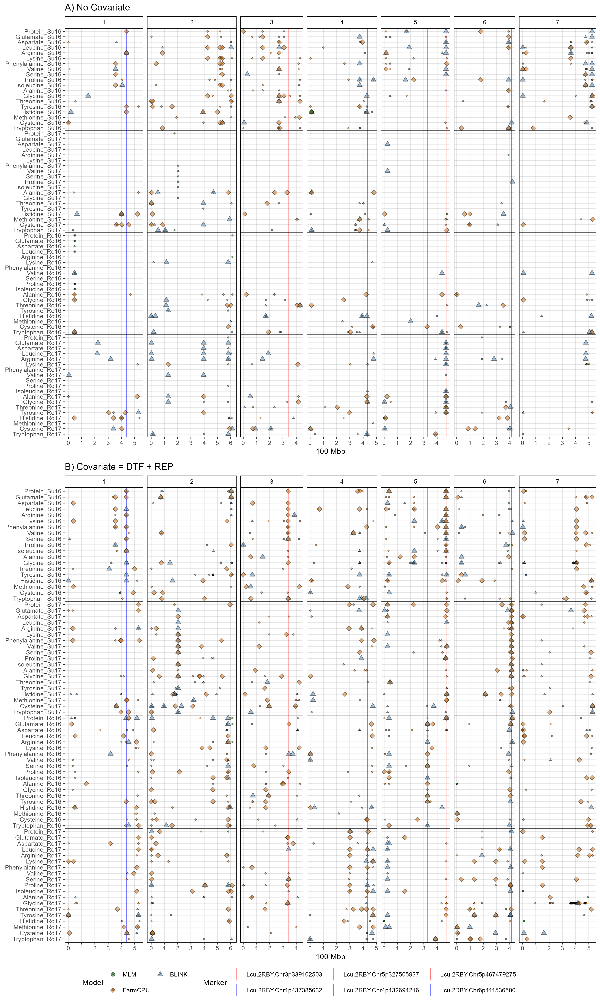
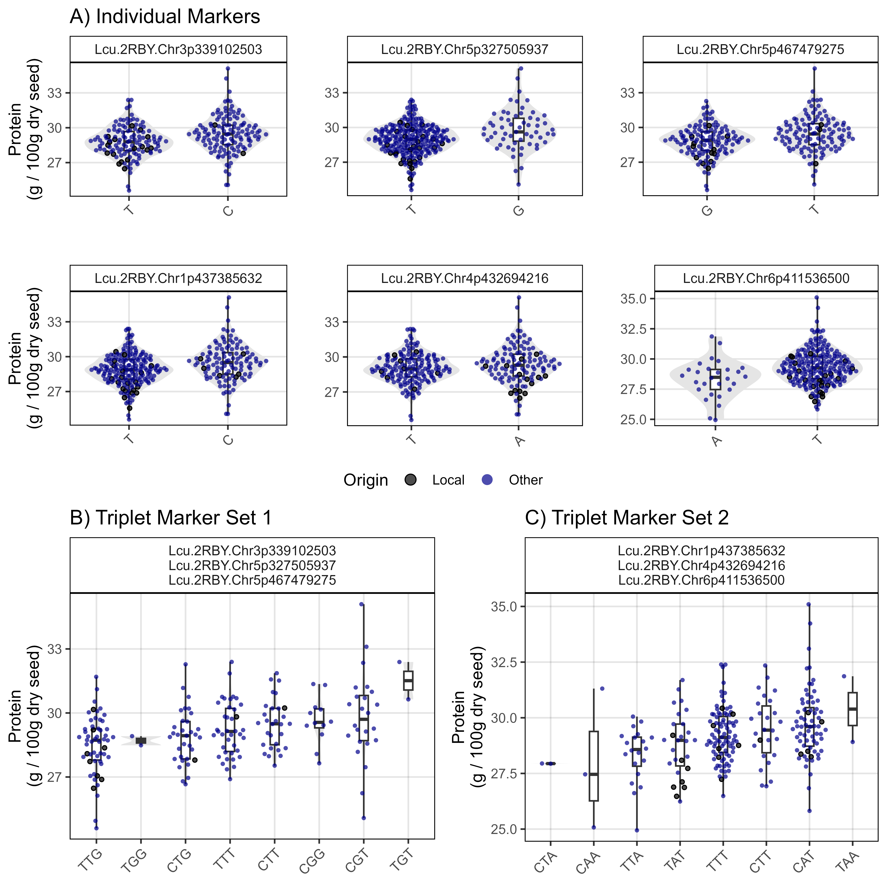
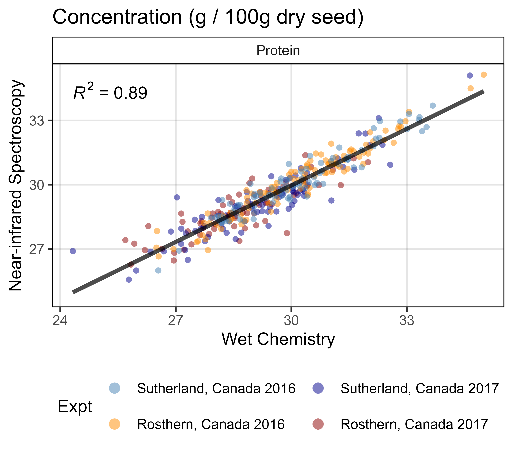
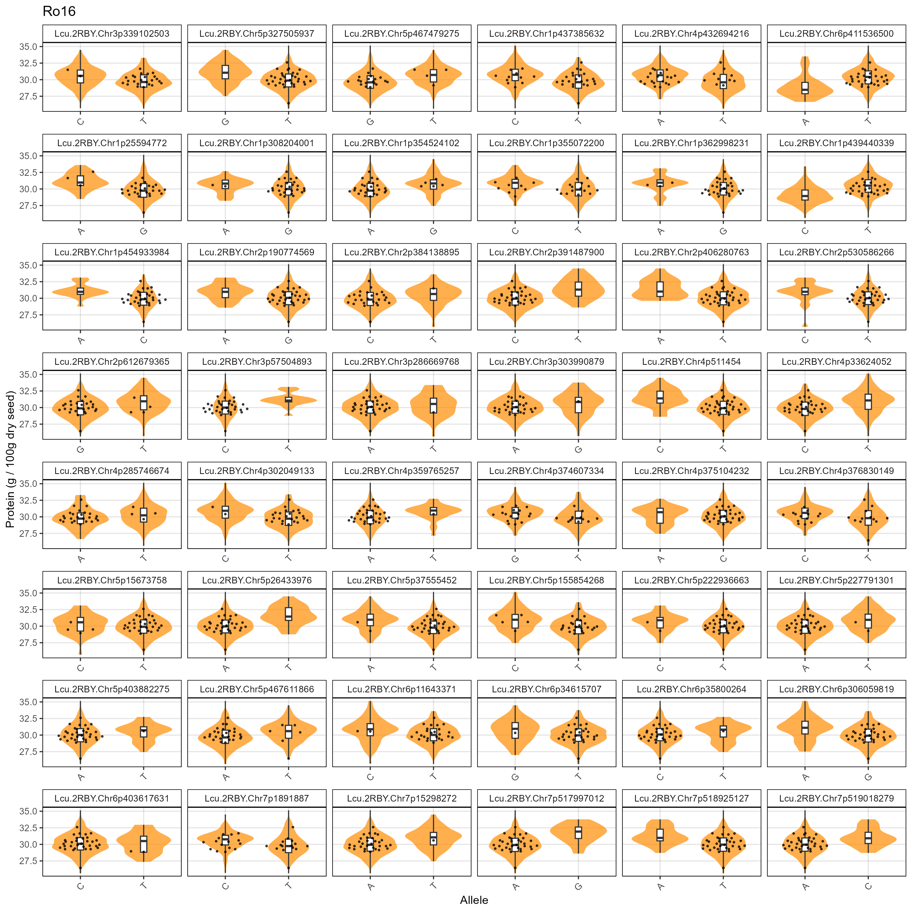
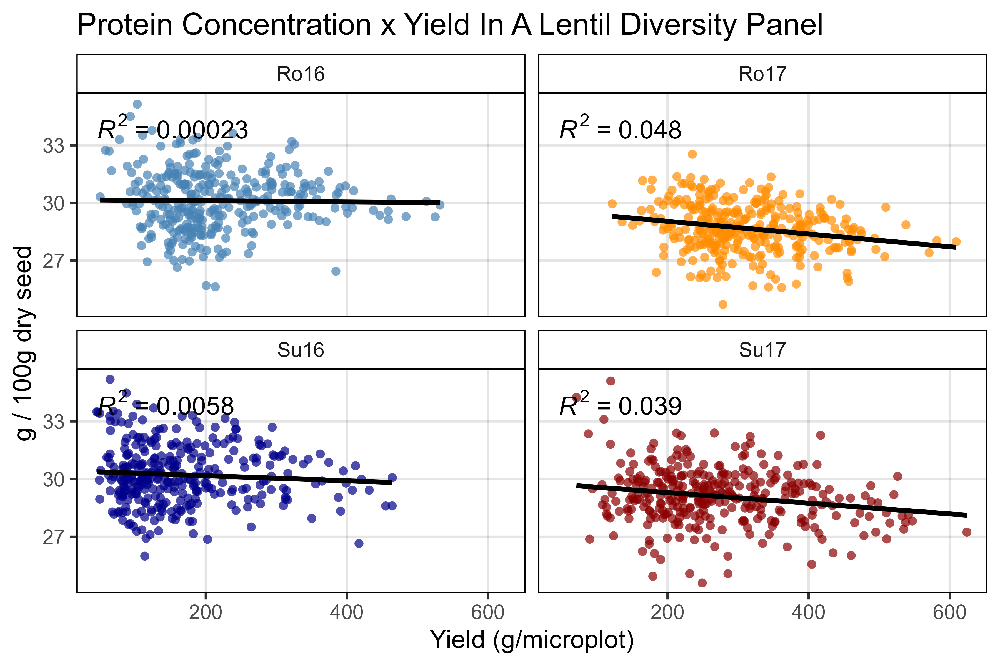

```{r setup, include=FALSE}
knitr::opts_chunk$set(echo = TRUE, message = F, warning = F, comment = NA, out.width = "100%")
```

---

> - [Derek Wright, Jiayi Hang, James D House & Kirstin E Bett (**2025**) **Breeding potential of cultivated lentil for increased protein and amino acid concentrations in the Northern Great Plains**. *Crop Science*. (**2025**) 65(3): e70085. doi.org/10.1002/csc2.70085](http://dx.doi.org/10.1002/csc2.70085){target="_blank"} 

which is follow-up to:

> - [Jiayi Hang, Da Shi, Jason Neufeld, Kirstin E. Bett & James D. House. **Prediction of protein and amino acid concentration in whole and ground lentils using near-infrared reflectance spectroscopy**. *LWT*. (**2022**) 165: 113669. doi.org/10.1016/j.lwt.2022.113669](https://doi.org/10.1016/j.lwt.2022.113669){target="_blank"}

&

> - [Derek M. Wright, Sandesh Neupane, Taryn Heidecker, Teketel A. Haile, Crystal Chan, Clarice J. Coyne, Rebecca J. McGee, Sripada Udupa, Fatima Henkrar, Eleonora Barilli, Diego Rubiales, Tania Gioia, Giuseppina Logozzo, Stefania Marzario, Reena Mehra, Ashutosh Sarker, Rajeev Dhakal, Babul Anwar, Debashish Sarker, Albert Vandenberg & Kirstin E. Bett. **Understanding photothermal interactions can help expand production range and increase genetic diversity of lentil (*Lens culinaris* Medik.)**. *Plants, People, Planet*. (**2020**) 3(2): 171-181. doi.org/10.1002/ppp3.10158](https://doi.org/10.1002/ppp3.10158){target="_blank"}

---

Contents

> - [https://github.com/derekmichaelwright/AGILE_LDP_Protein](https://github.com/derekmichaelwright/AGILE_LDP_Protein){target="_blank"}
> - [View as pdf](https://github.com/derekmichaelwright/AGILE_LDP_Protein/raw/master/README.pdf){target="_blank"}
> - [View as HTML](https://derekmichaelwright.github.io/AGILE_LDP_Protein/README.html){target="_blank"}
> - [Source Code Vignette (LDP_Protein_Vignette.html)](https://derekmichaelwright.github.io/AGILE_LDP_Protein/LDP_Protein_Vignette.html){target="_blank"}

> - [Figures](#figures)
> - [Supplemental Figures](#supplemental-figures)
> - [Additional Figures](#additional-figures)

Collaborators

> - Department of Plant Sciences and Crop Development Centre, University of Saskatchewan, Saskatoon, Saskatchewan, Canada
> - Department of Food and Human Nutritional Sciences, Faculty of Agriculture and Food Science, University of Manitoba, Winnipeg, MB, Canada


{width=50%}

{width=50%}

---

# Supplemental Table 1

[Supplemental_table_01.csv](Supplemental_table_01.csv)

---

# Supplemental Table 2

[Supplemental_table_02.csv](Supplemental_table_02.csv)

---

# Figures

## Figure 1


---

## Figure 2


---

## Figure 3


---

## Figure 4

{width=75%}

---

## Figure 5





---

# Supplemental Figures

## Supplemental Figure 1




---

## Supplemental Figure 2


---

## Supplemental Figure 3


---

## Supplemental Figure 4


---

## Supplemental Figure 5





---

\pagebreak

# Additional Figures

## Amino Acid Selections

> - [Additional/AA_Selections/](https://github.com/derekmichaelwright/AGILE_LDP_Protein/Additional/AA_Selections/)

> - [Additional/AA_Selections/Figure_03_01_Protein_Su16.html](https://derekmichaelwright.github.io/AGILE_LDP_Protein/Additional/AA_Selections/Figure_03_01_Protein_Su16.html){target="_blank"} 
> - [Additional/AA_Selections/Figure_03_02_Glutamate_Su16.html](https://derekmichaelwright.github.io/AGILE_LDP_Protein/Additional/AA_Selections/Figure_03_02_Glutamate_Su16.html){target="_blank"} 
> - [Additional/AA_Selections/Figure_03_03_Aspartate_Su16.html](https://derekmichaelwright.github.io/AGILE_LDP_Protein/Additional/AA_Selections/Figure_03_03_Aspartate_Su16.html){target="_blank"} 
> - [Additional/AA_Selections/Figure_03_04_Arginine_Su16.html](https://derekmichaelwright.github.io/AGILE_LDP_Protein/Additional/AA_Selections/Figure_03_04_Arginine_Su16.html){target="_blank"} 
> - [Additional/AA_Selections/Figure_03_05_Leucine_Su16.html](https://derekmichaelwright.github.io/AGILE_LDP_Protein/Additional/AA_Selections/Figure_03_05_Leucine_Su16.html){target="_blank"} 
> - [Additional/AA_Selections/Figure_03_06_Lysine_Su16.html](https://derekmichaelwright.github.io/AGILE_LDP_Protein/Additional/AA_Selections/Figure_03_06_Lysine_Su16.html){target="_blank"} 
> - [Additional/AA_Selections/Figure_03_07_Phenylalanine_Su16.html](https://derekmichaelwright.github.io/AGILE_LDP_Protein/Additional/AA_Selections/Figure_03_07_Phenylalanine_Su16.html){target="_blank"} 
> - [Additional/AA_Selections/Figure_03_08_Serine_Su16.html](https://derekmichaelwright.github.io/AGILE_LDP_Protein/Additional/AA_Selections/Figure_03_08_Serine_Su16.html){target="_blank"} 
> - [Additional/AA_Selections/Figure_03_09_Valine_Su16.html](https://derekmichaelwright.github.io/AGILE_LDP_Protein/Additional/AA_Selections/Figure_03_09_Valine_Su16.html){target="_blank"} 
> - [Additional/AA_Selections/Figure_03_10_Isoleucine_Su16.html](https://derekmichaelwright.github.io/AGILE_LDP_Protein/Additional/AA_Selections/Figure_03_10_Isoleucine_Su16.html){target="_blank"} 
> - [Additional/AA_Selections/Figure_03_11_Proline_Su16.html](https://derekmichaelwright.github.io/AGILE_LDP_Protein/Additional/AA_Selections/Figure_03_11_Proline_Su16.html){target="_blank"} 
> - [Additional/AA_Selections/Figure_03_12_Alanine_Su16.html](https://derekmichaelwright.github.io/AGILE_LDP_Protein/Additional/AA_Selections/Figure_03_12_Alanine_Su16.html){target="_blank"} 
> - [Additional/AA_Selections/Figure_03_13_Glycine_Su16.html](https://derekmichaelwright.github.io/AGILE_LDP_Protein/Additional/AA_Selections/Figure_03_13_Glycine_Su16.html){target="_blank"} 
> - [Additional/AA_Selections/Figure_03_14_Threonine_Su16.html](https://derekmichaelwright.github.io/AGILE_LDP_Protein/Additional/AA_Selections/Figure_03_14_Threonine_Su16.html){target="_blank"} 
> - [Additional/AA_Selections/Figure_03_15_Histidine_Su16.html](https://derekmichaelwright.github.io/AGILE_LDP_Protein/Additional/AA_Selections/Figure_03_15_Histidine_Su16.html){target="_blank"} 
> - [Additional/AA_Selections/Figure_03_16_Tyrosine_Su16.html](https://derekmichaelwright.github.io/AGILE_LDP_Protein/Additional/AA_Selections/Figure_03_16_Tyrosine_Su16.html){target="_blank"} 
> - [Additional/AA_Selections/Figure_03_17_Methionine_Su16.html](https://derekmichaelwright.github.io/AGILE_LDP_Protein/Additional/AA_Selections/Figure_03_17_Methionine_Su16.html){target="_blank"} 
> - [Additional/AA_Selections/Figure_03_18_Cysteine_Su16.html](https://derekmichaelwright.github.io/AGILE_LDP_Protein/Additional/AA_Selections/Figure_03_18_Cysteine_Su16.html){target="_blank"} 
> - [Additional/AA_Selections/Figure_03_19_Tryptophan_Su16.html](https://derekmichaelwright.github.io/AGILE_LDP_Protein/Additional/AA_Selections/Figure_03_19_Tryptophan_Su16.html){target="_blank"} 

{width=65%}

---

## Additional Figure 1

{width=85%}

---

## Additional Figure 2

{width=85%}

---

## Additional Figure 3


---

## Additional Figure 4

{width=90%}

---

## Additional Figure 5


---

\pagebreak

## Additional Figure 6

[Additional/Additional_Figure_06.html](https://derekmichaelwright.github.io/AGILE_LDP_Protein/Additional/Additional_Figure_06.html){target="_blank"}


---

## Additional Figure 7


---

## Additional Figure 8


---

## Additional Figure 9


---

&copy; Derek Michael Wright
