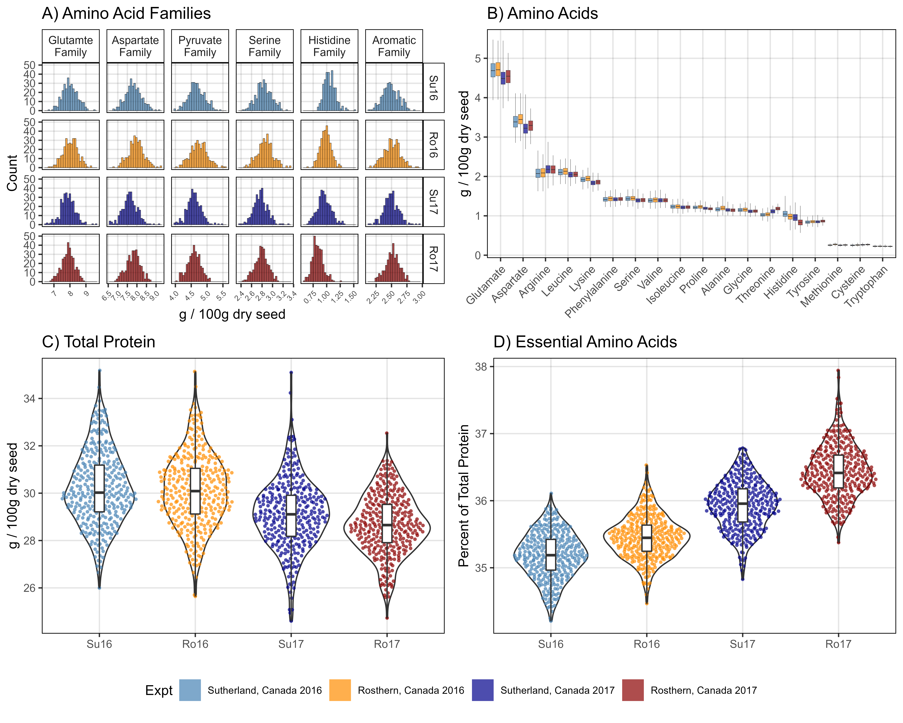

Protein analysis in the LDP
================
Derek Michael Wright <derek.wright@usask.ca>
10-08-2023

------------------------------------------------------------------------

[Derek Wright, Jiayi Hang, James D House & Kirstin E Bett (2020)
**Lentil Protein**.
*unpublished*](https://github.com/derekmichaelwright/AGILE_LDP_Protein)

which is follow-up to:

[Jiayi Hang, Da Shi, Jason Neufeld, Kirstin E. Bett & James D. House.
**Prediction of protein and amino acid contents in whole and ground
lentils using near-infrared reflectance spectroscopy**. *LWT*.
(**2022**) 165: 113669.
doi.org/10.1016/j.lwt.2022.113669](https://doi.org/10.1016/j.lwt.2022.113669)

&

[Derek M. Wright, Sandesh Neupane, Taryn Heidecker, Teketel A. Haile,
Crystal Chan, Clarice J. Coyne, Rebecca J. McGee, Sripada Udupa, Fatima
Henkrar, Eleonora Barilli, Diego Rubiales, Tania Gioia, Giuseppina
Logozzo, Stefania Marzario, Reena Mehra, Ashutosh Sarker, Rajeev Dhakal,
Babul Anwar, Debashish Sarker, Albert Vandenberg & Kirstin E. Bett.
**Understanding photothermal interactions can help expand production
range and increase genetic diversity of lentil (*Lens culinaris*
Medik.)**. *Plants, People, Planet*. (**2020**) 00:1-11.
doi.org/10.1002/ppp3.10158](https://doi.org/10.1002/ppp3.10158)

------------------------------------------------------------------------

<https://github.com/derekmichaelwright/AGILE_LDP_Protein>

[View as
pdf](https://github.com/derekmichaelwright/AGILE_LDP_Protein/raw/master/README.pdf)

[View as
HTML](https://derekmichaelwright.github.io/AGILE_LDP_Protein/README.html)

[Source Code Vignette
(LDP_Protein_Vignette.html)](https://derekmichaelwright.github.io/AGILE_LDP_Protein/LDP_Protein_Vignette.html)

# Contents

- [Figures](#figures)
- [GWAS Results](#gwas-results)

# AGILE

## Collaborators

- Department of Plant Sciences and Crop Development Centre, University
  of Saskatchewan, Saskatoon, Saskatchewan, Canada
- Department of Food and Human Nutritional Sciences, Faculty of
  Agriculture and Food Science, University of Manitoba, Winnipeg, MB,
  Canada

------------------------------------------------------------------------

# Figures

## Figure 1

------------------------------------------------------------------------

## Figure 2.png

------------------------------------------------------------------------

## Figure 3.png

------------------------------------------------------------------------

## Figure 4.png

------------------------------------------------------------------------

## Figure 5.png

------------------------------------------------------------------------

# Supplemental Figures

## Supplemental Figure 1

------------------------------------------------------------------------

## Supplemental Figure 2

------------------------------------------------------------------------

## Supplemental Figure 3

------------------------------------------------------------------------

## Supplemental Figure 4

------------------------------------------------------------------------

## Supplemental Figure 5

------------------------------------------------------------------------

## link

[Supplemental_Figure\_.html](https://derekmichaelwright.github.io/AGILE_LDP_Protein/Supplemental_Figure_04_1_noCV.html)

------------------------------------------------------------------------

© Derek Michael Wright
